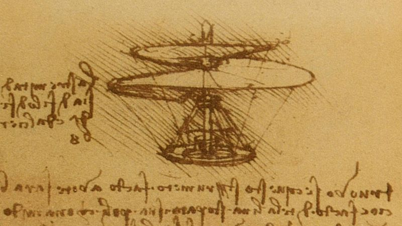

<!DOCTYPE html>
<html lang="en">
<head>
  <meta charset="UTF-8">
  <meta name="viewport" content="width=device-width, initial-scale=1.0">
<!--
<title>FORENSICS</title>
<style>
  /* CSS Crime Scene Style*/
  * {
    box-sizing: border-box;
    margin: 2;
    padding: 2;
  }
  body {
    font-family: Arial, sans-serif;
    background-color: rgb(22, 22, 24); /* Dark gray background */
    color: #fff; /* White text color */
    margin: 40px; /* Margin for better readability */
  }
  /* Titles */
  h1, h2, h3, h4, h5, h6 {
    color: #fff; /* White text color */
  }
  /* Elements with yellow details */
  hr, blockquote, table, thead, tbody, tfoot, tr, td, th {
    border-color: rgb(226, 181, 25); /* Yellowish color for borders */
  }
  /* Links within content */
  a {
    color: rgb(226, 26, 65); /* Reddish color for links */
    text-decoration: none; /* Remove underline by default */
  }
  a:hover {
    text-decoration: underline; /* Underline on hover */
  }
</style>
</head>
-->
<body>

<div id="header">

<h1>🕹️🚀☠️ Drones ☠️🚀🕹️</h1>

<blockquote><h3>"Bathtub falls and police officers kill more Americans than terrorism, yet we've been asked to sacrifice our most sacred rights for fear of falling victim to it." (Edward Snowden)</h3></blockquote>

<p align="center">

</p>

<hr>

<!-- ##### -->

<a href="https://youtu.be/auRlh-f2wwQ">
  
</a>

<a href="https://www.youtube.com/watch?v=m89bNn6RFoQ">
  
</a>

<a href="https://www.youtube.com/watch?v=EEXI6r08908">
  
</a>

<!-- ##### -->

<h4>Simple 3D Drone frame in ASCII STL</h4>

```stl
solid Drone
  facet normal -1 0 0
    outer loop
      vertex -56.191001892089844 11.354999542236328 2
      vertex -56.191001892089844 11.354999542236328 0
      vertex -56.191001892089844 10.572999954223633 0
    endloop
  endfacet
  facet normal -1 0 0
    outer loop
      vertex -56.191001892089844 11.354999542236328 2
      vertex -56.191001892089844 10.572999954223633 0
      vertex -56.191001892089844 10.572999954223633 2
    endloop
  endfacet
  facet normal 0.9509589076042175 0.3093172609806061 0
    outer loop
      vertex -8.361000061035156 12.098999977111816 2
      vertex -8.119000434875488 11.354999542236328 2
      vertex -8.119000434875488 11.354999542236328 0
    endloop
  endfacet
  facet normal 0.9509589076042175 0.3093172609806061 0
    outer loop
      vertex -8.361000061035156 12.098999977111816 2
      vertex -8.119000434875488 11.354999542236328 0
      vertex -8.361000061035156 12.098999977111816 0
    endloop
  endfacet
  facet normal 0.9509589076042175 -0.3093172609806061 0
    outer loop
      vertex -8.361000061035156 9.829000473022461 2
      vertex -8.361000061035156 9.829000473022461 0
      vertex -8.119000434875488 10.572999954223633 0
    endloop
  endfacet
  facet normal 0.9509589076042175 -0.3093172609806061 0
    outer loop
      vertex -8.361000061035156 9.829000473022461 2
      vertex -8.119000434875488 10.572999954223633 0
      vertex -8.119000434875488 10.572999954223633 2
    endloop
  endfacet
  facet normal 0 0 -1
    outer loop
      vertex -55.20500183105469 11.199000358581543 0
      vertex -56.191001892089844 11.354999542236328 0
      vertex -55.060001373291016 11.645999908447266 0
    endloop
  endfacet
  facet normal 0.4538491666316986 -0.891078531742096 0
    outer loop
      vertex -11.6850004196167 -10.059000015258789 5
      vertex -12.381999969482422 -10.413999557495117 5
      vertex -11.6850004196167 -10.059000015258789 0
    endloop
  endfacet
  facet normal 0.8095648288726807 -0.5870304703712463 0
    outer loop
      vertex -8.361000061035156 9.829000473022461 2
      vertex -8.819999694824219 9.196000099182129 2
      vertex -8.361000061035156 9.829000473022461 0
    endloop
  endfacet
  facet normal -0.4298737645149231 -0.9028890132904053 0
    outer loop
      vertex -16.459999084472656 -8.298999786376953 0
      vertex -16.459999084472656 -8.298999786376953 5
      vertex -18.804000854492188 -7.183000087738037 5
    endloop
  endfacet
  facet normal -0.4298737645149231 -0.9028890132904053 0
    outer loop
      vertex -16.459999084472656 -8.298999786376953 0
      vertex -18.804000854492188 -7.183000087738037 5
      vertex -18.804000854492188 -7.183000087738037 0
    endloop
  endfacet
  facet normal 0.8095648288726807 -0.5870304703712463 0
    outer loop
      vertex -8.361000061035156 9.829000473022461 0
      vertex -8.819999694824219 9.196000099182129 2
      vertex -8.819999694824219 9.196000099182129 0
    endloop
  endfacet
  facet normal -0.8091042041778564 0.5876652002334595 0
    outer loop
      vertex -9.25 10.281999588012695 2
      vertex -9.25 10.281999588012695 0
      vertex -9.526000022888184 9.902000427246094 0
    endloop
  endfacet
  facet normal -0.8091042041778564 0.5876652002334595 0
    outer loop
      vertex -9.25 10.281999588012695 2
      vertex -9.526000022888184 9.902000427246094 0
      vertex -9.526000022888184 9.902000427246094 2
    endloop
  endfacet
  facet normal -0.9512059688568115 0.3085567355155945 0
    outer loop
      vertex -9.104999542236328 10.729000091552734 0
      vertex -9.25 10.281999588012695 0
      vertex -9.25 10.281999588012695 2
    endloop
  endfacet
  facet normal -0.9512059688568115 0.3085567355155945 0
    outer loop
      vertex -9.104999542236328 10.729000091552734 0
      vertex -9.25 10.281999588012695 2
      vertex -9.104999542236328 10.729000091552734 2
    endloop
  endfacet
  facet normal -0.9512059688568115 -0.3085567355155945 0
    outer loop
      vertex -9.25 11.645999908447266 2
      vertex -9.25 11.645999908447266 0
      vertex -9.104999542236328 11.199000358581543 0
    endloop
  endfacet
  facet normal -0.9512059688568115 -0.3085567355155945 0
    outer loop
      vertex -9.25 11.645999908447266 2
      vertex -9.104999542236328 11.199000358581543 0
      vertex -9.104999542236328 11.199000358581543 2
    endloop
  endfacet
  facet normal 0 0 -1
    outer loop
      vertex -54.40299987792969 9.62600040435791 0
      vertex -54.856998443603516 8.736000061035156 0
      vertex -54.784000396728516 9.902000427246094 0
    endloop
  endfacet
  facet normal 0 0 -1
    outer loop
      vertex -54.856998443603516 8.736000061035156 0
      vertex -55.48899841308594 9.196000099182129 0
      vertex -54.784000396728516 9.902000427246094 0
    endloop
  endfacet
  facet normal -0.8091042041778564 -0.5876652002334595 0
    outer loop
      vertex -9.526000022888184 12.026000022888184 2
      vertex -9.526000022888184 12.026000022888184 0
      vertex -9.25 11.645999908447266 0
    endloop
  endfacet
  facet normal -0.8091042041778564 -0.5876652002334595 0
    outer loop
      vertex -9.526000022888184 12.026000022888184 2
      vertex -9.25 11.645999908447266 0
      vertex -9.25 11.645999908447266 2
    endloop
  endfacet
  facet normal 0 0 1
    outer loop
      vertex -50.689998626708984 -9.46500015258789 5
      vertex -50.38199996948242 -10.413999557495117 5
      vertex -50.27199935913086 -9.251999855041504 5
    endloop
  endfacet
  facet normal 0 0 -1
    outer loop
      vertex -54.112998962402344 8.494999885559082 0
      vertex -54.856998443603516 8.736000061035156 0
      vertex -53.957000732421875 9.480999946594238 0
    endloop
  endfacet
  facet normal 0 0 -1
    outer loop
      vertex -22.454999923706055 28.22599983215332 0
      vertex -14.892999649047852 20.663999557495117 0
      vertex -25.790422439575195 27.81342315673828 0
    endloop
  endfacet
  facet normal 0 0 -1
    outer loop
      vertex -18.804000854492188 29.111000061035156 0
      vertex -14.892999649047852 20.663999557495117 0
      vertex -22.454999923706055 28.22599983215332 0
    endloop
  endfacet
  facet normal -0.3085567355155945 0.9512059688568115 0
    outer loop
      vertex -9.906000137329102 9.62600040435791 2
      vertex -9.906000137329102 9.62600040435791 0
      vertex -10.352999687194824 9.480999946594238 0
    endloop
  endfacet
  facet normal -0.3085567355155945 0.9512059688568115 0
    outer loop
      vertex -9.906000137329102 9.62600040435791 2
      vertex -10.352999687194824 9.480999946594238 0
      vertex -10.352999687194824 9.480999946594238 2
    endloop
  endfacet
  facet normal 0 0 -1
    outer loop
      vertex -54.40299987792969 9.62600040435791 0
      vertex -53.957000732421875 9.480999946594238 0
      vertex -54.856998443603516 8.736000061035156 0
    endloop
  endfacet
  facet normal 0 0 1
    outer loop
      vertex -49.72600173950195 -8.5 5
      vertex -49.93899917602539 -8.918999671936035 5
      vertex -49.16294479370117 -9.53600025177002 5
    endloop
  endfacet
  facet normal -0.5876652002334595 0.8091042041778564 0
    outer loop
      vertex -9.526000022888184 9.902000427246094 2
      vertex -9.526000022888184 9.902000427246094 0
      vertex -9.906000137329102 9.62600040435791 0
    endloop
  endfacet
  facet normal -0.5876652002334595 0.8091042041778564 0
    outer loop
      vertex -9.526000022888184 9.902000427246094 2
      vertex -9.906000137329102 9.62600040435791 0
      vertex -9.906000137329102 9.62600040435791 2
    endloop
  endfacet
  facet normal 0 0 -1
    outer loop
      vertex -55.94900131225586 12.098999977111816 0
      vertex -55.060001373291016 11.645999908447266 0
      vertex -56.191001892089844 11.354999542236328 0
    endloop
  endfacet
  facet normal 0 0 -1
    outer loop
      vertex -56.191001892089844 11.354999542236328 0
      vertex -55.20500183105469 11.199000358581543 0
      vertex -55.20500183105469 10.729000091552734 0
    endloop
  endfacet
  facet normal 0 0 -1
    outer loop
      vertex -55.94900131225586 9.829000473022461 0
      vertex -56.191001892089844 10.572999954223633 0
      vertex -55.060001373291016 10.281999588012695 0
    endloop
  endfacet
  facet normal 0 0 -1
    outer loop
      vertex -55.060001373291016 10.281999588012695 0
      vertex -54.784000396728516 9.902000427246094 0
      vertex -55.94900131225586 9.829000473022461 0
    endloop
  endfacet
  facet normal 0 0 -1
    outer loop
      vertex -55.94900131225586 9.829000473022461 0
      vertex -54.784000396728516 9.902000427246094 0
      vertex -55.48899841308594 9.196000099182129 0
    endloop
  endfacet
  facet normal 0 0 -1
    outer loop
      vertex -55.20500183105469 10.729000091552734 0
      vertex -55.060001373291016 10.281999588012695 0
      vertex -56.191001892089844 10.572999954223633 0
    endloop
  endfacet
  facet normal 0 0 -1
    outer loop
      vertex -56.191001892089844 11.354999542236328 0
      vertex -55.20500183105469 10.729000091552734 0
      vertex -56.191001892089844 10.572999954223633 0
    endloop
  endfacet
  facet normal -0.5876652002334595 -0.8091042041778564 0
    outer loop
      vertex -9.906000137329102 12.302000045776367 2
      vertex -9.906000137329102 12.302000045776367 0
      vertex -9.526000022888184 12.026000022888184 2
    endloop
  endfacet
  facet normal -0.5876652002334595 -0.8091042041778564 0
    outer loop
      vertex -9.526000022888184 12.026000022888184 0
      vertex -9.526000022888184 12.026000022888184 2
      vertex -9.906000137329102 12.302000045776367 0
    endloop
  endfacet
  facet normal 0 0 1
    outer loop
      vertex -52.58399963378906 -8.5 5
      vertex -53.176998138427734 -9.505000114440918 5
      vertex -52.369998931884766 -8.918999671936035 5
    endloop
  endfacet
  facet normal -0.3085567355155945 -0.9512059688568115 0
    outer loop
      vertex -9.906000137329102 12.302000045776367 0
      vertex -9.906000137329102 12.302000045776367 2
      vertex -10.352999687194824 12.446999549865723 2
    endloop
  endfacet
  facet normal -0.3085567355155945 -0.9512059688568115 0
    outer loop
      vertex -9.906000137329102 12.302000045776367 0
      vertex -10.352999687194824 12.446999549865723 2
      vertex -10.352999687194824 12.446999549865723 0
    endloop
  endfacet
  facet normal 0 0 1
    outer loop
      vertex -55.94900131225586 12.098999977111816 2
      vertex -56.191001892089844 11.354999542236328 2
      vertex -55.060001373291016 11.645999908447266 2
    endloop
  endfacet
  facet normal 0 0 1
    outer loop
      vertex -52.369998931884766 -8.918999671936035 5
      vertex -53.176998138427734 -9.505000114440918 5
      vertex -52.03799819946289 -9.251999855041504 5
    endloop
  endfacet
  facet normal 0 0 1
    outer loop
      vertex -52.624000549316406 -10.059000015258789 5
      vertex -51.926998138427734 -10.413999557495117 5
      vertex -52.03799819946289 -9.251999855041504 5
    endloop
  endfacet
  facet normal -1 0 0
    outer loop
      vertex -9.104999542236328 11.199000358581543 2
      vertex -9.104999542236328 11.199000358581543 0
      vertex -9.104999542236328 10.729000091552734 0
    endloop
  endfacet
  facet normal -1 0 0
    outer loop
      vertex -9.104999542236328 11.199000358581543 2
      vertex -9.104999542236328 10.729000091552734 0
      vertex -9.104999542236328 10.729000091552734 2
    endloop
  endfacet
  facet normal 0 0 -1
    outer loop
      vertex -15.304931640625 17.327932357788086 0
      vertex -25.790422439575195 27.81342315673828 0
      vertex -14.892999649047852 20.663999557495117 0
    endloop
  endfacet
  facet normal 0 -1 0
    outer loop
      vertex -15.652000427246094 -9.53600025177002 0
      vertex -15.146056175231934 -9.53600025177002 5
      vertex -15.652000427246094 -9.53600025177002 5
    endloop
  endfacet
  facet normal 0 0 1
    outer loop
      vertex -49.93899917602539 -8.918999671936035 5
      vertex -50.27199935913086 -9.251999855041504 5
      vertex -49.16294479370117 -9.53600025177002 5
    endloop
  endfacet
  facet normal 0 0 1
    outer loop
      vertex -51.61899948120117 -9.46500015258789 5
      vertex -52.03799819946289 -9.251999855041504 5
      vertex -51.926998138427734 -10.413999557495117 5
    endloop
  endfacet
  facet normal 0 0 1
    outer loop
      vertex -51.926998138427734 -10.413999557495117 5
      vertex -51.154998779296875 -10.53600025177002 5
      vertex -51.61899948120117 -9.46500015258789 5
    endloop
  endfacet
  facet normal 0 0 1
    outer loop
      vertex -51.154998779296875 -9.538000106811523 5
      vertex -51.61899948120117 -9.46500015258789 5
      vertex -51.154998779296875 -10.53600025177002 5
    endloop
  endfacet
  facet normal 0 0 1
    outer loop
      vertex -50.689998626708984 -9.46500015258789 5
      vertex -51.154998779296875 -9.538000106811523 5
      vertex -51.154998779296875 -10.53600025177002 5
    endloop
  endfacet
  facet normal 0 0 1
    outer loop
      vertex -51.154998779296875 -10.53600025177002 5
      vertex -50.38199996948242 -10.413999557495117 5
      vertex -50.689998626708984 -9.46500015258789 5
    endloop
  endfacet
  facet normal 0 0 1
    outer loop
      vertex -50.38199996948242 -10.413999557495117 5
      vertex -49.685001373291016 -10.059000015258789 5
      vertex -50.27199935913086 -9.251999855041504 5
    endloop
  endfacet
  facet normal 0 0 1
    outer loop
      vertex -49.16294479370117 -9.53600025177002 5
      vertex -50.27199935913086 -9.251999855041504 5
      vertex -49.685001373291016 -10.059000015258789 5
    endloop
  endfacet
  facet normal 0 0 1
    outer loop
      vertex -54.784000396728516 9.902000427246094 2
      vertex -54.856998443603516 8.736000061035156 2
      vertex -54.40299987792969 9.62600040435791 2
    endloop
  endfacet
  facet normal 0 0 -1
    outer loop
      vertex -14.892999649047852 1.2640000581741333 0
      vertex -25.575952529907227 -5.911952018737793 0
      vertex -15.278444290161133 4.385555744171143 0
    endloop
  endfacet
  facet normal 0 -1 0
    outer loop
      vertex -15.146056175231934 -9.53600025177002 0
      vertex -15.146056175231934 -9.53600025177002 5
      vertex -15.652000427246094 -9.53600025177002 0
    endloop
  endfacet
  facet normal 0 0 1
    outer loop
      vertex -54.40299987792969 9.62600040435791 2
      vertex -54.856998443603516 8.736000061035156 2
      vertex -53.957000732421875 9.480999946594238 2
    endloop
  endfacet
  facet normal 0 0 1
    outer loop
      vertex -54.112998962402344 8.494999885559082 2
      vertex -53.957000732421875 9.480999946594238 2
      vertex -54.856998443603516 8.736000061035156 2
    endloop
  endfacet
  facet normal -0.7077452540397644 -0.7064677476882935 0
    outer loop
      vertex -15.146056175231934 -9.53600025177002 5
      vertex -15.146056175231934 -9.53600025177002 0
      vertex -14.62399959564209 -10.059000015258789 0
    endloop
  endfacet
  facet normal 0 0 1
    outer loop
      vertex -55.060001373291016 10.281999588012695 2
      vertex -55.94900131225586 9.829000473022461 2
      vertex -54.784000396728516 9.902000427246094 2
    endloop
  endfacet
  facet normal 0 0 1
    outer loop
      vertex -55.20500183105469 10.729000091552734 2
      vertex -55.20500183105469 11.199000358581543 2
      vertex -56.191001892089844 11.354999542236328 2
    endloop
  endfacet
  facet normal 0 0 1
    outer loop
      vertex -55.20500183105469 11.199000358581543 2
      vertex -55.060001373291016 11.645999908447266 2
      vertex -56.191001892089844 11.354999542236328 2
    endloop
  endfacet
  facet normal 0 0 1
    outer loop
      vertex -55.20500183105469 10.729000091552734 2
      vertex -56.191001892089844 10.572999954223633 2
      vertex -55.060001373291016 10.281999588012695 2
    endloop
  endfacet
  facet normal 0 0 1
    outer loop
      vertex -56.191001892089844 11.354999542236328 2
      vertex -56.191001892089844 10.572999954223633 2
      vertex -55.20500183105469 10.729000091552734 2
    endloop
  endfacet
  facet normal 0 0 1
    outer loop
      vertex -55.94900131225586 9.829000473022461 2
      vertex -55.060001373291016 10.281999588012695 2
      vertex -56.191001892089844 10.572999954223633 2
    endloop
  endfacet
  facet normal 0 0 1
    outer loop
      vertex -55.48899841308594 9.196000099182129 2
      vertex -54.784000396728516 9.902000427246094 2
      vertex -55.94900131225586 9.829000473022461 2
    endloop
  endfacet
  facet normal 0 0 1
    outer loop
      vertex -54.856998443603516 8.736000061035156 2
      vertex -54.784000396728516 9.902000427246094 2
      vertex -55.48899841308594 9.196000099182129 2
    endloop
  endfacet
  facet normal -0.3081607222557068 -0.9513342976570129 0
    outer loop
      vertex -54.856998443603516 8.736000061035156 2
      vertex -54.856998443603516 8.736000061035156 0
      vertex -54.112998962402344 8.494999885559082 0
    endloop
  endfacet
  facet normal -0.3081607222557068 -0.9513342976570129 0
    outer loop
      vertex -54.856998443603516 8.736000061035156 2
      vertex -54.112998962402344 8.494999885559082 0
      vertex -54.112998962402344 8.494999885559082 2
    endloop
  endfacet
  facet normal 0 0 1
    outer loop
      vertex -52.369998931884766 -7.1529998779296875 5
      vertex -52.03799819946289 -6.820000171661377 5
      vertex -52.654998779296875 -6.044055938720703 5
    endloop
  endfacet
  facet normal -0.5884759426116943 -0.8085147142410278 0
    outer loop
      vertex -54.856998443603516 8.736000061035156 0
      vertex -54.856998443603516 8.736000061035156 2
      vertex -55.48899841308594 9.196000099182129 0
    endloop
  endfacet
  facet normal -0.5884759426116943 -0.8085147142410278 0
    outer loop
      vertex -55.48899841308594 9.196000099182129 2
      vertex -55.48899841308594 9.196000099182129 0
      vertex -54.856998443603516 8.736000061035156 2
    endloop
  endfacet
  facet normal 0 0 1
    outer loop
      vertex -52.654998779296875 -6.044055938720703 5
      vertex -53.176998138427734 -6.566999912261963 5
      vertex -52.369998931884766 -7.1529998779296875 5
    endloop
  endfacet
  facet normal 0 -1 0
    outer loop
      vertex -10.196999549865723 8.494999885559082 0
      vertex -10.196999549865723 8.494999885559082 2
      vertex -10.979000091552734 8.494999885559082 2
    endloop
  endfacet
  facet normal 0 -1 0
    outer loop
      vertex -10.196999549865723 8.494999885559082 0
      vertex -10.979000091552734 8.494999885559082 2
      vertex -10.979000091552734 8.494999885559082 0
    endloop
  endfacet
  facet normal -0.8089570999145508 -0.5878676772117615 0
    outer loop
      vertex -55.94900131225586 9.829000473022461 2
      vertex -55.94900131225586 9.829000473022461 0
      vertex -55.48899841308594 9.196000099182129 0
    endloop
  endfacet
  facet normal -0.8089570999145508 -0.5878676772117615 0
    outer loop
      vertex -55.94900131225586 9.829000473022461 2
      vertex -55.48899841308594 9.196000099182129 0
      vertex -55.48899841308594 9.196000099182129 2
    endloop
  endfacet
  facet normal 0 0 1
    outer loop
      vertex -52.654998779296875 -5.538000106811523 5
      vertex -51.61899948120117 -6.60699987411499 5
      vertex -51.417999267578125 -4.730999946594238 5
    endloop
  endfacet
  facet normal -0.9509589076042175 -0.3093172609806061 0
    outer loop
      vertex -56.191001892089844 10.572999954223633 2
      vertex -56.191001892089844 10.572999954223633 0
      vertex -55.94900131225586 9.829000473022461 0
    endloop
  endfacet
  facet normal -0.9509589076042175 -0.3093172609806061 0
    outer loop
      vertex -56.191001892089844 10.572999954223633 2
      vertex -55.94900131225586 9.829000473022461 0
      vertex -55.94900131225586 9.829000473022461 2
    endloop
  endfacet
  facet normal -0.9509589076042175 0.3093172609806061 0
    outer loop
      vertex -55.94900131225586 12.098999977111816 2
      vertex -55.94900131225586 12.098999977111816 0
      vertex -56.191001892089844 11.354999542236328 0
    endloop
  endfacet
  facet normal -0.9509589076042175 0.3093172609806061 0
    outer loop
      vertex -55.94900131225586 12.098999977111816 2
      vertex -56.191001892089844 11.354999542236328 0
      vertex -56.191001892089844 11.354999542236328 2
    endloop
  endfacet
  facet normal 0.12273378670215607 0.9924396276473999 0
    outer loop
      vertex -37.25400161743164 27.656999588012695 5
      vertex -37.25400161743164 27.656999588012695 2
      vertex -38.94132995605469 27.86566925048828 2
    endloop
  endfacet
  facet normal 0.12273378670215607 0.9924396276473999 0
    outer loop
      vertex -41.85499954223633 28.22599983215332 0
      vertex -41.85499954223633 28.22599983215332 5
      vertex -38.94132995605469 27.86566925048828 2
    endloop
  endfacet
  facet normal 0.12273378670215607 0.9924396276473999 0
    outer loop
      vertex -37.25400161743164 27.656999588012695 5
      vertex -38.94132995605469 27.86566925048828 2
      vertex -41.85499954223633 28.22599983215332 5
    endloop
  endfacet
  facet normal 0.12273378670215607 0.9924396276473999 0
    outer loop
      vertex -41.85499954223633 28.22599983215332 0
      vertex -38.94132995605469 27.86566925048828 2
      vertex -38.94132995605469 27.86566925048828 0
    endloop
  endfacet
  facet normal 0 0 1
    outer loop
      vertex -10.352999687194824 12.446999549865723 2
      vertex -10.979000091552734 13.432999610900879 2
      vertex -10.822999954223633 12.446999549865723 2
    endloop
  endfacet
  facet normal 0 0 1
    outer loop
      vertex -11.270000457763672 12.302000045776367 2
      vertex -10.822999954223633 12.446999549865723 2
      vertex -11.304217338562012 13.327217102050781 2
    endloop
  endfacet
  facet normal 0.03821485862135887 0.9992695450782776 0
    outer loop
      vertex -32.154998779296875 27.461999893188477 5
      vertex -37.25400161743164 27.656999588012695 2
      vertex -37.25400161743164 27.656999588012695 5
    endloop
  endfacet
  facet normal 0.9512059688568115 -0.3085567355155945 0
    outer loop
      vertex -55.20500183105469 11.199000358581543 2
      vertex -55.20500183105469 11.199000358581543 0
      vertex -55.060001373291016 11.645999908447266 0
    endloop
  endfacet
  facet normal 0.9512059688568115 -0.3085567355155945 0
    outer loop
      vertex -55.20500183105469 11.199000358581543 2
      vertex -55.060001373291016 11.645999908447266 0
      vertex -55.060001373291016 11.645999908447266 2
    endloop
  endfacet
  facet normal 0.5876652002334595 -0.8091042041778564 0
    outer loop
      vertex -11.270000457763672 12.302000045776367 2
      vertex -11.649999618530273 12.026000022888184 2
      vertex -11.270000457763672 12.302000045776367 0
    endloop
  endfacet
  facet normal 0.9512059688568115 0.3085567355155945 0
    outer loop
      vertex -55.060001373291016 10.281999588012695 2
      vertex -55.060001373291016 10.281999588012695 0
      vertex -55.20500183105469 10.729000091552734 0
    endloop
  endfacet
  facet normal 0.9512059688568115 0.3085567355155945 0
    outer loop
      vertex -55.060001373291016 10.281999588012695 2
      vertex -55.20500183105469 10.729000091552734 0
      vertex -55.20500183105469 10.729000091552734 2
    endloop
  endfacet
  facet normal 0.8091042041778564 0.5876652002334595 0
    outer loop
      vertex -54.784000396728516 9.902000427246094 2
      vertex -54.784000396728516 9.902000427246094 0
      vertex -55.060001373291016 10.281999588012695 0
    endloop
  endfacet
  facet normal 0.8091042041778564 0.5876652002334595 0
    outer loop
      vertex -54.784000396728516 9.902000427246094 2
      vertex -55.060001373291016 10.281999588012695 0
      vertex -55.060001373291016 10.281999588012695 2
    endloop
  endfacet
  facet normal 0.3085567355155945 -0.9512059688568115 0
    outer loop
      vertex -11.270000457763672 12.302000045776367 2
      vertex -11.270000457763672 12.302000045776367 0
      vertex -10.822999954223633 12.446999549865723 0
    endloop
  endfacet
  facet normal 0.3085567355155945 -0.9512059688568115 0
    outer loop
      vertex -11.270000457763672 12.302000045776367 2
      vertex -10.822999954223633 12.446999549865723 0
      vertex -10.822999954223633 12.446999549865723 2
    endloop
  endfacet
  facet normal 0.5866540670394897 0.8098376393318176 0
    outer loop
      vertex -54.40299987792969 9.62600040435791 2
      vertex -54.40299987792969 9.62600040435791 0
      vertex -54.784000396728516 9.902000427246094 0
    endloop
  endfacet
  facet normal 0.5866540670394897 0.8098376393318176 0
    outer loop
      vertex -54.40299987792969 9.62600040435791 2
      vertex -54.784000396728516 9.902000427246094 0
      vertex -54.784000396728516 9.902000427246094 2
    endloop
  endfacet
  facet normal -0.03820737451314926 0.9992698431015015 0
    outer loop
      vertex -27.05500030517578 27.656999588012695 5
      vertex -27.05500030517578 27.656999588012695 2
      vertex -32.154998779296875 27.461999893188477 2
    endloop
  endfacet
  facet normal 0 -1 0
    outer loop
      vertex -10.352999687194824 12.446999549865723 0
      vertex -10.352999687194824 12.446999549865723 2
      vertex -10.822999954223633 12.446999549865723 2
    endloop
  endfacet
  facet normal 0 -1 0
    outer loop
      vertex -10.352999687194824 12.446999549865723 0
      vertex -10.822999954223633 12.446999549865723 2
      vertex -10.822999954223633 12.446999549865723 0
    endloop
  endfacet
  facet normal 0.3091824948787689 0.9510027170181274 0
    outer loop
      vertex -53.957000732421875 9.480999946594238 2
      vertex -53.957000732421875 9.480999946594238 0
      vertex -54.40299987792969 9.62600040435791 0
    endloop
  endfacet
  facet normal 0.3091824948787689 0.9510027170181274 0
    outer loop
      vertex -53.957000732421875 9.480999946594238 2
      vertex -54.40299987792969 9.62600040435791 0
      vertex -54.40299987792969 9.62600040435791 2
    endloop
  endfacet
  facet normal -0.03820737451314926 0.9992698431015015 0
    outer loop
      vertex -27.05500030517578 27.656999588012695 5
      vertex -32.154998779296875 27.461999893188477 2
      vertex -32.154998779296875 27.461999893188477 5
    endloop
  endfacet
  facet normal 0 1 0
    outer loop
      vertex -10.352999687194824 9.480999946594238 2
      vertex -10.352999687194824 9.480999946594238 0
      vertex -10.822999954223633 9.480999946594238 0
    endloop
  endfacet
  facet normal 0 1 0
    outer loop
      vertex -10.352999687194824 9.480999946594238 2
      vertex -10.822999954223633 9.480999946594238 0
      vertex -10.822999954223633 9.480999946594238 2
    endloop
  endfacet
  facet normal -0.12276006489992142 0.9924363493919373 0
    outer loop
      vertex -22.454999923706055 28.22599983215332 5
      vertex -22.454999923706055 28.22599983215332 0
      vertex -25.790422439575195 27.81342315673828 2
    endloop
  endfacet
  facet normal -0.12276006489992142 0.9924363493919373 0
    outer loop
      vertex -27.05500030517578 27.656999588012695 2
      vertex -27.05500030517578 27.656999588012695 5
      vertex -25.790422439575195 27.81342315673828 2
    endloop
  endfacet
  facet normal -0.12276006489992142 0.9924363493919373 0
    outer loop
      vertex -22.454999923706055 28.22599983215332 5
      vertex -25.790422439575195 27.81342315673828 2
      vertex -27.05500030517578 27.656999588012695 5
    endloop
  endfacet
  facet normal 0 0 -1
    outer loop
      vertex -49.03095245361328 4.384951591491699 0
      vertex -38.94132995605469 27.86566925048828 0
      vertex -38.73397445678711 -5.912026405334473 0
    endloop
  endfacet
  facet normal 0 0 -1
    outer loop
      vertex -52.237998962402344 10.729000091552734 0
      vertex -52.237998962402344 11.199000358581543 0
      vertex -49.03095245361328 4.384951591491699 0
    endloop
  endfacet
  facet normal 0 0 -1
    outer loop
      vertex -49.03095245361328 4.384951591491699 0
      vertex -52.38399887084961 10.281999588012695 0
      vertex -52.237998962402344 10.729000091552734 0
    endloop
  endfacet
  facet normal 1 0 0
    outer loop
      vertex -55.20500183105469 10.729000091552734 2
      vertex -55.20500183105469 10.729000091552734 0
      vertex -55.20500183105469 11.199000358581543 0
    endloop
  endfacet
  facet normal 1 0 0
    outer loop
      vertex -55.20500183105469 10.729000091552734 2
      vertex -55.20500183105469 11.199000358581543 0
      vertex -55.20500183105469 11.199000358581543 2
    endloop
  endfacet
  facet normal -0.12276006489992142 0.9924363493919373 0
    outer loop
      vertex -25.790422439575195 27.81342315673828 0
      vertex -25.790422439575195 27.81342315673828 2
      vertex -22.454999923706055 28.22599983215332 0
    endloop
  endfacet
  facet normal -0.8914288282394409 -0.45316073298454285 0
    outer loop
      vertex -11.72599983215332 -7.572000026702881 0
      vertex -11.72599983215332 -7.572000026702881 5
      vertex -11.939000129699707 -7.1529998779296875 0
    endloop
  endfacet
  facet normal 0 0 1
    outer loop
      vertex -11.270000457763672 9.62600040435791 2
      vertex -11.122512817382812 8.541487693786621 2
      vertex -10.822999954223633 9.480999946594238 2
    endloop
  endfacet
  facet normal 0 0 1
    outer loop
      vertex -10.352999687194824 9.480999946594238 2
      vertex -10.822999954223633 9.480999946594238 2
      vertex -10.196999549865723 8.494999885559082 2
    endloop
  endfacet
  facet normal 0 0 1
    outer loop
      vertex -11.122512817382812 8.541487693786621 2
      vertex -10.979000091552734 8.494999885559082 2
      vertex -10.822999954223633 9.480999946594238 2
    endloop
  endfacet
  facet normal 0.03821485862135887 0.9992695450782776 0
    outer loop
      vertex -32.154998779296875 27.461999893188477 2
      vertex -37.25400161743164 27.656999588012695 2
      vertex -32.154998779296875 27.461999893188477 5
    endloop
  endfacet
  facet normal 0 0 -1
    outer loop
      vertex -55.060001373291016 11.645999908447266 0
      vertex -55.94900131225586 12.098999977111816 0
      vertex -54.784000396728516 12.026000022888184 0
    endloop
  endfacet
  facet normal 0.8908147215843201 0.4543667137622833 0
    outer loop
      vertex -11.131999969482422 31.433000564575195 0
      vertex -10.777000427246094 30.73699951171875 5
      vertex -10.777000427246094 30.73699951171875 0
    endloop
  endfacet
  facet normal 0 0 1
    outer loop
      vertex -52.654998779296875 27.466999053955078 5
      vertex -51.417999267578125 26.659000396728516 5
      vertex -51.61899948120117 28.53499984741211 5
    endloop
  endfacet
  facet normal 0 0 1
    outer loop
      vertex -51.154998779296875 28.461999893188477 5
      vertex -51.61899948120117 28.53499984741211 5
      vertex -51.417999267578125 26.659000396728516 5
    endloop
  endfacet
  facet normal 0.3085567355155945 0.9512059688568115 0
    outer loop
      vertex -11.270000457763672 9.62600040435791 2
      vertex -10.822999954223633 9.480999946594238 2
      vertex -11.270000457763672 9.62600040435791 0
    endloop
  endfacet
  facet normal 0.3085567355155945 0.9512059688568115 0
    outer loop
      vertex -10.822999954223633 9.480999946594238 0
      vertex -11.270000457763672 9.62600040435791 0
      vertex -10.822999954223633 9.480999946594238 2
    endloop
  endfacet
  facet normal 0.9877732992172241 0.15589694678783417 0
    outer loop
      vertex -10.777000427246094 30.73699951171875 5
      vertex -10.654999732971191 29.964000701904297 0
      vertex -10.777000427246094 30.73699951171875 0
    endloop
  endfacet
  facet normal 0 0 1
    outer loop
      vertex -52.03799819946289 -6.820000171661377 5
      vertex -51.61899948120117 -6.60699987411499 5
      vertex -52.654998779296875 -6.044055938720703 5
    endloop
  endfacet
  facet normal 0 0 1
    outer loop
      vertex -52.654998779296875 -5.538000106811523 5
      vertex -52.654998779296875 -6.044055938720703 5
      vertex -51.61899948120117 -6.60699987411499 5
    endloop
  endfacet
  facet normal 0 0 1
    outer loop
      vertex -51.154998779296875 -6.5329999923706055 5
      vertex -51.417999267578125 -4.730999946594238 5
      vertex -51.61899948120117 -6.60699987411499 5
    endloop
  endfacet
  facet normal 0 0 1
    outer loop
      vertex -50.689998626708984 -6.60699987411499 5
      vertex -51.417999267578125 -4.730999946594238 5
      vertex -51.154998779296875 -6.5329999923706055 5
    endloop
  endfacet
  facet normal 0 0 -1
    outer loop
      vertex -55.48899841308594 12.732000350952148 0
      vertex -54.856998443603516 13.190999984741211 0
      vertex -54.784000396728516 12.026000022888184 0
    endloop
  endfacet
  facet normal 0 0 -1
    outer loop
      vertex -55.94900131225586 12.098999977111816 0
      vertex -55.48899841308594 12.732000350952148 0
      vertex -54.784000396728516 12.026000022888184 0
    endloop
  endfacet
  facet normal 0 0 1
    outer loop
      vertex -11.304217338562012 13.327217102050781 2
      vertex -10.822999954223633 12.446999549865723 2
      vertex -10.979000091552734 13.432999610900879 2
    endloop
  endfacet
  facet normal 0 0 -1
    outer loop
      vertex -54.856998443603516 13.190999984741211 0
      vertex -54.112998962402344 13.432999610900879 0
      vertex -54.40299987792969 12.302000045776367 0
    endloop
  endfacet
  facet normal 0 0 -1
    outer loop
      vertex -53.957000732421875 12.446999549865723 0
      vertex -54.40299987792969 12.302000045776367 0
      vertex -54.112998962402344 13.432999610900879 0
    endloop
  endfacet
  facet normal 0.45316073298454285 -0.8914288282394409 0
    outer loop
      vertex -14.038000106811523 -6.820000171661377 5
      vertex -14.038000106811523 -6.820000171661377 0
      vertex -13.619000434875488 -6.60699987411499 0
    endloop
  endfacet
  facet normal 0.12273378670215607 -0.9924396276473999 0
    outer loop
      vertex -41.85499954223633 -6.297999858856201 0
      vertex -38.73397445678711 -5.912026405334473 2
      vertex -41.85499954223633 -6.297999858856201 5
    endloop
  endfacet
  facet normal 0 0 -1
    outer loop
      vertex -54.40299987792969 12.302000045776367 0
      vertex -54.784000396728516 12.026000022888184 0
      vertex -54.856998443603516 13.190999984741211 0
    endloop
  endfacet
  facet normal -0.8914288282394409 -0.45316073298454285 0
    outer loop
      vertex -49.93899917602539 -7.1529998779296875 5
      vertex -49.93899917602539 -7.1529998779296875 0
      vertex -49.72600173950195 -7.572000026702881 5
    endloop
  endfacet
  facet normal 0.7081692814826965 -0.7060426473617554 0
    outer loop
      vertex -14.038000106811523 -6.820000171661377 0
      vertex -14.038000106811523 -6.820000171661377 5
      vertex -14.369999885559082 -7.1529998779296875 5
    endloop
  endfacet
  facet normal 0.7081692814826965 -0.7060426473617554 0
    outer loop
      vertex -14.038000106811523 -6.820000171661377 0
      vertex -14.369999885559082 -7.1529998779296875 5
      vertex -14.369999885559082 -7.1529998779296875 0
    endloop
  endfacet
  facet normal 0.12273378670215607 -0.9924396276473999 0
    outer loop
      vertex -38.73397445678711 -5.912026405334473 0
      vertex -38.73397445678711 -5.912026405334473 2
      vertex -41.85499954223633 -6.297999858856201 0
    endloop
  endfacet
  facet normal -0.7071067690849304 -0.7071067690849304 0
    outer loop
      vertex -50.27199935913086 -6.820000171661377 5
      vertex -49.93899917602539 -7.1529998779296875 0
      vertex -49.93899917602539 -7.1529998779296875 5
    endloop
  endfacet
  facet normal 0.12273378670215607 -0.9924396276473999 0
    outer loop
      vertex -41.85499954223633 -6.297999858856201 5
      vertex -38.73397445678711 -5.912026405334473 2
      vertex -37.25400161743164 -5.729000091552734 5
    endloop
  endfacet
  facet normal 0.12273378670215607 -0.9924396276473999 0
    outer loop
      vertex -37.25400161743164 -5.729000091552734 2
      vertex -37.25400161743164 -5.729000091552734 5
      vertex -38.73397445678711 -5.912026405334473 2
    endloop
  endfacet
  facet normal 0.8905686140060425 -0.45484888553619385 0
    outer loop
      vertex -14.369999885559082 -7.1529998779296875 0
      vertex -14.369999885559082 -7.1529998779296875 5
      vertex -14.583999633789062 -7.572000026702881 0
    endloop
  endfacet
  facet normal 0 1 0
    outer loop
      vertex -10.979000091552734 13.432999610900879 0
      vertex -10.979000091552734 13.432999610900879 2
      vertex -10.196999549865723 13.432999610900879 0
    endloop
  endfacet
  facet normal -0.4540215730667114 -0.890990674495697 0
    outer loop
      vertex -50.689998626708984 -6.60699987411499 5
      vertex -50.689998626708984 -6.60699987411499 0
      vertex -50.27199935913086 -6.820000171661377 5
    endloop
  endfacet
  facet normal -0.3093172609806061 0.9509589076042175 0
    outer loop
      vertex -10.979000091552734 13.432999610900879 0
      vertex -11.304217338562012 13.327217102050781 0
      vertex -11.304217338562012 13.327217102050781 2
    endloop
  endfacet
  facet normal -0.3093172609806061 0.9509589076042175 0
    outer loop
      vertex -10.979000091552734 13.432999610900879 0
      vertex -11.304217338562012 13.327217102050781 2
      vertex -10.979000091552734 13.432999610900879 2
    endloop
  endfacet
  facet normal 0.9878491163253784 -0.15541592240333557 0
    outer loop
      vertex -14.656999588012695 -8.03600025177002 0
      vertex -14.583999633789062 -7.572000026702881 0
      vertex -14.656999588012695 -8.03600025177002 5
    endloop
  endfacet
  facet normal -0.1571621298789978 -0.9875727891921997 0
    outer loop
      vertex -50.689998626708984 -6.60699987411499 5
      vertex -51.154998779296875 -6.5329999923706055 5
      vertex -50.689998626708984 -6.60699987411499 0
    endloop
  endfacet
  facet normal 0.15749244391918182 -0.9875202178955078 0
    outer loop
      vertex -51.61899948120117 -6.60699987411499 5
      vertex -51.61899948120117 -6.60699987411499 0
      vertex -51.154998779296875 -6.5329999923706055 5
    endloop
  endfacet
  facet normal 0.9878491163253784 0.15541592240333557 0
    outer loop
      vertex -14.583999633789062 -8.5 5
      vertex -14.583999633789062 -8.5 0
      vertex -14.656999588012695 -8.03600025177002 5
    endloop
  endfacet
  facet normal 0.7071067690849304 0.7071067690849304 0
    outer loop
      vertex -15.304931640625 17.327932357788086 0
      vertex -11.304217338562012 13.327217102050781 2
      vertex -11.304217338562012 13.327217102050781 0
    endloop
  endfacet
  facet normal 0.45316073298454285 -0.8914288282394409 0
    outer loop
      vertex -52.03799819946289 -6.820000171661377 5
      vertex -51.61899948120117 -6.60699987411499 0
      vertex -51.61899948120117 -6.60699987411499 5
    endloop
  endfacet
  facet normal 0 0 1
    outer loop
      vertex -55.060001373291016 11.645999908447266 2
      vertex -54.784000396728516 12.026000022888184 2
      vertex -55.94900131225586 12.098999977111816 2
    endloop
  endfacet
  facet normal 0 0 1
    outer loop
      vertex -54.856998443603516 13.190999984741211 2
      vertex -55.48899841308594 12.732000350952148 2
      vertex -54.784000396728516 12.026000022888184 2
    endloop
  endfacet
  facet normal -0.15609396994113922 -0.9877421855926514 0
    outer loop
      vertex -13.927000045776367 -10.413999557495117 0
      vertex -13.154999732971191 -10.53600025177002 0
      vertex -13.154999732971191 -10.53600025177002 5
    endloop
  endfacet
  facet normal 0.7081692814826965 -0.7060426473617554 0
    outer loop
      vertex -52.369998931884766 -7.1529998779296875 5
      vertex -52.369998931884766 -7.1529998779296875 0
      vertex -52.03799819946289 -6.820000171661377 5
    endloop
  endfacet
  facet normal 0 0 1
    outer loop
      vertex -49.16294479370117 -9.53600025177002 5
      vertex -48.65700149536133 -9.53600025177002 5
      vertex -49.72600173950195 -8.5 5
    endloop
  endfacet
  facet normal 0 0 1
    outer loop
      vertex -49.72600173950195 -7.572000026702881 5
      vertex -49.652000427246094 -8.03600025177002 5
      vertex -47.849998474121094 -8.298999786376953 5
    endloop
  endfacet
  facet normal -0.4538491666316986 -0.891078531742096 0
    outer loop
      vertex -13.927000045776367 -10.413999557495117 0
      vertex -14.62399959564209 -10.059000015258789 5
      vertex -14.62399959564209 -10.059000015258789 0
    endloop
  endfacet
  facet normal 0.5876652002334595 -0.8091042041778564 0
    outer loop
      vertex -11.649999618530273 12.026000022888184 0
      vertex -11.270000457763672 12.302000045776367 0
      vertex -11.649999618530273 12.026000022888184 2
    endloop
  endfacet
  facet normal -0.23557716608047485 -0.971855640411377 0
    outer loop
      vertex -22.454999923706055 -6.297999858856201 0
      vertex -18.804000854492188 -7.183000087738037 5
      vertex -22.454999923706055 -6.297999858856201 5
    endloop
  endfacet
  facet normal -0.4538491666316986 0.891078531742096 0
    outer loop
      vertex -13.927000045776367 32.34199905395508 5
      vertex -13.927000045776367 32.34199905395508 0
      vertex -14.62399959564209 31.98699951171875 0
    endloop
  endfacet
  facet normal 0 0 1
    outer loop
      vertex -54.856998443603516 13.190999984741211 2
      vertex -54.784000396728516 12.026000022888184 2
      vertex -54.40299987792969 12.302000045776367 2
    endloop
  endfacet
  facet normal 0 0 1
    outer loop
      vertex -54.856998443603516 13.190999984741211 2
      vertex -54.40299987792969 12.302000045776367 2
      vertex -54.112998962402344 13.432999610900879 2
    endloop
  endfacet
  facet normal 0 0 1
    outer loop
      vertex -53.957000732421875 12.446999549865723 2
      vertex -54.112998962402344 13.432999610900879 2
      vertex -54.40299987792969 12.302000045776367 2
    endloop
  endfacet
  facet normal -0.7077452540397644 -0.7064677476882935 0
    outer loop
      vertex -15.146056175231934 -9.53600025177002 5
      vertex -14.62399959564209 -10.059000015258789 0
      vertex -14.62399959564209 -10.059000015258789 5
    endloop
  endfacet
  facet normal -0.23557716608047485 -0.971855640411377 0
    outer loop
      vertex -18.804000854492188 -7.183000087738037 5
      vertex -22.454999923706055 -6.297999858856201 0
      vertex -18.804000854492188 -7.183000087738037 0
    endloop
  endfacet
  facet normal -0.15609396994113922 0.9877421855926514 0
    outer loop
      vertex -13.154999732971191 32.4640007019043 0
      vertex -13.927000045776367 32.34199905395508 0
      vertex -13.927000045776367 32.34199905395508 5
    endloop
  endfacet
  facet normal 0 0 1
    outer loop
      vertex -55.94900131225586 12.098999977111816 2
      vertex -54.784000396728516 12.026000022888184 2
      vertex -55.48899841308594 12.732000350952148 2
    endloop
  endfacet
  facet normal -0.12276006489992142 -0.9924363493919373 0
    outer loop
      vertex -22.454999923706055 -6.297999858856201 0
      vertex -22.454999923706055 -6.297999858856201 5
      vertex -25.575952529907227 -5.911952018737793 2
    endloop
  endfacet
  facet normal -0.12276006489992142 -0.9924363493919373 0
    outer loop
      vertex -22.454999923706055 -6.297999858856201 5
      vertex -27.05500030517578 -5.729000091552734 5
      vertex -25.575952529907227 -5.911952018737793 2
    endloop
  endfacet
  facet normal -0.12276006489992142 -0.9924363493919373 0
    outer loop
      vertex -27.05500030517578 -5.729000091552734 2
      vertex -25.575952529907227 -5.911952018737793 2
      vertex -27.05500030517578 -5.729000091552734 5
    endloop
  endfacet
  facet normal 0 0 1
    outer loop
      vertex -10.196999549865723 8.494999885559082 2
      vertex -10.822999954223633 9.480999946594238 2
      vertex -10.979000091552734 8.494999885559082 2
    endloop
  endfacet
  facet normal -0.12276006489992142 -0.9924363493919373 0
    outer loop
      vertex -22.454999923706055 -6.297999858856201 0
      vertex -25.575952529907227 -5.911952018737793 2
      vertex -25.575952529907227 -5.911952018737793 0
    endloop
  endfacet
  facet normal 0.4538491666316986 -0.891078531742096 0
    outer loop
      vertex -11.6850004196167 -10.059000015258789 0
      vertex -12.381999969482422 -10.413999557495117 5
      vertex -12.381999969482422 -10.413999557495117 0
    endloop
  endfacet
  facet normal 0 0 1
    outer loop
      vertex -14.656999588012695 -8.03600025177002 5
      vertex -14.583999633789062 -7.572000026702881 5
      vertex -16.459999084472656 -8.298999786376953 5
    endloop
  endfacet
  facet normal -0.03840302303433418 -0.9992623329162598 0
    outer loop
      vertex -27.05500030517578 -5.729000091552734 5
      vertex -32.154998779296875 -5.5329999923706055 5
      vertex -27.05500030517578 -5.729000091552734 2
    endloop
  endfacet
  facet normal -0.03840302303433418 -0.9992623329162598 0
    outer loop
      vertex -32.154998779296875 -5.5329999923706055 2
      vertex -27.05500030517578 -5.729000091552734 2
      vertex -32.154998779296875 -5.5329999923706055 5
    endloop
  endfacet
  facet normal 0.15589694678783417 -0.9877732992172241 0
    outer loop
      vertex -12.381999969482422 -10.413999557495117 5
      vertex -13.154999732971191 -10.53600025177002 5
      vertex -13.154999732971191 -10.53600025177002 0
    endloop
  endfacet
  facet normal 0.15589694678783417 -0.9877732992172241 0
    outer loop
      vertex -12.381999969482422 -10.413999557495117 5
      vertex -13.154999732971191 -10.53600025177002 0
      vertex -12.381999969482422 -10.413999557495117 0
    endloop
  endfacet
  facet normal 0.03841054439544678 -0.9992620348930359 0
    outer loop
      vertex -32.154998779296875 -5.5329999923706055 5
      vertex -37.25400161743164 -5.729000091552734 5
      vertex -32.154998779296875 -5.5329999923706055 2
    endloop
  endfacet
  facet normal 0.03841054439544678 -0.9992620348930359 0
    outer loop
      vertex -37.25400161743164 -5.729000091552734 2
      vertex -32.154998779296875 -5.5329999923706055 2
      vertex -37.25400161743164 -5.729000091552734 5
    endloop
  endfacet
  facet normal 0.7077452540397644 0.7064677476882935 0
    outer loop
      vertex -11.131999969482422 31.433000564575195 5
      vertex -11.131999969482422 31.433000564575195 0
      vertex -11.6850004196167 31.98699951171875 5
    endloop
  endfacet
  facet normal -0.8089570999145508 0.5878676772117615 0
    outer loop
      vertex -55.94900131225586 12.098999977111816 0
      vertex -55.94900131225586 12.098999977111816 2
      vertex -55.48899841308594 12.732000350952148 0
    endloop
  endfacet
  facet normal -0.8089570999145508 0.5878676772117615 0
    outer loop
      vertex -55.48899841308594 12.732000350952148 2
      vertex -55.48899841308594 12.732000350952148 0
      vertex -55.94900131225586 12.098999977111816 2
    endloop
  endfacet
  facet normal -0.5876386761665344 0.8091234564781189 0
    outer loop
      vertex -54.856998443603516 13.190999984741211 2
      vertex -54.856998443603516 13.190999984741211 0
      vertex -55.48899841308594 12.732000350952148 2
    endloop
  endfacet
  facet normal -0.5876386761665344 0.8091234564781189 0
    outer loop
      vertex -55.48899841308594 12.732000350952148 2
      vertex -54.856998443603516 13.190999984741211 0
      vertex -55.48899841308594 12.732000350952148 0
    endloop
  endfacet
  facet normal 0 0 1
    outer loop
      vertex -11.649999618530273 9.902000427246094 2
      vertex -15.461000442504883 5.863999843597412 2
      vertex -11.270000457763672 9.62600040435791 2
    endloop
  endfacet
  facet normal -0.3081607222557068 -0.9513342976570129 0
    outer loop
      vertex -11.122512817382812 8.541487693786621 2
      vertex -11.122512817382812 8.541487693786621 0
      vertex -10.979000091552734 8.494999885559082 0
    endloop
  endfacet
  facet normal -0.3081607222557068 -0.9513342976570129 0
    outer loop
      vertex -11.122512817382812 8.541487693786621 2
      vertex -10.979000091552734 8.494999885559082 0
      vertex -10.979000091552734 8.494999885559082 2
    endloop
  endfacet
  facet normal -0.3093172609806061 0.9509589076042175 0
    outer loop
      vertex -54.112998962402344 13.432999610900879 0
      vertex -54.856998443603516 13.190999984741211 0
      vertex -54.856998443603516 13.190999984741211 2
    endloop
  endfacet
  facet normal -0.3093172609806061 0.9509589076042175 0
    outer loop
      vertex -54.112998962402344 13.432999610900879 0
      vertex -54.856998443603516 13.190999984741211 2
      vertex -54.112998962402344 13.432999610900879 2
    endloop
  endfacet
  facet normal 0 0 1
    outer loop
      vertex -15.146056175231934 -9.53600025177002 5
      vertex -14.583999633789062 -8.5 5
      vertex -15.652000427246094 -9.53600025177002 5
    endloop
  endfacet
  facet normal 0 0 1
    outer loop
      vertex -14.62399959564209 -10.059000015258789 5
      vertex -14.038000106811523 -9.251999855041504 5
      vertex -15.146056175231934 -9.53600025177002 5
    endloop
  endfacet
  facet normal 0 0 1
    outer loop
      vertex -14.656999588012695 -8.03600025177002 5
      vertex -16.459999084472656 -8.298999786376953 5
      vertex -14.583999633789062 -8.5 5
    endloop
  endfacet
  facet normal 0.3091824948787689 -0.9510027170181274 0
    outer loop
      vertex -54.40299987792969 12.302000045776367 2
      vertex -54.40299987792969 12.302000045776367 0
      vertex -53.957000732421875 12.446999549865723 0
    endloop
  endfacet
  facet normal 0.3091824948787689 -0.9510027170181274 0
    outer loop
      vertex -54.40299987792969 12.302000045776367 2
      vertex -53.957000732421875 12.446999549865723 0
      vertex -53.957000732421875 12.446999549865723 2
    endloop
  endfacet
  facet normal -0.9992623329162598 0.03840302303433418 0
    outer loop
      vertex -48.847999572753906 5.863999843597412 5
      vertex -48.652000427246094 10.96399974822998 5
      vertex -48.652000427246094 10.96399974822998 2
    endloop
  endfacet
  facet normal 0.5866540670394897 -0.8098376393318176 0
    outer loop
      vertex -54.784000396728516 12.026000022888184 2
      vertex -54.784000396728516 12.026000022888184 0
      vertex -54.40299987792969 12.302000045776367 0
    endloop
  endfacet
  facet normal 0.5866540670394897 -0.8098376393318176 0
    outer loop
      vertex -54.784000396728516 12.026000022888184 2
      vertex -54.40299987792969 12.302000045776367 0
      vertex -54.40299987792969 12.302000045776367 2
    endloop
  endfacet
  facet normal 0.8091042041778564 -0.5876652002334595 0
    outer loop
      vertex -55.060001373291016 11.645999908447266 2
      vertex -55.060001373291016 11.645999908447266 0
      vertex -54.784000396728516 12.026000022888184 0
    endloop
  endfacet
  facet normal 0.8091042041778564 -0.5876652002334595 0
    outer loop
      vertex -55.060001373291016 11.645999908447266 2
      vertex -54.784000396728516 12.026000022888184 0
      vertex -54.784000396728516 12.026000022888184 2
    endloop
  endfacet
  facet normal 0.5876652002334595 0.8091042041778564 0
    outer loop
      vertex -11.649999618530273 9.902000427246094 0
      vertex -11.649999618530273 9.902000427246094 2
      vertex -11.270000457763672 9.62600040435791 0
    endloop
  endfacet
  facet normal 0.5876652002334595 0.8091042041778564 0
    outer loop
      vertex -11.270000457763672 9.62600040435791 2
      vertex -11.270000457763672 9.62600040435791 0
      vertex -11.649999618530273 9.902000427246094 2
    endloop
  endfacet
  facet normal -0.1571621298789978 -0.9875727891921997 0
    outer loop
      vertex -13.154999732971191 31.466999053955078 0
      vertex -12.6899995803833 31.39299964904785 0
      vertex -13.154999732971191 31.466999053955078 5
    endloop
  endfacet
  facet normal 0 0 1
    outer loop
      vertex -41.85499954223633 28.22599983215332 5
      vertex -45.50600051879883 29.111000061035156 5
      vertex -50.301998138427734 24.315000534057617 5
    endloop
  endfacet
  facet normal 0 -1 0
    outer loop
      vertex -53.957000732421875 12.446999549865723 2
      vertex -53.957000732421875 12.446999549865723 0
      vertex -53.48699951171875 12.446999549865723 2
    endloop
  endfacet
  facet normal 0.15749244391918182 -0.9875202178955078 0
    outer loop
      vertex -13.619000434875488 31.39299964904785 5
      vertex -13.154999732971191 31.466999053955078 0
      vertex -13.154999732971191 31.466999053955078 5
    endloop
  endfacet
  facet normal 0.7077452540397644 -0.7064677476882935 0
    outer loop
      vertex -11.131999969482422 28.4950008392334 0
      vertex -11.131999969482422 28.4950008392334 5
      vertex -11.654999732971191 27.971054077148438 0
    endloop
  endfacet
  facet normal 0.8905686140060425 -0.45484888553619385 0
    outer loop
      vertex -52.58399963378906 -7.572000026702881 5
      vertex -52.58399963378906 -7.572000026702881 0
      vertex -52.369998931884766 -7.1529998779296875 0
    endloop
  endfacet
  facet normal 0.8905686140060425 -0.45484888553619385 0
    outer loop
      vertex -52.58399963378906 -7.572000026702881 5
      vertex -52.369998931884766 -7.1529998779296875 0
      vertex -52.369998931884766 -7.1529998779296875 5
    endloop
  endfacet
  facet normal 0.9924626350402832 -0.12254755944013596 0
    outer loop
      vertex -15.461000442504883 16.06399917602539 5
      vertex -15.461000442504883 16.06399917602539 2
      vertex -15.304931640625 17.327932357788086 2
    endloop
  endfacet
  facet normal 0.9924626350402832 -0.12254755944013596 0
    outer loop
      vertex -15.461000442504883 16.06399917602539 5
      vertex -15.304931640625 17.327932357788086 2
      vertex -14.892999649047852 20.663999557495117 5
    endloop
  endfacet
  facet normal 0.9924626350402832 -0.12254755944013596 0
    outer loop
      vertex -15.304931640625 17.327932357788086 0
      vertex -14.892999649047852 20.663999557495117 0
      vertex -15.304931640625 17.327932357788086 2
    endloop
  endfacet
  facet normal 0.9924626350402832 -0.12254755944013596 0
    outer loop
      vertex -14.892999649047852 20.663999557495117 5
      vertex -15.304931640625 17.327932357788086 2
      vertex -14.892999649047852 20.663999557495117 0
    endloop
  endfacet
  facet normal 0 0 1
    outer loop
      vertex -48.847999572753906 16.06399917602539 5
      vertex -48.652000427246094 10.96399974822998 5
      vertex -37.25400161743164 27.656999588012695 5
    endloop
  endfacet
  facet normal -0.15508973598480225 0.9879003763198853 0
    outer loop
      vertex -12.6899995803833 -9.46500015258789 5
      vertex -12.6899995803833 -9.46500015258789 0
      vertex -13.154999732971191 -9.538000106811523 0
    endloop
  endfacet
  facet normal -0.15508973598480225 0.9879003763198853 0
    outer loop
      vertex -12.6899995803833 -9.46500015258789 5
      vertex -13.154999732971191 -9.538000106811523 0
      vertex -13.154999732971191 -9.538000106811523 5
    endloop
  endfacet
  facet normal 0 0 1
    outer loop
      vertex -51.154998779296875 31.466999053955078 5
      vertex -50.689998626708984 31.39299964904785 5
      vertex -50.38199996948242 32.34199905395508 5
    endloop
  endfacet
  facet normal 0 0 1
    outer loop
      vertex -50.689998626708984 31.39299964904785 5
      vertex -50.27199935913086 31.18000030517578 5
      vertex -50.38199996948242 32.34199905395508 5
    endloop
  endfacet
  facet normal 0 0 1
    outer loop
      vertex -51.154998779296875 32.4640007019043 5
      vertex -51.154998779296875 31.466999053955078 5
      vertex -50.38199996948242 32.34199905395508 5
    endloop
  endfacet
  facet normal 0 0 1
    outer loop
      vertex -52.624000549316406 31.98699951171875 5
      vertex -53.176998138427734 31.433000564575195 5
      vertex -52.03799819946289 31.18000030517578 5
    endloop
  endfacet
  facet normal 0.9992623329162598 -0.03840302303433418 0
    outer loop
      vertex -15.461000442504883 16.06399917602539 5
      vertex -15.656999588012695 10.96399974822998 5
      vertex -15.461000442504883 16.06399917602539 2
    endloop
  endfacet
  facet normal 0.9992623329162598 -0.03840302303433418 0
    outer loop
      vertex -15.656999588012695 10.96399974822998 2
      vertex -15.461000442504883 16.06399917602539 2
      vertex -15.656999588012695 10.96399974822998 5
    endloop
  endfacet
  facet normal -0.4540215730667114 0.890990674495697 0
    outer loop
      vertex -12.6899995803833 -9.46500015258789 0
      vertex -12.6899995803833 -9.46500015258789 5
      vertex -12.272000312805176 -9.251999855041504 0
    endloop
  endfacet
  facet normal -0.4540215730667114 0.890990674495697 0
    outer loop
      vertex -12.272000312805176 -9.251999855041504 5
      vertex -12.272000312805176 -9.251999855041504 0
      vertex -12.6899995803833 -9.46500015258789 5
    endloop
  endfacet
  facet normal 0 0 1
    outer loop
      vertex -37.25400161743164 -5.729000091552734 5
      vertex -37.25400161743164 27.656999588012695 5
      vertex -48.652000427246094 10.96399974822998 5
    endloop
  endfacet
  facet normal 0 0 1
    outer loop
      vertex -52.369998931884766 30.847000122070312 5
      vertex -52.03799819946289 31.18000030517578 5
      vertex -53.176998138427734 31.433000564575195 5
    endloop
  endfacet
  facet normal 0 0 1
    outer loop
      vertex -51.926998138427734 32.34199905395508 5
      vertex -52.624000549316406 31.98699951171875 5
      vertex -52.03799819946289 31.18000030517578 5
    endloop
  endfacet
  facet normal 0.9992623329162598 0.03840302303433418 0
    outer loop
      vertex -15.656999588012695 10.96399974822998 2
      vertex -15.656999588012695 10.96399974822998 5
      vertex -15.461000442504883 5.863999843597412 2
    endloop
  endfacet
  facet normal 0.9992623329162598 0.03840302303433418 0
    outer loop
      vertex -15.461000442504883 5.863999843597412 5
      vertex -15.461000442504883 5.863999843597412 2
      vertex -15.656999588012695 10.96399974822998 5
    endloop
  endfacet
  facet normal -0.7071067690849304 0.7071067690849304 0
    outer loop
      vertex -11.939000129699707 -8.918999671936035 5
      vertex -11.939000129699707 -8.918999671936035 0
      vertex -12.272000312805176 -9.251999855041504 0
    endloop
  endfacet
  facet normal -0.7071067690849304 0.7071067690849304 0
    outer loop
      vertex -11.939000129699707 -8.918999671936035 5
      vertex -12.272000312805176 -9.251999855041504 0
      vertex -12.272000312805176 -9.251999855041504 5
    endloop
  endfacet
  facet normal -0.15609396994113922 -0.9877421855926514 0
    outer loop
      vertex -51.154998779296875 -10.53600025177002 5
      vertex -51.926998138427734 -10.413999557495117 5
      vertex -51.926998138427734 -10.413999557495117 0
    endloop
  endfacet
  facet normal 0.9924626350402832 0.12254755944013596 0
    outer loop
      vertex -15.461000442504883 5.863999843597412 2
      vertex -15.461000442504883 5.863999843597412 5
      vertex -15.278444290161133 4.385555744171143 2
    endloop
  endfacet
  facet normal 0.9924626350402832 0.12254755944013596 0
    outer loop
      vertex -14.892999649047852 1.2640000581741333 5
      vertex -15.278444290161133 4.385555744171143 2
      vertex -15.461000442504883 5.863999843597412 5
    endloop
  endfacet
  facet normal -0.4540215730667114 -0.890990674495697 0
    outer loop
      vertex -12.272000312805176 31.18000030517578 0
      vertex -12.272000312805176 31.18000030517578 5
      vertex -12.6899995803833 31.39299964904785 0
    endloop
  endfacet
  facet normal -0.4538491666316986 -0.891078531742096 0
    outer loop
      vertex -51.926998138427734 -10.413999557495117 5
      vertex -52.624000549316406 -10.059000015258789 5
      vertex -51.926998138427734 -10.413999557495117 0
    endloop
  endfacet
  facet normal 0.9924626350402832 0.12254755944013596 0
    outer loop
      vertex -14.892999649047852 1.2640000581741333 5
      vertex -14.892999649047852 1.2640000581741333 0
      vertex -15.278444290161133 4.385555744171143 2
    endloop
  endfacet
  facet normal 0.9924626350402832 0.12254755944013596 0
    outer loop
      vertex -15.278444290161133 4.385555744171143 0
      vertex -15.278444290161133 4.385555744171143 2
      vertex -14.892999649047852 1.2640000581741333 0
    endloop
  endfacet
  facet normal 0 0 1
    outer loop
      vertex -16.459999084472656 -8.298999786376953 5
      vertex -14.006999969482422 -2.38700008392334 5
      vertex -18.804000854492188 -7.183000087738037 5
    endloop
  endfacet
  facet normal -0.8914288282394409 0.45316073298454285 0
    outer loop
      vertex -11.939000129699707 -8.918999671936035 0
      vertex -11.939000129699707 -8.918999671936035 5
      vertex -11.72599983215332 -8.5 0
    endloop
  endfacet
  facet normal -0.8914288282394409 0.45316073298454285 0
    outer loop
      vertex -11.72599983215332 -8.5 5
      vertex -11.72599983215332 -8.5 0
      vertex -11.939000129699707 -8.918999671936035 5
    endloop
  endfacet
  facet normal 0 0 1
    outer loop
      vertex -11.131999969482422 -6.566999912261963 5
      vertex -11.939000129699707 -7.1529998779296875 5
      vertex -10.777000427246094 -7.263000011444092 5
    endloop
  endfacet
  facet normal 0 0 1
    outer loop
      vertex -11.72599983215332 -7.572000026702881 5
      vertex -11.652000427246094 -8.03600025177002 5
      vertex -10.777000427246094 -7.263000011444092 5
    endloop
  endfacet
  facet normal -0.1571621298789978 -0.9875727891921997 0
    outer loop
      vertex -12.6899995803833 31.39299964904785 0
      vertex -12.6899995803833 31.39299964904785 5
      vertex -13.154999732971191 31.466999053955078 5
    endloop
  endfacet
  facet normal 0.7077452540397644 -0.7064677476882935 0
    outer loop
      vertex -49.685001373291016 -10.059000015258789 5
      vertex -49.685001373291016 -10.059000015258789 0
      vertex -49.16294479370117 -9.53600025177002 0
    endloop
  endfacet
  facet normal 0 0 1
    outer loop
      vertex -22.454999923706055 28.22599983215332 5
      vertex -27.05500030517578 27.656999588012695 5
      vertex -14.892999649047852 20.663999557495117 5
    endloop
  endfacet
  facet normal 0 0 1
    outer loop
      vertex -14.892999649047852 20.663999557495117 5
      vertex -14.006999969482422 24.315000534057617 5
      vertex -18.804000854492188 29.111000061035156 5
    endloop
  endfacet
  facet normal 0 0 1
    outer loop
      vertex -10.777000427246094 -8.809000015258789 5
      vertex -10.654999732971191 -8.03600025177002 5
      vertex -11.652000427246094 -8.03600025177002 5
    endloop
  endfacet
  facet normal 0 0 1
    outer loop
      vertex -11.652000427246094 -8.03600025177002 5
      vertex -11.72599983215332 -8.5 5
      vertex -10.777000427246094 -8.809000015258789 5
    endloop
  endfacet
  facet normal 0 0 1
    outer loop
      vertex -11.72599983215332 -8.5 5
      vertex -11.939000129699707 -8.918999671936035 5
      vertex -10.777000427246094 -8.809000015258789 5
    endloop
  endfacet
  facet normal 0.15749244391918182 -0.9875202178955078 0
    outer loop
      vertex -13.619000434875488 31.39299964904785 0
      vertex -13.154999732971191 31.466999053955078 0
      vertex -13.619000434875488 31.39299964904785 5
    endloop
  endfacet
  facet normal 0.9878491163253784 0.15541592240333557 0
    outer loop
      vertex -14.656999588012695 -8.03600025177002 0
      vertex -14.656999588012695 -8.03600025177002 5
      vertex -14.583999633789062 -8.5 0
    endloop
  endfacet
  facet normal 0.45316073298454285 -0.8914288282394409 0
    outer loop
      vertex -14.038000106811523 31.18000030517578 0
      vertex -13.619000434875488 31.39299964904785 0
      vertex -14.038000106811523 31.18000030517578 5
    endloop
  endfacet
  facet normal 0.45316073298454285 -0.8914288282394409 0
    outer loop
      vertex -13.619000434875488 31.39299964904785 5
      vertex -14.038000106811523 31.18000030517578 5
      vertex -13.619000434875488 31.39299964904785 0
    endloop
  endfacet
  facet normal 0.7077452540397644 0.7064677476882935 0
    outer loop
      vertex -11.131999969482422 -6.566999912261963 0
      vertex -11.654999732971191 -6.043054103851318 0
      vertex -11.131999969482422 -6.566999912261963 5
    endloop
  endfacet
  facet normal 0.8905686140060425 0.45484888553619385 0
    outer loop
      vertex -14.369999885559082 -8.918999671936035 5
      vertex -14.369999885559082 -8.918999671936035 0
      vertex -14.583999633789062 -8.5 5
    endloop
  endfacet
  facet normal 0.8905686140060425 0.45484888553619385 0
    outer loop
      vertex -14.583999633789062 -8.5 0
      vertex -14.583999633789062 -8.5 5
      vertex -14.369999885559082 -8.918999671936035 0
    endloop
  endfacet
  facet normal 0.7077452540397644 0.7064677476882935 0
    outer loop
      vertex -49.16294479370117 31.464000701904297 5
      vertex -49.16294479370117 31.464000701904297 0
      vertex -49.685001373291016 31.98699951171875 5
    endloop
  endfacet
  facet normal 0.7081692814826965 -0.7060426473617554 0
    outer loop
      vertex -14.369999885559082 30.847000122070312 5
      vertex -14.369999885559082 30.847000122070312 0
      vertex -14.038000106811523 31.18000030517578 5
    endloop
  endfacet
  facet normal 0.7081692814826965 -0.7060426473617554 0
    outer loop
      vertex -14.038000106811523 31.18000030517578 0
      vertex -14.038000106811523 31.18000030517578 5
      vertex -14.369999885559082 30.847000122070312 0
    endloop
  endfacet
  facet normal -0.4540215730667114 0.890990674495697 0
    outer loop
      vertex -50.27199935913086 -9.251999855041504 5
      vertex -50.27199935913086 -9.251999855041504 0
      vertex -50.689998626708984 -9.46500015258789 5
    endloop
  endfacet
  facet normal 0.7081692814826965 0.7060426473617554 0
    outer loop
      vertex -14.369999885559082 -8.918999671936035 0
      vertex -14.369999885559082 -8.918999671936035 5
      vertex -14.038000106811523 -9.251999855041504 5
    endloop
  endfacet
  facet normal 0.7081692814826965 0.7060426473617554 0
    outer loop
      vertex -14.369999885559082 -8.918999671936035 0
      vertex -14.038000106811523 -9.251999855041504 5
      vertex -14.038000106811523 -9.251999855041504 0
    endloop
  endfacet
  facet normal 0.9877732992172241 0.15589694678783417 0
    outer loop
      vertex -10.777000427246094 -7.263000011444092 5
      vertex -10.654999732971191 -8.03600025177002 5
      vertex -10.654999732971191 -8.03600025177002 0
    endloop
  endfacet
  facet normal 0 0 1
    outer loop
      vertex -52.237998962402344 10.729000091552734 2
      vertex -52.38399887084961 10.281999588012695 2
      vertex -48.652000427246094 10.96399974822998 2
    endloop
  endfacet
  facet normal 0.9877732992172241 -0.15589694678783417 0
    outer loop
      vertex -10.777000427246094 -8.809000015258789 5
      vertex -10.777000427246094 -8.809000015258789 0
      vertex -10.654999732971191 -8.03600025177002 5
    endloop
  endfacet
  facet normal -0.7071067690849304 0.7071067690849304 0
    outer loop
      vertex -50.27199935913086 -9.251999855041504 0
      vertex -50.27199935913086 -9.251999855041504 5
      vertex -49.93899917602539 -8.918999671936035 0
    endloop
  endfacet
  facet normal -0.7071067690849304 0.7071067690849304 0
    outer loop
      vertex -49.93899917602539 -8.918999671936035 5
      vertex -49.93899917602539 -8.918999671936035 0
      vertex -50.27199935913086 -9.251999855041504 5
    endloop
  endfacet
  facet normal 0.8905686140060425 -0.45484888553619385 0
    outer loop
      vertex -14.583999633789062 30.42799949645996 5
      vertex -14.583999633789062 30.42799949645996 0
      vertex -14.369999885559082 30.847000122070312 5
    endloop
  endfacet
  facet normal 0.8905686140060425 -0.45484888553619385 0
    outer loop
      vertex -14.369999885559082 30.847000122070312 0
      vertex -14.369999885559082 30.847000122070312 5
      vertex -14.583999633789062 30.42799949645996 0
    endloop
  endfacet
  facet normal 0.45316073298454285 0.8914288282394409 0
    outer loop
      vertex -14.038000106811523 -9.251999855041504 0
      vertex -14.038000106811523 -9.251999855041504 5
      vertex -13.619000434875488 -9.46500015258789 0
    endloop
  endfacet
  facet normal 0.45316073298454285 0.8914288282394409 0
    outer loop
      vertex -13.619000434875488 -9.46500015258789 5
      vertex -13.619000434875488 -9.46500015258789 0
      vertex -14.038000106811523 -9.251999855041504 5
    endloop
  endfacet
  facet normal -0.9992623329162598 -0.03840302303433418 0
    outer loop
      vertex -48.652000427246094 10.96399974822998 2
      vertex -48.652000427246094 10.96399974822998 5
      vertex -48.847999572753906 16.06399917602539 2
    endloop
  endfacet
  facet normal -0.9992623329162598 -0.03840302303433418 0
    outer loop
      vertex -48.847999572753906 16.06399917602539 5
      vertex -48.847999572753906 16.06399917602539 2
      vertex -48.652000427246094 10.96399974822998 5
    endloop
  endfacet
  facet normal -0.8914288282394409 0.45316073298454285 0
    outer loop
      vertex -49.93899917602539 -8.918999671936035 0
      vertex -49.93899917602539 -8.918999671936035 5
      vertex -49.72600173950195 -8.5 5
    endloop
  endfacet
  facet normal 0.9878491163253784 -0.15541592240333557 0
    outer loop
      vertex -14.583999633789062 30.42799949645996 0
      vertex -14.583999633789062 30.42799949645996 5
      vertex -14.656999588012695 29.964000701904297 5
    endloop
  endfacet
  facet normal 0.15541592240333557 0.9878491163253784 0
    outer loop
      vertex -13.154999732971191 -9.538000106811523 5
      vertex -13.154999732971191 -9.538000106811523 0
      vertex -13.619000434875488 -9.46500015258789 0
    endloop
  endfacet
  facet normal 0.15541592240333557 0.9878491163253784 0
    outer loop
      vertex -13.154999732971191 -9.538000106811523 5
      vertex -13.619000434875488 -9.46500015258789 0
      vertex -13.619000434875488 -9.46500015258789 5
    endloop
  endfacet
  facet normal -0.9924363493919373 -0.12276006489992142 0
    outer loop
      vertex -48.847999572753906 16.06399917602539 2
      vertex -48.847999572753906 16.06399917602539 5
      vertex -49.05659866333008 17.75040054321289 2
    endloop
  endfacet
  facet normal -0.9924363493919373 -0.12276006489992142 0
    outer loop
      vertex -49.41699981689453 20.663999557495117 5
      vertex -49.05659866333008 17.75040054321289 2
      vertex -48.847999572753906 16.06399917602539 5
    endloop
  endfacet
  facet normal 0 0 1
    outer loop
      vertex -50.301998138427734 24.315000534057617 5
      vertex -49.41699981689453 20.663999557495117 5
      vertex -41.85499954223633 28.22599983215332 5
    endloop
  endfacet
  facet normal -0.9924363493919373 -0.12276006489992142 0
    outer loop
      vertex -49.41699981689453 20.663999557495117 5
      vertex -49.41699981689453 20.663999557495117 0
      vertex -49.05659866333008 17.75040054321289 2
    endloop
  endfacet
  facet normal -0.9924363493919373 -0.12276006489992142 0
    outer loop
      vertex -49.05659866333008 17.75040054321289 0
      vertex -49.05659866333008 17.75040054321289 2
      vertex -49.41699981689453 20.663999557495117 0
    endloop
  endfacet
  facet normal -0.7077452540397644 0.7064677476882935 0
    outer loop
      vertex -53.176998138427734 31.433000564575195 0
      vertex -52.624000549316406 31.98699951171875 5
      vertex -52.624000549316406 31.98699951171875 0
    endloop
  endfacet
  facet normal 0.9877732992172241 -0.15589694678783417 0
    outer loop
      vertex -10.654999732971191 -8.03600025177002 0
      vertex -10.654999732971191 -8.03600025177002 5
      vertex -10.777000427246094 -8.809000015258789 0
    endloop
  endfacet
  facet normal 0.8908147215843201 -0.4543667137622833 0
    outer loop
      vertex -10.777000427246094 -8.809000015258789 5
      vertex -11.131999969482422 -9.505000114440918 5
      vertex -10.777000427246094 -8.809000015258789 0
    endloop
  endfacet
  facet normal -0.4538491666316986 0.891078531742096 0
    outer loop
      vertex -51.926998138427734 32.34199905395508 5
      vertex -51.926998138427734 32.34199905395508 0
      vertex -52.624000549316406 31.98699951171875 0
    endloop
  endfacet
  facet normal -0.4538491666316986 0.891078531742096 0
    outer loop
      vertex -51.926998138427734 32.34199905395508 5
      vertex -52.624000549316406 31.98699951171875 0
      vertex -52.624000549316406 31.98699951171875 5
    endloop
  endfacet
  facet normal 0.8905686140060425 0.45484888553619385 0
    outer loop
      vertex -14.369999885559082 29.08099937438965 0
      vertex -14.583999633789062 29.5 0
      vertex -14.369999885559082 29.08099937438965 5
    endloop
  endfacet
  facet normal 0.8905686140060425 0.45484888553619385 0
    outer loop
      vertex -14.583999633789062 29.5 5
      vertex -14.369999885559082 29.08099937438965 5
      vertex -14.583999633789062 29.5 0
    endloop
  endfacet
  facet normal 0.8905686140060425 0.45484888553619385 0
    outer loop
      vertex -52.369998931884766 -8.918999671936035 5
      vertex -52.369998931884766 -8.918999671936035 0
      vertex -52.58399963378906 -8.5 5
    endloop
  endfacet
  facet normal -0.15609396994113922 0.9877421855926514 0
    outer loop
      vertex -51.926998138427734 32.34199905395508 0
      vertex -51.926998138427734 32.34199905395508 5
      vertex -51.154998779296875 32.4640007019043 0
    endloop
  endfacet
  facet normal -0.15609396994113922 0.9877421855926514 0
    outer loop
      vertex -51.154998779296875 32.4640007019043 5
      vertex -51.154998779296875 32.4640007019043 0
      vertex -51.926998138427734 32.34199905395508 5
    endloop
  endfacet
  facet normal 0.7081692814826965 0.7060426473617554 0
    outer loop
      vertex -52.03799819946289 -9.251999855041504 5
      vertex -52.369998931884766 -8.918999671936035 0
      vertex -52.369998931884766 -8.918999671936035 5
    endloop
  endfacet
  facet normal 0.7081692814826965 0.7060426473617554 0
    outer loop
      vertex -14.038000106811523 28.74799919128418 5
      vertex -14.038000106811523 28.74799919128418 0
      vertex -14.369999885559082 29.08099937438965 5
    endloop
  endfacet
  facet normal 0.7081692814826965 0.7060426473617554 0
    outer loop
      vertex -14.369999885559082 29.08099937438965 0
      vertex -14.369999885559082 29.08099937438965 5
      vertex -14.038000106811523 28.74799919128418 0
    endloop
  endfacet
  facet normal 0 0 1
    outer loop
      vertex -37.25400161743164 27.656999588012695 5
      vertex -41.85499954223633 28.22599983215332 5
      vertex -48.847999572753906 16.06399917602539 5
    endloop
  endfacet
  facet normal 0 0 1
    outer loop
      vertex -48.652000427246094 10.96399974822998 5
      vertex -48.847999572753906 5.863999843597412 5
      vertex -37.25400161743164 -5.729000091552734 5
    endloop
  endfacet
  facet normal 0 0 1
    outer loop
      vertex -48.847999572753906 5.863999843597412 5
      vertex -49.41699981689453 1.2640000581741333 5
      vertex -41.85499954223633 -6.297999858856201 5
    endloop
  endfacet
  facet normal 0 0 1
    outer loop
      vertex -37.25400161743164 27.656999588012695 5
      vertex -37.25400161743164 -5.729000091552734 5
      vertex -32.154998779296875 -5.5329999923706055 5
    endloop
  endfacet
  facet normal 0 0 1
    outer loop
      vertex -27.05500030517578 -5.729000091552734 5
      vertex -27.05500030517578 27.656999588012695 5
      vertex -32.154998779296875 -5.5329999923706055 5
    endloop
  endfacet
  facet normal 0 0 1
    outer loop
      vertex -37.25400161743164 27.656999588012695 5
      vertex -32.154998779296875 -5.5329999923706055 5
      vertex -32.154998779296875 27.461999893188477 5
    endloop
  endfacet
  facet normal 0 0 1
    outer loop
      vertex -15.461000442504883 16.06399917602539 5
      vertex -14.892999649047852 20.663999557495117 5
      vertex -27.05500030517578 27.656999588012695 5
    endloop
  endfacet
  facet normal 0 0 1
    outer loop
      vertex -15.656999588012695 10.96399974822998 5
      vertex -15.461000442504883 16.06399917602539 5
      vertex -27.05500030517578 27.656999588012695 5
    endloop
  endfacet
  facet normal 0 0 1
    outer loop
      vertex -32.154998779296875 27.461999893188477 5
      vertex -32.154998779296875 -5.5329999923706055 5
      vertex -27.05500030517578 27.656999588012695 5
    endloop
  endfacet
  facet normal 0.15589694678783417 0.9877732992172241 0
    outer loop
      vertex -50.38199996948242 32.34199905395508 5
      vertex -50.38199996948242 32.34199905395508 0
      vertex -51.154998779296875 32.4640007019043 0
    endloop
  endfacet
  facet normal 0.15589694678783417 0.9877732992172241 0
    outer loop
      vertex -50.38199996948242 32.34199905395508 5
      vertex -51.154998779296875 32.4640007019043 0
      vertex -51.154998779296875 32.4640007019043 5
    endloop
  endfacet
  facet normal 0.45316073298454285 0.8914288282394409 0
    outer loop
      vertex -51.61899948120117 -9.46500015258789 5
      vertex -51.61899948120117 -9.46500015258789 0
      vertex -52.03799819946289 -9.251999855041504 5
    endloop
  endfacet
  facet normal 0 0 1
    outer loop
      vertex -22.454999923706055 -6.297999858856201 5
      vertex -18.804000854492188 -7.183000087738037 5
      vertex -14.892999649047852 1.2640000581741333 5
    endloop
  endfacet
  facet normal 0.4538491666316986 0.891078531742096 0
    outer loop
      vertex -50.38199996948242 32.34199905395508 0
      vertex -50.38199996948242 32.34199905395508 5
      vertex -49.685001373291016 31.98699951171875 0
    endloop
  endfacet
  facet normal 0.4538491666316986 0.891078531742096 0
    outer loop
      vertex -49.685001373291016 31.98699951171875 5
      vertex -49.685001373291016 31.98699951171875 0
      vertex -50.38199996948242 32.34199905395508 5
    endloop
  endfacet
  facet normal 0.7077452540397644 0.7064677476882935 0
    outer loop
      vertex -11.654999732971191 -6.043054103851318 5
      vertex -11.131999969482422 -6.566999912261963 5
      vertex -11.654999732971191 -6.043054103851318 0
    endloop
  endfacet
  facet normal 0.15541592240333557 0.9878491163253784 0
    outer loop
      vertex -51.154998779296875 -9.538000106811523 5
      vertex -51.61899948120117 -9.46500015258789 0
      vertex -51.61899948120117 -9.46500015258789 5
    endloop
  endfacet
  facet normal -0.9924363493919373 0.12276006489992142 0
    outer loop
      vertex -48.847999572753906 5.863999843597412 5
      vertex -49.03095245361328 4.384951591491699 2
      vertex -49.41699981689453 1.2640000581741333 5
    endloop
  endfacet
  facet normal 0.8908147215843201 0.4543667137622833 0
    outer loop
      vertex -10.777000427246094 -7.263000011444092 0
      vertex -11.131999969482422 -6.566999912261963 0
      vertex -10.777000427246094 -7.263000011444092 5
    endloop
  endfacet
  facet normal 0.8908147215843201 0.4543667137622833 0
    outer loop
      vertex -11.131999969482422 -6.566999912261963 5
      vertex -10.777000427246094 -7.263000011444092 5
      vertex -11.131999969482422 -6.566999912261963 0
    endloop
  endfacet
  facet normal -0.9924363493919373 0.12276006489992142 0
    outer loop
      vertex -49.03095245361328 4.384951591491699 0
      vertex -49.41699981689453 1.2640000581741333 0
      vertex -49.03095245361328 4.384951591491699 2
    endloop
  endfacet
  facet normal -0.9924363493919373 0.12276006489992142 0
    outer loop
      vertex -49.41699981689453 1.2640000581741333 5
      vertex -49.03095245361328 4.384951591491699 2
      vertex -49.41699981689453 1.2640000581741333 0
    endloop
  endfacet
  facet normal 0.7077452540397644 0.7064677476882935 0
    outer loop
      vertex -49.685001373291016 31.98699951171875 0
      vertex -49.685001373291016 31.98699951171875 5
      vertex -49.16294479370117 31.464000701904297 0
    endloop
  endfacet
  facet normal -0.4540215730667114 0.890990674495697 0
    outer loop
      vertex -12.6899995803833 28.53499984741211 5
      vertex -12.272000312805176 28.74799919128418 5
      vertex -12.272000312805176 28.74799919128418 0
    endloop
  endfacet
  facet normal -0.15508973598480225 0.9879003763198853 0
    outer loop
      vertex -12.6899995803833 28.53499984741211 5
      vertex -12.6899995803833 28.53499984741211 0
      vertex -13.154999732971191 28.461999893188477 5
    endloop
  endfacet
  facet normal -0.7071067690849304 0.7071067690849304 0
    outer loop
      vertex -11.939000129699707 29.08099937438965 5
      vertex -11.939000129699707 29.08099937438965 0
      vertex -12.272000312805176 28.74799919128418 0
    endloop
  endfacet
  facet normal -0.7071067690849304 0.7071067690849304 0
    outer loop
      vertex -11.939000129699707 29.08099937438965 5
      vertex -12.272000312805176 28.74799919128418 0
      vertex -12.272000312805176 28.74799919128418 5
    endloop
  endfacet
  facet normal -0.9924363493919373 0.12276006489992142 0
    outer loop
      vertex -49.03095245361328 4.384951591491699 2
      vertex -48.847999572753906 5.863999843597412 5
      vertex -48.847999572753906 5.863999843597412 2
    endloop
  endfacet
  facet normal 0.9877732992172241 0.15589694678783417 0
    outer loop
      vertex -10.777000427246094 -7.263000011444092 5
      vertex -10.654999732971191 -8.03600025177002 0
      vertex -10.777000427246094 -7.263000011444092 0
    endloop
  endfacet
  facet normal 0 0 1
    outer loop
      vertex -15.656999588012695 10.96399974822998 5
      vertex -27.05500030517578 27.656999588012695 5
      vertex -27.05500030517578 -5.729000091552734 5
    endloop
  endfacet
  facet normal 0.15541592240333557 0.9878491163253784 0
    outer loop
      vertex -13.154999732971191 28.461999893188477 5
      vertex -13.154999732971191 28.461999893188477 0
      vertex -13.619000434875488 28.53499984741211 5
    endloop
  endfacet
  facet normal -0.9992623329162598 0.03840302303433418 0
    outer loop
      vertex -48.652000427246094 10.96399974822998 2
      vertex -48.847999572753906 5.863999843597412 2
      vertex -48.847999572753906 5.863999843597412 5
    endloop
  endfacet
  facet normal 0 0 1
    outer loop
      vertex -15.461000442504883 5.863999843597412 5
      vertex -15.656999588012695 10.96399974822998 5
      vertex -27.05500030517578 -5.729000091552734 5
    endloop
  endfacet
  facet normal -0.8914288282394409 0.45316073298454285 0
    outer loop
      vertex -11.939000129699707 29.08099937438965 0
      vertex -11.939000129699707 29.08099937438965 5
      vertex -11.72599983215332 29.5 0
    endloop
  endfacet
  facet normal -0.8914288282394409 0.45316073298454285 0
    outer loop
      vertex -11.72599983215332 29.5 5
      vertex -11.72599983215332 29.5 0
      vertex -11.939000129699707 29.08099937438965 5
    endloop
  endfacet
  facet normal 0 0 1
    outer loop
      vertex -14.892999649047852 1.2640000581741333 5
      vertex -15.461000442504883 5.863999843597412 5
      vertex -27.05500030517578 -5.729000091552734 5
    endloop
  endfacet
  facet normal 0 0 1
    outer loop
      vertex -27.05500030517578 -5.729000091552734 5
      vertex -22.454999923706055 -6.297999858856201 5
      vertex -14.892999649047852 1.2640000581741333 5
    endloop
  endfacet
  facet normal -0.9875202178955078 0.15749244391918182 0
    outer loop
      vertex -11.652000427246094 29.964000701904297 5
      vertex -11.652000427246094 29.964000701904297 0
      vertex -11.72599983215332 29.5 5
    endloop
  endfacet
  facet normal -0.9875202178955078 0.15749244391918182 0
    outer loop
      vertex -11.72599983215332 29.5 0
      vertex -11.72599983215332 29.5 5
      vertex -11.652000427246094 29.964000701904297 0
    endloop
  endfacet
  facet normal -0.9875202178955078 0.15749244391918182 0
    outer loop
      vertex -11.72599983215332 -8.5 0
      vertex -11.72599983215332 -8.5 5
      vertex -11.652000427246094 -8.03600025177002 5
    endloop
  endfacet
  facet normal -0.9875202178955078 -0.15749244391918182 0
    outer loop
      vertex -11.72599983215332 30.42799949645996 5
      vertex -11.72599983215332 30.42799949645996 0
      vertex -11.652000427246094 29.964000701904297 0
    endloop
  endfacet
  facet normal -0.9875202178955078 -0.15749244391918182 0
    outer loop
      vertex -11.72599983215332 30.42799949645996 5
      vertex -11.652000427246094 29.964000701904297 0
      vertex -11.652000427246094 29.964000701904297 5
    endloop
  endfacet
  facet normal -0.1571621298789978 -0.9875727891921997 0
    outer loop
      vertex -12.6899995803833 -6.60699987411499 0
      vertex -12.6899995803833 -6.60699987411499 5
      vertex -13.154999732971191 -6.5329999923706055 0
    endloop
  endfacet
  facet normal 0 0 1
    outer loop
      vertex -51.417999267578125 -4.730999946594238 5
      vertex -50.689998626708984 -6.60699987411499 5
      vertex -50.301998138427734 -2.38700008392334 5
    endloop
  endfacet
  facet normal 0 0 1
    outer loop
      vertex -45.50600051879883 -7.183000087738037 5
      vertex -50.301998138427734 -2.38700008392334 5
      vertex -47.849998474121094 -8.298999786376953 5
    endloop
  endfacet
  facet normal -0.9875202178955078 -0.15749244391918182 0
    outer loop
      vertex -11.72599983215332 -7.572000026702881 5
      vertex -11.72599983215332 -7.572000026702881 0
      vertex -11.652000427246094 -8.03600025177002 0
    endloop
  endfacet
  facet normal 0 0 1
    outer loop
      vertex -41.85499954223633 -6.297999858856201 5
      vertex -37.25400161743164 -5.729000091552734 5
      vertex -48.847999572753906 5.863999843597412 5
    endloop
  endfacet
  facet normal -0.8914288282394409 -0.45316073298454285 0
    outer loop
      vertex -11.72599983215332 30.42799949645996 0
      vertex -11.72599983215332 30.42799949645996 5
      vertex -11.939000129699707 30.847000122070312 0
    endloop
  endfacet
  facet normal -0.8914288282394409 -0.45316073298454285 0
    outer loop
      vertex -11.939000129699707 30.847000122070312 5
      vertex -11.939000129699707 30.847000122070312 0
      vertex -11.72599983215332 30.42799949645996 5
    endloop
  endfacet
  facet normal 0.15749244391918182 -0.9875202178955078 0
    outer loop
      vertex -13.154999732971191 -6.5329999923706055 0
      vertex -13.619000434875488 -6.60699987411499 5
      vertex -13.619000434875488 -6.60699987411499 0
    endloop
  endfacet
  facet normal -0.9875202178955078 0.15749244391918182 0
    outer loop
      vertex -11.652000427246094 -8.03600025177002 0
      vertex -11.72599983215332 -8.5 0
      vertex -11.652000427246094 -8.03600025177002 5
    endloop
  endfacet
  facet normal -0.7071067690849304 -0.7071067690849304 0
    outer loop
      vertex -11.939000129699707 30.847000122070312 5
      vertex -12.272000312805176 31.18000030517578 5
      vertex -11.939000129699707 30.847000122070312 0
    endloop
  endfacet
  facet normal -0.7071067690849304 -0.7071067690849304 0
    outer loop
      vertex -12.272000312805176 31.18000030517578 0
      vertex -11.939000129699707 30.847000122070312 0
      vertex -12.272000312805176 31.18000030517578 5
    endloop
  endfacet
  facet normal 0 0 1
    outer loop
      vertex -49.41699981689453 20.663999557495117 5
      vertex -48.847999572753906 16.06399917602539 5
      vertex -41.85499954223633 28.22599983215332 5
    endloop
  endfacet
  facet normal -0.4540215730667114 -0.890990674495697 0
    outer loop
      vertex -12.6899995803833 31.39299964904785 5
      vertex -12.6899995803833 31.39299964904785 0
      vertex -12.272000312805176 31.18000030517578 5
    endloop
  endfacet
  facet normal 0.8908147215843201 -0.4543667137622833 0
    outer loop
      vertex -10.777000427246094 29.19099998474121 0
      vertex -11.131999969482422 28.4950008392334 5
      vertex -11.131999969482422 28.4950008392334 0
    endloop
  endfacet
  facet normal 0.8908147215843201 -0.4543667137622833 0
    outer loop
      vertex -10.777000427246094 -8.809000015258789 0
      vertex -11.131999969482422 -9.505000114440918 5
      vertex -11.131999969482422 -9.505000114440918 0
    endloop
  endfacet
  facet normal 0.9030384421348572 0.4295596778392792 0
    outer loop
      vertex -12.892000198364258 -4.730999946594238 5
      vertex -12.892000198364258 -4.730999946594238 0
      vertex -14.006999969482422 -2.38700008392334 0
    endloop
  endfacet
  facet normal 0.9030384421348572 0.4295596778392792 0
    outer loop
      vertex -12.892000198364258 -4.730999946594238 5
      vertex -14.006999969482422 -2.38700008392334 0
      vertex -14.006999969482422 -2.38700008392334 5
    endloop
  endfacet
  facet normal 0 0 -1
    outer loop
      vertex -31.763999938964844 35 0
      vertex -31.020000457763672 34.757999420166016 0
      vertex -31.472999572753906 33.86899948120117 0
    endloop
  endfacet
  facet normal 0 0 -1
    outer loop
      vertex -31.472999572753906 33.86899948120117 0
      vertex -31.020000457763672 34.757999420166016 0
      vertex -31.093000411987305 33.59299850463867 0
    endloop
  endfacet
  facet normal 0 0 1
    outer loop
      vertex -45.50600051879883 -7.183000087738037 5
      vertex -41.85499954223633 -6.297999858856201 5
      vertex -50.301998138427734 -2.38700008392334 5
    endloop
  endfacet
  facet normal 0.7077452540397644 -0.7064677476882935 0
    outer loop
      vertex -11.131999969482422 28.4950008392334 5
      vertex -11.654999732971191 27.971054077148438 5
      vertex -11.654999732971191 27.971054077148438 0
    endloop
  endfacet
  facet normal 0 1 0
    outer loop
      vertex -15.146056175231934 31.464000701904297 0
      vertex -15.652000427246094 31.464000701904297 0
      vertex -15.146056175231934 31.464000701904297 5
    endloop
  endfacet
  facet normal 0.7077452540397644 -0.7064677476882935 0
    outer loop
      vertex -11.6850004196167 -10.059000015258789 5
      vertex -11.6850004196167 -10.059000015258789 0
      vertex -11.131999969482422 -9.505000114440918 5
    endloop
  endfacet
  facet normal 0.7077452540397644 -0.7064677476882935 0
    outer loop
      vertex -11.131999969482422 -9.505000114440918 5
      vertex -11.6850004196167 -10.059000015258789 0
      vertex -11.131999969482422 -9.505000114440918 0
    endloop
  endfacet
  facet normal 0.5463916659355164 0.8375297784805298 0
    outer loop
      vertex -11.654999732971191 -5.538000106811523 5
      vertex -11.654999732971191 -5.538000106811523 0
      vertex -12.892000198364258 -4.730999946594238 5
    endloop
  endfacet
  facet normal 0.5463916659355164 0.8375297784805298 0
    outer loop
      vertex -12.892000198364258 -4.730999946594238 0
      vertex -12.892000198364258 -4.730999946594238 5
      vertex -11.654999732971191 -5.538000106811523 0
    endloop
  endfacet
  facet normal 0 0 1
    outer loop
      vertex -49.41699981689453 1.2640000581741333 5
      vertex -50.301998138427734 -2.38700008392334 5
      vertex -41.85499954223633 -6.297999858856201 5
    endloop
  endfacet
  facet normal 0 0 -1
    outer loop
      vertex -31.920000076293945 34.013999938964844 0
      vertex -31.763999938964844 35 0
      vertex -31.472999572753906 33.86899948120117 0
    endloop
  endfacet
  facet normal -0.4540215730667114 0.890990674495697 0
    outer loop
      vertex -12.6899995803833 28.53499984741211 5
      vertex -12.272000312805176 28.74799919128418 0
      vertex -12.6899995803833 28.53499984741211 0
    endloop
  endfacet
  facet normal 0 1 0
    outer loop
      vertex -15.652000427246094 31.464000701904297 5
      vertex -15.146056175231934 31.464000701904297 5
      vertex -15.652000427246094 31.464000701904297 0
    endloop
  endfacet
  facet normal 1 0 0
    outer loop
      vertex -11.654999732971191 27.466999053955078 0
      vertex -11.654999732971191 27.971054077148438 0
      vertex -11.654999732971191 27.466999053955078 5
    endloop
  endfacet
  facet normal 0 0 -1
    outer loop
      vertex -33.49300003051758 33.21200180053711 0
      vertex -34.38199996948242 33.66600036621094 0
      vertex -33.21699905395508 33.59299850463867 0
    endloop
  endfacet
  facet normal 0 0 1
    outer loop
      vertex -50.27199935913086 -6.820000171661377 5
      vertex -49.93899917602539 -7.1529998779296875 5
      vertex -50.301998138427734 -2.38700008392334 5
    endloop
  endfacet
  facet normal 0 0 1
    outer loop
      vertex -50.27199935913086 -6.820000171661377 5
      vertex -50.301998138427734 -2.38700008392334 5
      vertex -50.689998626708984 -6.60699987411499 5
    endloop
  endfacet
  facet normal 1 0 0
    outer loop
      vertex -11.654999732971191 27.971054077148438 0
      vertex -11.654999732971191 27.971054077148438 5
      vertex -11.654999732971191 27.466999053955078 5
    endloop
  endfacet
  facet normal 0 0 -1
    outer loop
      vertex -33.63800048828125 32.76599884033203 0
      vertex -34.624000549316406 32.922000885009766 0
      vertex -33.49300003051758 33.21200180053711 0
    endloop
  endfacet
  facet normal 0 0 -1
    outer loop
      vertex -34.624000549316406 32.922000885009766 0
      vertex -34.38199996948242 33.66600036621094 0
      vertex -33.49300003051758 33.21200180053711 0
    endloop
  endfacet
  facet normal 0 1 0
    outer loop
      vertex -48.65700149536133 31.464000701904297 5
      vertex -48.65700149536133 31.464000701904297 0
      vertex -49.16294479370117 31.464000701904297 5
    endloop
  endfacet
  facet normal 0 1 0
    outer loop
      vertex -49.16294479370117 31.464000701904297 0
      vertex -49.16294479370117 31.464000701904297 5
      vertex -48.65700149536133 31.464000701904297 0
    endloop
  endfacet
  facet normal -0.15508973598480225 0.9879003763198853 0
    outer loop
      vertex -13.154999732971191 28.461999893188477 0
      vertex -13.154999732971191 28.461999893188477 5
      vertex -12.6899995803833 28.53499984741211 0
    endloop
  endfacet
  facet normal 0 -1 0
    outer loop
      vertex -31.763999938964844 -13.071999549865723 0
      vertex -31.763999938964844 -13.071999549865723 2
      vertex -32.54600143432617 -13.071999549865723 2
    endloop
  endfacet
  facet normal 0 -1 0
    outer loop
      vertex -31.763999938964844 -13.071999549865723 0
      vertex -32.54600143432617 -13.071999549865723 2
      vertex -32.54600143432617 -13.071999549865723 0
    endloop
  endfacet
  facet normal 0.9512059688568115 -0.3085567355155945 0
    outer loop
      vertex -12.071000099182129 11.199000358581543 2
      vertex -12.071000099182129 11.199000358581543 0
      vertex -11.925999641418457 11.645999908447266 0
    endloop
  endfacet
  facet normal 0.9512059688568115 -0.3085567355155945 0
    outer loop
      vertex -12.071000099182129 11.199000358581543 2
      vertex -11.925999641418457 11.645999908447266 0
      vertex -11.925999641418457 11.645999908447266 2
    endloop
  endfacet
  facet normal -0.8914288282394409 -0.45316073298454285 0
    outer loop
      vertex -49.72600173950195 -7.572000026702881 5
      vertex -49.93899917602539 -7.1529998779296875 0
      vertex -49.72600173950195 -7.572000026702881 0
    endloop
  endfacet
  facet normal 0 0 -1
    outer loop
      vertex -32.38999938964844 34.013999938964844 0
      vertex -32.83700180053711 33.86899948120117 0
      vertex -32.54600143432617 35 0
    endloop
  endfacet
  facet normal 0 0 -1
    outer loop
      vertex -33.290000915527344 34.757999420166016 0
      vertex -32.54600143432617 35 0
      vertex -32.83700180053711 33.86899948120117 0
    endloop
  endfacet
  facet normal 0 0 -1
    outer loop
      vertex -32.83700180053711 33.86899948120117 0
      vertex -33.21699905395508 33.59299850463867 0
      vertex -33.290000915527344 34.757999420166016 0
    endloop
  endfacet
  facet normal 0 0 -1
    outer loop
      vertex -31.920000076293945 34.013999938964844 0
      vertex -32.38999938964844 34.013999938964844 0
      vertex -31.763999938964844 35 0
    endloop
  endfacet
  facet normal 0 0 -1
    outer loop
      vertex -31.763999938964844 35 0
      vertex -32.38999938964844 34.013999938964844 0
      vertex -32.54600143432617 35 0
    endloop
  endfacet
  facet normal 0.45316073298454285 0.8914288282394409 0
    outer loop
      vertex -14.038000106811523 28.74799919128418 0
      vertex -14.038000106811523 28.74799919128418 5
      vertex -13.619000434875488 28.53499984741211 0
    endloop
  endfacet
  facet normal 0.45316073298454285 0.8914288282394409 0
    outer loop
      vertex -13.619000434875488 28.53499984741211 5
      vertex -13.619000434875488 28.53499984741211 0
      vertex -14.038000106811523 28.74799919128418 5
    endloop
  endfacet
  facet normal -0.7071067690849304 -0.7071067690849304 0
    outer loop
      vertex -50.27199935913086 -6.820000171661377 5
      vertex -50.27199935913086 -6.820000171661377 0
      vertex -49.93899917602539 -7.1529998779296875 0
    endloop
  endfacet
  facet normal 0 0 -1
    outer loop
      vertex -53.48699951171875 9.480999946594238 0
      vertex -53.040000915527344 9.62600040435791 0
      vertex -52.6769905090332 8.706850051879883 0
    endloop
  endfacet
  facet normal 0 0 -1
    outer loop
      vertex -52.6769905090332 8.706850051879883 0
      vertex -53.33100128173828 8.494999885559082 0
      vertex -53.48699951171875 9.480999946594238 0
    endloop
  endfacet
  facet normal 0 0 -1
    outer loop
      vertex -53.957000732421875 9.480999946594238 0
      vertex -53.48699951171875 9.480999946594238 0
      vertex -53.33100128173828 8.494999885559082 0
    endloop
  endfacet
  facet normal 0 0 -1
    outer loop
      vertex -53.957000732421875 9.480999946594238 0
      vertex -53.33100128173828 8.494999885559082 0
      vertex -54.112998962402344 8.494999885559082 0
    endloop
  endfacet
  facet normal 1 0 0
    outer loop
      vertex -12.071000099182129 11.199000358581543 0
      vertex -12.071000099182129 11.199000358581543 2
      vertex -12.071000099182129 10.729000091552734 2
    endloop
  endfacet
  facet normal 1 0 0
    outer loop
      vertex -12.071000099182129 11.199000358581543 0
      vertex -12.071000099182129 10.729000091552734 2
      vertex -12.071000099182129 10.729000091552734 0
    endloop
  endfacet
  facet normal 0.15541592240333557 0.9878491163253784 0
    outer loop
      vertex -13.619000434875488 28.53499984741211 0
      vertex -13.619000434875488 28.53499984741211 5
      vertex -13.154999732971191 28.461999893188477 0
    endloop
  endfacet
  facet normal -0.4540215730667114 -0.890990674495697 0
    outer loop
      vertex -50.27199935913086 -6.820000171661377 5
      vertex -50.689998626708984 -6.60699987411499 0
      vertex -50.27199935913086 -6.820000171661377 0
    endloop
  endfacet
  facet normal 0 0 -1
    outer loop
      vertex -30.816999435424805 33.21200180053711 0
      vertex -31.093000411987305 33.59299850463867 0
      vertex -29.927000045776367 33.66600036621094 0
    endloop
  endfacet
  facet normal 0 0 -1
    outer loop
      vertex -30.386999130249023 34.29800033569336 0
      vertex -29.927000045776367 33.66600036621094 0
      vertex -31.093000411987305 33.59299850463867 0
    endloop
  endfacet
  facet normal 0 0 -1
    outer loop
      vertex -30.386999130249023 34.29800033569336 0
      vertex -31.093000411987305 33.59299850463867 0
      vertex -31.020000457763672 34.757999420166016 0
    endloop
  endfacet
  facet normal 0 0 -1
    outer loop
      vertex -30.672000885009766 32.76599884033203 0
      vertex -30.816999435424805 33.21200180053711 0
      vertex -29.927000045776367 33.66600036621094 0
    endloop
  endfacet
  facet normal 0 0 -1
    outer loop
      vertex -29.927000045776367 33.66600036621094 0
      vertex -29.68600082397461 32.922000885009766 0
      vertex -30.672000885009766 32.76599884033203 0
    endloop
  endfacet
  facet normal 0 0 -1
    outer loop
      vertex -30.672000885009766 32.29600143432617 0
      vertex -30.672000885009766 32.76599884033203 0
      vertex -29.68600082397461 32.922000885009766 0
    endloop
  endfacet
  facet normal 0 0 -1
    outer loop
      vertex -30.672000885009766 32.29600143432617 0
      vertex -29.68600082397461 32.922000885009766 0
      vertex -29.68600082397461 32.13999938964844 0
    endloop
  endfacet
  facet normal 1 0 0
    outer loop
      vertex -11.654999732971191 -5.538000106811523 5
      vertex -11.654999732971191 -6.043054103851318 5
      vertex -11.654999732971191 -5.538000106811523 0
    endloop
  endfacet
  facet normal 1 0 0
    outer loop
      vertex -11.654999732971191 -6.043054103851318 0
      vertex -11.654999732971191 -5.538000106811523 0
      vertex -11.654999732971191 -6.043054103851318 5
    endloop
  endfacet
  facet normal 0 0 1
    outer loop
      vertex -12.071000099182129 11.199000358581543 2
      vertex -15.656999588012695 10.96399974822998 2
      vertex -12.071000099182129 10.729000091552734 2
    endloop
  endfacet
  facet normal 0 0 -1
    outer loop
      vertex -33.290000915527344 34.757999420166016 0
      vertex -33.21699905395508 33.59299850463867 0
      vertex -33.92300033569336 34.29800033569336 0
    endloop
  endfacet
  facet normal 0 0 -1
    outer loop
      vertex -34.38199996948242 33.66600036621094 0
      vertex -33.92300033569336 34.29800033569336 0
      vertex -33.21699905395508 33.59299850463867 0
    endloop
  endfacet
  facet normal 0 0 -1
    outer loop
      vertex -33.63800048828125 32.29600143432617 0
      vertex -34.624000549316406 32.18299865722656 0
      vertex -33.63800048828125 32.76599884033203 0
    endloop
  endfacet
  facet normal 0 0 1
    outer loop
      vertex -33.21699905395508 -11.664999961853027 2
      vertex -33.290000915527344 -12.829999923706055 2
      vertex -32.83700180053711 -11.940999984741211 2
    endloop
  endfacet
  facet normal 0.9512059688568115 0.3085567355155945 0
    outer loop
      vertex -11.925999641418457 10.281999588012695 2
      vertex -11.925999641418457 10.281999588012695 0
      vertex -12.071000099182129 10.729000091552734 0
    endloop
  endfacet
  facet normal 0.9512059688568115 0.3085567355155945 0
    outer loop
      vertex -11.925999641418457 10.281999588012695 2
      vertex -12.071000099182129 10.729000091552734 0
      vertex -12.071000099182129 10.729000091552734 2
    endloop
  endfacet
  facet normal 0.45316073298454285 -0.8914288282394409 0
    outer loop
      vertex -52.03799819946289 -6.820000171661377 5
      vertex -52.03799819946289 -6.820000171661377 0
      vertex -51.61899948120117 -6.60699987411499 0
    endloop
  endfacet
  facet normal 0 0 1
    outer loop
      vertex -31.920000076293945 -12.086000442504883 2
      vertex -31.763999938964844 -13.071999549865723 2
      vertex -31.472999572753906 -11.940999984741211 2
    endloop
  endfacet
  facet normal 0.7081692814826965 -0.7060426473617554 0
    outer loop
      vertex -52.03799819946289 -6.820000171661377 0
      vertex -52.03799819946289 -6.820000171661377 5
      vertex -52.369998931884766 -7.1529998779296875 0
    endloop
  endfacet
  facet normal 0 0 -1
    outer loop
      vertex -14.369999885559082 30.847000122070312 0
      vertex -15.146056175231934 31.464000701904297 0
      vertex -14.038000106811523 31.18000030517578 0
    endloop
  endfacet
  facet normal 0 0 -1
    outer loop
      vertex -12.6899995803833 -6.60699987411499 0
      vertex -11.654999732971191 -6.043054103851318 0
      vertex -12.272000312805176 -6.820000171661377 0
    endloop
  endfacet
  facet normal 0 0 1
    outer loop
      vertex -11.925999641418457 11.645999908447266 2
      vertex -11.649999618530273 12.026000022888184 2
      vertex -15.461000442504883 16.06399917602539 2
    endloop
  endfacet
  facet normal 0 0 1
    outer loop
      vertex -11.304217338562012 13.327217102050781 2
      vertex -15.461000442504883 16.06399917602539 2
      vertex -11.649999618530273 12.026000022888184 2
    endloop
  endfacet
  facet normal 0 0 -1
    outer loop
      vertex -14.583999633789062 30.42799949645996 0
      vertex -15.146056175231934 31.464000701904297 0
      vertex -14.369999885559082 30.847000122070312 0
    endloop
  endfacet
  facet normal 0 0 1
    outer loop
      vertex -31.763999938964844 -13.071999549865723 2
      vertex -31.020000457763672 -12.829999923706055 2
      vertex -31.472999572753906 -11.940999984741211 2
    endloop
  endfacet
  facet normal 0 0 1
    outer loop
      vertex -31.763999938964844 -13.071999549865723 2
      vertex -31.920000076293945 -12.086000442504883 2
      vertex -32.38999938964844 -12.086000442504883 2
    endloop
  endfacet
  facet normal 0 0 1
    outer loop
      vertex -33.290000915527344 -12.829999923706055 2
      vertex -32.54600143432617 -13.071999549865723 2
      vertex -32.83700180053711 -11.940999984741211 2
    endloop
  endfacet
  facet normal 0 0 1
    outer loop
      vertex -32.38999938964844 -12.086000442504883 2
      vertex -32.83700180053711 -11.940999984741211 2
      vertex -32.54600143432617 -13.071999549865723 2
    endloop
  endfacet
  facet normal 0 0 1
    outer loop
      vertex -31.763999938964844 -13.071999549865723 2
      vertex -32.38999938964844 -12.086000442504883 2
      vertex -32.54600143432617 -13.071999549865723 2
    endloop
  endfacet
  facet normal 0 0 -1
    outer loop
      vertex -13.154999732971191 -6.5329999923706055 0
      vertex -12.892000198364258 -4.730999946594238 0
      vertex -12.6899995803833 -6.60699987411499 0
    endloop
  endfacet
  facet normal 0 0 -1
    outer loop
      vertex -25.790422439575195 27.81342315673828 0
      vertex -31.093000411987305 31.4689998626709 0
      vertex -29.791452407836914 31.814453125 0
    endloop
  endfacet
  facet normal 0.9878491163253784 -0.15541592240333557 0
    outer loop
      vertex -52.58399963378906 -7.572000026702881 5
      vertex -52.65700149536133 -8.03600025177002 0
      vertex -52.58399963378906 -7.572000026702881 0
    endloop
  endfacet
  facet normal 0 0 -1
    outer loop
      vertex -29.68600082397461 32.13999938964844 0
      vertex -29.791452407836914 31.814453125 0
      vertex -30.672000885009766 32.29600143432617 0
    endloop
  endfacet
  facet normal 0 0 -1
    outer loop
      vertex -30.816999435424805 31.849000930786133 0
      vertex -30.672000885009766 32.29600143432617 0
      vertex -29.791452407836914 31.814453125 0
    endloop
  endfacet
  facet normal 0 0 1
    outer loop
      vertex -11.270000457763672 12.302000045776367 2
      vertex -11.304217338562012 13.327217102050781 2
      vertex -11.649999618530273 12.026000022888184 2
    endloop
  endfacet
  facet normal 0 0 -1
    outer loop
      vertex -34.624000549316406 32.922000885009766 0
      vertex -33.63800048828125 32.76599884033203 0
      vertex -34.624000549316406 32.18299865722656 0
    endloop
  endfacet
  facet normal 0 0 1
    outer loop
      vertex -33.63800048828125 -10.838000297546387 2
      vertex -34.624000549316406 -10.994000434875488 2
      vertex -33.49300003051758 -11.28499984741211 2
    endloop
  endfacet
  facet normal 0 0 1
    outer loop
      vertex -34.624000549316406 -10.994000434875488 2
      vertex -34.38199996948242 -11.73799991607666 2
      vertex -33.49300003051758 -11.28499984741211 2
    endloop
  endfacet
  facet normal 0 0 1
    outer loop
      vertex -33.21699905395508 -11.664999961853027 2
      vertex -33.49300003051758 -11.28499984741211 2
      vertex -34.38199996948242 -11.73799991607666 2
    endloop
  endfacet
  facet normal 0 0 1
    outer loop
      vertex -34.38199996948242 -11.73799991607666 2
      vertex -33.92300033569336 -12.371000289916992 2
      vertex -33.21699905395508 -11.664999961853027 2
    endloop
  endfacet
  facet normal 0 0 1
    outer loop
      vertex -33.290000915527344 -12.829999923706055 2
      vertex -33.21699905395508 -11.664999961853027 2
      vertex -33.92300033569336 -12.371000289916992 2
    endloop
  endfacet
  facet normal 0 0 -1
    outer loop
      vertex -53.48699951171875 12.446999549865723 0
      vertex -53.374000549316406 13.432999610900879 0
      vertex -53.040000915527344 12.302000045776367 0
    endloop
  endfacet
  facet normal -0.15609396994113922 -0.9877421855926514 0
    outer loop
      vertex -51.926998138427734 -10.413999557495117 0
      vertex -51.154998779296875 -10.53600025177002 0
      vertex -51.154998779296875 -10.53600025177002 5
    endloop
  endfacet
  facet normal 0 0 -1
    outer loop
      vertex -14.583999633789062 -7.572000026702881 0
      vertex -18.804000854492188 -7.183000087738037 0
      vertex -14.369999885559082 -7.1529998779296875 0
    endloop
  endfacet
  facet normal 0 0 -1
    outer loop
      vertex -52.66730880737305 9.896692276000977 0
      vertex -52.6769905090332 8.706850051879883 0
      vertex -53.040000915527344 9.62600040435791 0
    endloop
  endfacet
  facet normal 0 0 -1
    outer loop
      vertex -33.63800048828125 32.29600143432617 0
      vertex -33.49300003051758 31.849000930786133 0
      vertex -34.624000549316406 32.18299865722656 0
    endloop
  endfacet
  facet normal -0.4538491666316986 -0.891078531742096 0
    outer loop
      vertex -51.926998138427734 -10.413999557495117 0
      vertex -52.624000549316406 -10.059000015258789 5
      vertex -52.624000549316406 -10.059000015258789 0
    endloop
  endfacet
  facet normal 0 0 -1
    outer loop
      vertex -18.804000854492188 -7.183000087738037 0
      vertex -14.583999633789062 -7.572000026702881 0
      vertex -16.459999084472656 -8.298999786376953 0
    endloop
  endfacet
  facet normal 0 0 1
    outer loop
      vertex -15.304931640625 17.327932357788086 2
      vertex -15.461000442504883 16.06399917602539 2
      vertex -11.304217338562012 13.327217102050781 2
    endloop
  endfacet
  facet normal 0 0 1
    outer loop
      vertex -11.925999641418457 11.645999908447266 2
      vertex -15.656999588012695 10.96399974822998 2
      vertex -12.071000099182129 11.199000358581543 2
    endloop
  endfacet
  facet normal 0.3093172609806061 -0.9509589076042175 0
    outer loop
      vertex -31.763999938964844 -13.071999549865723 2
      vertex -31.763999938964844 -13.071999549865723 0
      vertex -31.020000457763672 -12.829999923706055 0
    endloop
  endfacet
  facet normal 0.3093172609806061 -0.9509589076042175 0
    outer loop
      vertex -31.763999938964844 -13.071999549865723 2
      vertex -31.020000457763672 -12.829999923706055 0
      vertex -31.020000457763672 -12.829999923706055 2
    endloop
  endfacet
  facet normal -0.3093172609806061 -0.9509589076042175 0
    outer loop
      vertex -33.290000915527344 -12.829999923706055 2
      vertex -33.290000915527344 -12.829999923706055 0
      vertex -32.54600143432617 -13.071999549865723 0
    endloop
  endfacet
  facet normal -0.3093172609806061 -0.9509589076042175 0
    outer loop
      vertex -33.290000915527344 -12.829999923706055 2
      vertex -32.54600143432617 -13.071999549865723 0
      vertex -32.54600143432617 -13.071999549865723 2
    endloop
  endfacet
  facet normal 0.7071067690849304 0.7071067690849304 0
    outer loop
      vertex -15.304931640625 17.327932357788086 0
      vertex -15.304931640625 17.327932357788086 2
      vertex -11.304217338562012 13.327217102050781 2
    endloop
  endfacet
  facet normal -0.5870304703712463 -0.8095648288726807 0
    outer loop
      vertex -33.290000915527344 -12.829999923706055 2
      vertex -33.92300033569336 -12.371000289916992 0
      vertex -33.290000915527344 -12.829999923706055 0
    endloop
  endfacet
  facet normal 0.4538491666316986 -0.891078531742096 0
    outer loop
      vertex -50.38199996948242 -10.413999557495117 0
      vertex -49.685001373291016 -10.059000015258789 0
      vertex -50.38199996948242 -10.413999557495117 5
    endloop
  endfacet
  facet normal 0.4538491666316986 -0.891078531742096 0
    outer loop
      vertex -49.685001373291016 -10.059000015258789 5
      vertex -50.38199996948242 -10.413999557495117 5
      vertex -49.685001373291016 -10.059000015258789 0
    endloop
  endfacet
  facet normal 0 0 -1
    outer loop
      vertex -11.72599983215332 29.5 0
      vertex -10.777000427246094 29.19099998474121 0
      vertex -11.939000129699707 29.08099937438965 0
    endloop
  endfacet
  facet normal 0 0 -1
    outer loop
      vertex -11.131999969482422 28.4950008392334 0
      vertex -11.654999732971191 27.971054077148438 0
      vertex -11.939000129699707 29.08099937438965 0
    endloop
  endfacet
  facet normal 0 0 -1
    outer loop
      vertex -12.272000312805176 -9.251999855041504 0
      vertex -11.939000129699707 -8.918999671936035 0
      vertex -11.6850004196167 -10.059000015258789 0
    endloop
  endfacet
  facet normal 0.15589694678783417 -0.9877732992172241 0
    outer loop
      vertex -50.38199996948242 -10.413999557495117 5
      vertex -51.154998779296875 -10.53600025177002 5
      vertex -51.154998779296875 -10.53600025177002 0
    endloop
  endfacet
  facet normal 0.15589694678783417 -0.9877732992172241 0
    outer loop
      vertex -50.38199996948242 -10.413999557495117 5
      vertex -51.154998779296875 -10.53600025177002 0
      vertex -50.38199996948242 -10.413999557495117 0
    endloop
  endfacet
  facet normal -0.5870304703712463 -0.8095648288726807 0
    outer loop
      vertex -33.92300033569336 -12.371000289916992 2
      vertex -33.92300033569336 -12.371000289916992 0
      vertex -33.290000915527344 -12.829999923706055 2
    endloop
  endfacet
  facet normal 0.8091042041778564 -0.5876652002334595 0
    outer loop
      vertex -11.925999641418457 11.645999908447266 2
      vertex -11.925999641418457 11.645999908447266 0
      vertex -11.649999618530273 12.026000022888184 2
    endloop
  endfacet
  facet normal 0.8091042041778564 -0.5876652002334595 0
    outer loop
      vertex -11.649999618530273 12.026000022888184 0
      vertex -11.649999618530273 12.026000022888184 2
      vertex -11.925999641418457 11.645999908447266 0
    endloop
  endfacet
  facet normal 0 0 -1
    outer loop
      vertex -11.652000427246094 29.964000701904297 0
      vertex -10.777000427246094 29.19099998474121 0
      vertex -11.72599983215332 29.5 0
    endloop
  endfacet
  facet normal 0 0 -1
    outer loop
      vertex -11.72599983215332 -8.5 0
      vertex -10.777000427246094 -8.809000015258789 0
      vertex -11.939000129699707 -8.918999671936035 0
    endloop
  endfacet
  facet normal 0 0 -1
    outer loop
      vertex -11.131999969482422 -9.505000114440918 0
      vertex -11.6850004196167 -10.059000015258789 0
      vertex -11.939000129699707 -8.918999671936035 0
    endloop
  endfacet
  facet normal -0.8095648288726807 -0.5870304703712463 0
    outer loop
      vertex -34.38199996948242 -11.73799991607666 2
      vertex -34.38199996948242 -11.73799991607666 0
      vertex -33.92300033569336 -12.371000289916992 0
    endloop
  endfacet
  facet normal -0.8095648288726807 -0.5870304703712463 0
    outer loop
      vertex -34.38199996948242 -11.73799991607666 2
      vertex -33.92300033569336 -12.371000289916992 0
      vertex -33.92300033569336 -12.371000289916992 2
    endloop
  endfacet
  facet normal -0.9509589076042175 -0.3093172609806061 0
    outer loop
      vertex -34.624000549316406 -10.994000434875488 2
      vertex -34.624000549316406 -10.994000434875488 0
      vertex -34.38199996948242 -11.73799991607666 0
    endloop
  endfacet
  facet normal -0.9509589076042175 -0.3093172609806061 0
    outer loop
      vertex -34.624000549316406 -10.994000434875488 2
      vertex -34.38199996948242 -11.73799991607666 0
      vertex -34.38199996948242 -11.73799991607666 2
    endloop
  endfacet
  facet normal 0.9512059688568115 0.3085567355155945 0
    outer loop
      vertex -33.49300003051758 -11.28499984741211 2
      vertex -33.49300003051758 -11.28499984741211 0
      vertex -33.63800048828125 -10.838000297546387 0
    endloop
  endfacet
  facet normal 0.9512059688568115 0.3085567355155945 0
    outer loop
      vertex -33.49300003051758 -11.28499984741211 2
      vertex -33.63800048828125 -10.838000297546387 0
      vertex -33.63800048828125 -10.838000297546387 2
    endloop
  endfacet
  facet normal 0.8091042041778564 0.5876652002334595 0
    outer loop
      vertex -33.21699905395508 -11.664999961853027 2
      vertex -33.21699905395508 -11.664999961853027 0
      vertex -33.49300003051758 -11.28499984741211 0
    endloop
  endfacet
  facet normal 0.8091042041778564 0.5876652002334595 0
    outer loop
      vertex -33.21699905395508 -11.664999961853027 2
      vertex -33.49300003051758 -11.28499984741211 0
      vertex -33.49300003051758 -11.28499984741211 2
    endloop
  endfacet
  facet normal 0 0 1
    outer loop
      vertex -11.925999641418457 10.281999588012695 2
      vertex -15.461000442504883 5.863999843597412 2
      vertex -11.649999618530273 9.902000427246094 2
    endloop
  endfacet
  facet normal 0 0 1
    outer loop
      vertex -11.122512817382812 8.541487693786621 2
      vertex -11.270000457763672 9.62600040435791 2
      vertex -15.461000442504883 5.863999843597412 2
    endloop
  endfacet
  facet normal 0.5876652002334595 0.8091042041778564 0
    outer loop
      vertex -32.83700180053711 -11.940999984741211 2
      vertex -32.83700180053711 -11.940999984741211 0
      vertex -33.21699905395508 -11.664999961853027 0
    endloop
  endfacet
  facet normal 0.5876652002334595 0.8091042041778564 0
    outer loop
      vertex -32.83700180053711 -11.940999984741211 2
      vertex -33.21699905395508 -11.664999961853027 0
      vertex -33.21699905395508 -11.664999961853027 2
    endloop
  endfacet
  facet normal 0 0 -1
    outer loop
      vertex -10.654999732971191 29.964000701904297 0
      vertex -11.652000427246094 29.964000701904297 0
      vertex -10.777000427246094 30.73699951171875 0
    endloop
  endfacet
  facet normal 0 0 -1
    outer loop
      vertex -11.652000427246094 29.964000701904297 0
      vertex -11.72599983215332 30.42799949645996 0
      vertex -10.777000427246094 30.73699951171875 0
    endloop
  endfacet
  facet normal 0 0 -1
    outer loop
      vertex -10.777000427246094 29.19099998474121 0
      vertex -11.652000427246094 29.964000701904297 0
      vertex -10.654999732971191 29.964000701904297 0
    endloop
  endfacet
  facet normal 0 0 -1
    outer loop
      vertex -11.72599983215332 30.42799949645996 0
      vertex -11.939000129699707 30.847000122070312 0
      vertex -10.777000427246094 30.73699951171875 0
    endloop
  endfacet
  facet normal 0 0 -1
    outer loop
      vertex -12.272000312805176 31.18000030517578 0
      vertex -11.6850004196167 31.98699951171875 0
      vertex -11.939000129699707 30.847000122070312 0
    endloop
  endfacet
  facet normal 0.3085567355155945 0.9512059688568115 0
    outer loop
      vertex -32.38999938964844 -12.086000442504883 0
      vertex -32.83700180053711 -11.940999984741211 0
      vertex -32.83700180053711 -11.940999984741211 2
    endloop
  endfacet
  facet normal 0.3085567355155945 0.9512059688568115 0
    outer loop
      vertex -32.38999938964844 -12.086000442504883 0
      vertex -32.83700180053711 -11.940999984741211 2
      vertex -32.38999938964844 -12.086000442504883 2
    endloop
  endfacet
  facet normal 0 0 -1
    outer loop
      vertex -13.619000434875488 -9.46500015258789 0
      vertex -13.927000045776367 -10.413999557495117 0
      vertex -14.038000106811523 -9.251999855041504 0
    endloop
  endfacet
  facet normal 0 0 -1
    outer loop
      vertex -14.62399959564209 -10.059000015258789 0
      vertex -15.146056175231934 -9.53600025177002 0
      vertex -14.038000106811523 -9.251999855041504 0
    endloop
  endfacet
  facet normal 0 0 -1
    outer loop
      vertex -13.927000045776367 32.34199905395508 0
      vertex -13.154999732971191 32.4640007019043 0
      vertex -13.154999732971191 31.466999053955078 0
    endloop
  endfacet
  facet normal 0 0 -1
    outer loop
      vertex -13.619000434875488 31.39299964904785 0
      vertex -14.038000106811523 31.18000030517578 0
      vertex -13.927000045776367 32.34199905395508 0
    endloop
  endfacet
  facet normal 0 0 -1
    outer loop
      vertex -15.146056175231934 31.464000701904297 0
      vertex -14.62399959564209 31.98699951171875 0
      vertex -14.038000106811523 31.18000030517578 0
    endloop
  endfacet
  facet normal 0 0 -1
    outer loop
      vertex -14.62399959564209 31.98699951171875 0
      vertex -13.927000045776367 32.34199905395508 0
      vertex -14.038000106811523 31.18000030517578 0
    endloop
  endfacet
  facet normal 0 0 -1
    outer loop
      vertex -13.154999732971191 31.466999053955078 0
      vertex -13.619000434875488 31.39299964904785 0
      vertex -13.927000045776367 32.34199905395508 0
    endloop
  endfacet
  facet normal 0 0 -1
    outer loop
      vertex -13.154999732971191 32.4640007019043 0
      vertex -12.381999969482422 32.34199905395508 0
      vertex -13.154999732971191 31.466999053955078 0
    endloop
  endfacet
  facet normal 0 0 -1
    outer loop
      vertex -12.6899995803833 31.39299964904785 0
      vertex -13.154999732971191 31.466999053955078 0
      vertex -12.381999969482422 32.34199905395508 0
    endloop
  endfacet
  facet normal 0 0 -1
    outer loop
      vertex -12.272000312805176 31.18000030517578 0
      vertex -12.6899995803833 31.39299964904785 0
      vertex -12.381999969482422 32.34199905395508 0
    endloop
  endfacet
  facet normal 0 0 -1
    outer loop
      vertex -12.272000312805176 31.18000030517578 0
      vertex -12.381999969482422 32.34199905395508 0
      vertex -11.6850004196167 31.98699951171875 0
    endloop
  endfacet
  facet normal 0 0 1
    outer loop
      vertex -15.278444290161133 4.385555744171143 2
      vertex -11.122512817382812 8.541487693786621 2
      vertex -15.461000442504883 5.863999843597412 2
    endloop
  endfacet
  facet normal 0 0 1
    outer loop
      vertex -12.071000099182129 10.729000091552734 2
      vertex -15.656999588012695 10.96399974822998 2
      vertex -11.925999641418457 10.281999588012695 2
    endloop
  endfacet
  facet normal -0.3085567355155945 0.9512059688568115 0
    outer loop
      vertex -31.472999572753906 -11.940999984741211 2
      vertex -31.472999572753906 -11.940999984741211 0
      vertex -31.920000076293945 -12.086000442504883 0
    endloop
  endfacet
  facet normal -0.3085567355155945 0.9512059688568115 0
    outer loop
      vertex -31.472999572753906 -11.940999984741211 2
      vertex -31.920000076293945 -12.086000442504883 0
      vertex -31.920000076293945 -12.086000442504883 2
    endloop
  endfacet
  facet normal 0 0 -1
    outer loop
      vertex -13.154999732971191 -9.538000106811523 0
      vertex -13.154999732971191 -10.53600025177002 0
      vertex -13.619000434875488 -9.46500015258789 0
    endloop
  endfacet
  facet normal 0 0 -1
    outer loop
      vertex -11.131999969482422 31.433000564575195 0
      vertex -11.939000129699707 30.847000122070312 0
      vertex -11.6850004196167 31.98699951171875 0
    endloop
  endfacet
  facet normal 0 0 -1
    outer loop
      vertex -11.131999969482422 31.433000564575195 0
      vertex -10.777000427246094 30.73699951171875 0
      vertex -11.939000129699707 30.847000122070312 0
    endloop
  endfacet
  facet normal 0 0 -1
    outer loop
      vertex -10.777000427246094 29.19099998474121 0
      vertex -11.131999969482422 28.4950008392334 0
      vertex -11.939000129699707 29.08099937438965 0
    endloop
  endfacet
  facet normal 0 0 -1
    outer loop
      vertex -12.272000312805176 28.74799919128418 0
      vertex -11.939000129699707 29.08099937438965 0
      vertex -11.654999732971191 27.971054077148438 0
    endloop
  endfacet
  facet normal 0 0 1
    outer loop
      vertex -15.461000442504883 5.863999843597412 2
      vertex -11.925999641418457 10.281999588012695 2
      vertex -15.656999588012695 10.96399974822998 2
    endloop
  endfacet
  facet normal 0 0 1
    outer loop
      vertex -15.656999588012695 10.96399974822998 2
      vertex -11.925999641418457 11.645999908447266 2
      vertex -15.461000442504883 16.06399917602539 2
    endloop
  endfacet
  facet normal 0 1 0
    outer loop
      vertex -31.920000076293945 -12.086000442504883 2
      vertex -31.920000076293945 -12.086000442504883 0
      vertex -32.38999938964844 -12.086000442504883 0
    endloop
  endfacet
  facet normal 0 1 0
    outer loop
      vertex -31.920000076293945 -12.086000442504883 2
      vertex -32.38999938964844 -12.086000442504883 0
      vertex -32.38999938964844 -12.086000442504883 2
    endloop
  endfacet
  facet normal 0.7071067690849304 -0.7071067690849304 0
    outer loop
      vertex -15.278444290161133 4.385555744171143 2
      vertex -15.278444290161133 4.385555744171143 0
      vertex -11.122512817382812 8.541487693786621 2
    endloop
  endfacet
  facet normal 0 0 -1
    outer loop
      vertex -13.154999732971191 28.461999893188477 0
      vertex -12.6899995803833 28.53499984741211 0
      vertex -12.892000198364258 26.659000396728516 0
    endloop
  endfacet
  facet normal 0 0 -1
    outer loop
      vertex -13.154999732971191 -9.538000106811523 0
      vertex -12.6899995803833 -9.46500015258789 0
      vertex -13.154999732971191 -10.53600025177002 0
    endloop
  endfacet
  facet normal 0 0 -1
    outer loop
      vertex -13.927000045776367 -10.413999557495117 0
      vertex -13.619000434875488 -9.46500015258789 0
      vertex -13.154999732971191 -10.53600025177002 0
    endloop
  endfacet
  facet normal 0 0 -1
    outer loop
      vertex -14.62399959564209 -10.059000015258789 0
      vertex -14.038000106811523 -9.251999855041504 0
      vertex -13.927000045776367 -10.413999557495117 0
    endloop
  endfacet
  facet normal 0 0 -1
    outer loop
      vertex -12.381999969482422 -10.413999557495117 0
      vertex -13.154999732971191 -10.53600025177002 0
      vertex -12.6899995803833 -9.46500015258789 0
    endloop
  endfacet
  facet normal 0 0 -1
    outer loop
      vertex -12.6899995803833 -9.46500015258789 0
      vertex -12.272000312805176 -9.251999855041504 0
      vertex -12.381999969482422 -10.413999557495117 0
    endloop
  endfacet
  facet normal 0 0 -1
    outer loop
      vertex -11.6850004196167 -10.059000015258789 0
      vertex -12.381999969482422 -10.413999557495117 0
      vertex -12.272000312805176 -9.251999855041504 0
    endloop
  endfacet
  facet normal 0 0 -1
    outer loop
      vertex -11.654999732971191 27.466999053955078 0
      vertex -12.892000198364258 26.659000396728516 0
      vertex -12.6899995803833 28.53499984741211 0
    endloop
  endfacet
  facet normal 0 0 -1
    outer loop
      vertex -11.654999732971191 27.971054077148438 0
      vertex -11.654999732971191 27.466999053955078 0
      vertex -12.6899995803833 28.53499984741211 0
    endloop
  endfacet
  facet normal 0 0 -1
    outer loop
      vertex -12.6899995803833 28.53499984741211 0
      vertex -12.272000312805176 28.74799919128418 0
      vertex -11.654999732971191 27.971054077148438 0
    endloop
  endfacet
  facet normal 0.45316073298454285 0.8914288282394409 0
    outer loop
      vertex -52.03799819946289 -9.251999855041504 5
      vertex -51.61899948120117 -9.46500015258789 0
      vertex -52.03799819946289 -9.251999855041504 0
    endloop
  endfacet
  facet normal 0 0 -1
    outer loop
      vertex -54.112998962402344 13.432999610900879 0
      vertex -53.374000549316406 13.432999610900879 0
      vertex -53.957000732421875 12.446999549865723 0
    endloop
  endfacet
  facet normal -1 0 0
    outer loop
      vertex -34.624000549316406 -10.211999893188477 0
      vertex -34.624000549316406 -10.994000434875488 0
      vertex -34.624000549316406 -10.994000434875488 2
    endloop
  endfacet
  facet normal 0.7071067690849304 -0.7071067690849304 0
    outer loop
      vertex -11.122512817382812 8.541487693786621 0
      vertex -11.122512817382812 8.541487693786621 2
      vertex -15.278444290161133 4.385555744171143 0
    endloop
  endfacet
  facet normal -0.15508973598480225 0.9879003763198853 0
    outer loop
      vertex -50.689998626708984 -9.46500015258789 5
      vertex -50.689998626708984 -9.46500015258789 0
      vertex -51.154998779296875 -9.538000106811523 0
    endloop
  endfacet
  facet normal -0.15508973598480225 0.9879003763198853 0
    outer loop
      vertex -50.689998626708984 -9.46500015258789 5
      vertex -51.154998779296875 -9.538000106811523 0
      vertex -51.154998779296875 -9.538000106811523 5
    endloop
  endfacet
  facet normal 0.8091042041778564 0.5876652002334595 0
    outer loop
      vertex -11.925999641418457 10.281999588012695 0
      vertex -11.925999641418457 10.281999588012695 2
      vertex -11.649999618530273 9.902000427246094 0
    endloop
  endfacet
  facet normal 0.8091042041778564 0.5876652002334595 0
    outer loop
      vertex -11.649999618530273 9.902000427246094 2
      vertex -11.649999618530273 9.902000427246094 0
      vertex -11.925999641418457 10.281999588012695 2
    endloop
  endfacet
  facet normal 0 0 1
    outer loop
      vertex -31.093000411987305 -11.664999961853027 2
      vertex -30.386999130249023 -12.371000289916992 2
      vertex -30.816999435424805 -11.28499984741211 2
    endloop
  endfacet
  facet normal 0 0 1
    outer loop
      vertex -31.472999572753906 -11.940999984741211 2
      vertex -31.020000457763672 -12.829999923706055 2
      vertex -31.093000411987305 -11.664999961853027 2
    endloop
  endfacet
  facet normal 0 0 1
    outer loop
      vertex -31.020000457763672 -12.829999923706055 2
      vertex -30.386999130249023 -12.371000289916992 2
      vertex -31.093000411987305 -11.664999961853027 2
    endloop
  endfacet
  facet normal 0 0 -1
    outer loop
      vertex -51.154998779296875 31.466999053955078 0
      vertex -51.61899948120117 31.39299964904785 0
      vertex -51.926998138427734 32.34199905395508 0
    endloop
  endfacet
  facet normal -0.4540215730667114 0.890990674495697 0
    outer loop
      vertex -50.689998626708984 -9.46500015258789 0
      vertex -50.689998626708984 -9.46500015258789 5
      vertex -50.27199935913086 -9.251999855041504 0
    endloop
  endfacet
  facet normal 0.5468663573265076 -0.8372198939323425 0
    outer loop
      vertex -11.654999732971191 27.466999053955078 5
      vertex -12.892000198364258 26.659000396728516 5
      vertex -12.892000198364258 26.659000396728516 0
    endloop
  endfacet
  facet normal 0.5468663573265076 -0.8372198939323425 0
    outer loop
      vertex -11.654999732971191 27.466999053955078 5
      vertex -12.892000198364258 26.659000396728516 0
      vertex -11.654999732971191 27.466999053955078 0
    endloop
  endfacet
  facet normal 0 0 -1
    outer loop
      vertex -53.48699951171875 12.446999549865723 0
      vertex -53.957000732421875 12.446999549865723 0
      vertex -53.374000549316406 13.432999610900879 0
    endloop
  endfacet
  facet normal 0 0 -1
    outer loop
      vertex -51.61899948120117 31.39299964904785 0
      vertex -52.03799819946289 31.18000030517578 0
      vertex -51.926998138427734 32.34199905395508 0
    endloop
  endfacet
  facet normal 0 0 -1
    outer loop
      vertex -51.926998138427734 32.34199905395508 0
      vertex -51.154998779296875 32.4640007019043 0
      vertex -51.154998779296875 31.466999053955078 0
    endloop
  endfacet
  facet normal 0 0 -1
    outer loop
      vertex -51.154998779296875 32.4640007019043 0
      vertex -50.38199996948242 32.34199905395508 0
      vertex -51.154998779296875 31.466999053955078 0
    endloop
  endfacet
  facet normal 0 0 -1
    outer loop
      vertex -49.16294479370117 31.464000701904297 0
      vertex -50.27199935913086 31.18000030517578 0
      vertex -49.685001373291016 31.98699951171875 0
    endloop
  endfacet
  facet normal 0 0 -1
    outer loop
      vertex -50.38199996948242 32.34199905395508 0
      vertex -49.685001373291016 31.98699951171875 0
      vertex -50.27199935913086 31.18000030517578 0
    endloop
  endfacet
  facet normal 0 0 1
    outer loop
      vertex -29.927000045776367 -11.73799991607666 2
      vertex -29.68600082397461 -10.994000434875488 2
      vertex -30.816999435424805 -11.28499984741211 2
    endloop
  endfacet
  facet normal 0 0 1
    outer loop
      vertex -30.672000885009766 -10.838000297546387 2
      vertex -30.816999435424805 -11.28499984741211 2
      vertex -29.68600082397461 -10.994000434875488 2
    endloop
  endfacet
  facet normal 0.9030384421348572 -0.4295596778392792 0
    outer loop
      vertex -14.006999969482422 24.315000534057617 0
      vertex -12.892000198364258 26.659000396728516 5
      vertex -14.006999969482422 24.315000534057617 5
    endloop
  endfacet
  facet normal -0.8908147215843201 -0.4543667137622833 0
    outer loop
      vertex -53.53200149536133 29.19099998474121 5
      vertex -53.176998138427734 28.4950008392334 0
      vertex -53.176998138427734 28.4950008392334 5
    endloop
  endfacet
  facet normal 0 0 -1
    outer loop
      vertex -52.654693603515625 9.909307479858398 0
      vertex -52.6769905090332 8.706850051879883 0
      vertex -52.66730880737305 9.896692276000977 0
    endloop
  endfacet
  facet normal 0 0 1
    outer loop
      vertex -29.927000045776367 -11.73799991607666 2
      vertex -30.816999435424805 -11.28499984741211 2
      vertex -30.386999130249023 -12.371000289916992 2
    endloop
  endfacet
  facet normal 0.9030384421348572 -0.4295596778392792 0
    outer loop
      vertex -12.892000198364258 26.659000396728516 0
      vertex -12.892000198364258 26.659000396728516 5
      vertex -14.006999969482422 24.315000534057617 0
    endloop
  endfacet
  facet normal -0.8914288282394409 0.45316073298454285 0
    outer loop
      vertex -49.72600173950195 -8.5 5
      vertex -49.72600173950195 -8.5 0
      vertex -49.93899917602539 -8.918999671936035 0
    endloop
  endfacet
  facet normal 0.9717946648597717 -0.23582856357097626 0
    outer loop
      vertex -14.892999649047852 20.663999557495117 5
      vertex -14.006999969482422 24.315000534057617 0
      vertex -14.006999969482422 24.315000534057617 5
    endloop
  endfacet
  facet normal 1 0 0
    outer loop
      vertex -29.68600082397461 -10.211999893188477 2
      vertex -29.68600082397461 -10.994000434875488 2
      vertex -29.68600082397461 -10.994000434875488 0
    endloop
  endfacet
  facet normal 0.5870304703712463 -0.8095648288726807 0
    outer loop
      vertex -31.020000457763672 -12.829999923706055 2
      vertex -31.020000457763672 -12.829999923706055 0
      vertex -30.386999130249023 -12.371000289916992 0
    endloop
  endfacet
  facet normal 0.5870304703712463 -0.8095648288726807 0
    outer loop
      vertex -31.020000457763672 -12.829999923706055 2
      vertex -30.386999130249023 -12.371000289916992 0
      vertex -30.386999130249023 -12.371000289916992 2
    endloop
  endfacet
  facet normal 1 0 0
    outer loop
      vertex -29.68600082397461 32.922000885009766 0
      vertex -29.68600082397461 32.922000885009766 2
      vertex -29.68600082397461 32.13999938964844 0
    endloop
  endfacet
  facet normal 0.9717946648597717 -0.23582856357097626 0
    outer loop
      vertex -14.892999649047852 20.663999557495117 5
      vertex -14.892999649047852 20.663999557495117 0
      vertex -14.006999969482422 24.315000534057617 0
    endloop
  endfacet
  facet normal 0.9513342976570129 -0.3081607222557068 0
    outer loop
      vertex -29.927000045776367 -11.73799991607666 2
      vertex -29.927000045776367 -11.73799991607666 0
      vertex -29.68600082397461 -10.994000434875488 0
    endloop
  endfacet
  facet normal 0.9513342976570129 -0.3081607222557068 0
    outer loop
      vertex -29.927000045776367 -11.73799991607666 2
      vertex -29.68600082397461 -10.994000434875488 0
      vertex -29.68600082397461 -10.994000434875488 2
    endloop
  endfacet
  facet normal 0 1 0
    outer loop
      vertex -31.763999938964844 35 2
      vertex -31.763999938964844 35 0
      vertex -32.54600143432617 35 0
    endloop
  endfacet
  facet normal 0 1 0
    outer loop
      vertex -31.763999938964844 35 2
      vertex -32.54600143432617 35 0
      vertex -32.54600143432617 35 2
    endloop
  endfacet
  facet normal 0.9717946648597717 0.23582856357097626 0
    outer loop
      vertex -14.006999969482422 -2.38700008392334 0
      vertex -14.892999649047852 1.2640000581741333 0
      vertex -14.006999969482422 -2.38700008392334 5
    endloop
  endfacet
  facet normal 0.9878491163253784 0.15541592240333557 0
    outer loop
      vertex -52.58399963378906 -8.5 0
      vertex -52.65700149536133 -8.03600025177002 0
      vertex -52.58399963378906 -8.5 5
    endloop
  endfacet
  facet normal 0.9717946648597717 0.23582856357097626 0
    outer loop
      vertex -14.892999649047852 1.2640000581741333 5
      vertex -14.006999969482422 -2.38700008392334 5
      vertex -14.892999649047852 1.2640000581741333 0
    endloop
  endfacet
  facet normal 0.8089570999145508 -0.5878676772117615 0
    outer loop
      vertex -29.927000045776367 -11.73799991607666 0
      vertex -29.927000045776367 -11.73799991607666 2
      vertex -30.386999130249023 -12.371000289916992 2
    endloop
  endfacet
  facet normal 0.8089570999145508 -0.5878676772117615 0
    outer loop
      vertex -29.927000045776367 -11.73799991607666 0
      vertex -30.386999130249023 -12.371000289916992 2
      vertex -30.386999130249023 -12.371000289916992 0
    endloop
  endfacet
  facet normal 0.8905686140060425 0.45484888553619385 0
    outer loop
      vertex -52.58399963378906 -8.5 0
      vertex -52.58399963378906 -8.5 5
      vertex -52.369998931884766 -8.918999671936035 0
    endloop
  endfacet
  facet normal -0.9875758290290833 -0.15714336931705475 0
    outer loop
      vertex -53.654998779296875 29.964000701904297 5
      vertex -53.654998779296875 29.964000701904297 0
      vertex -53.53200149536133 29.19099998474121 0
    endloop
  endfacet
  facet normal -0.9875758290290833 -0.15714336931705475 0
    outer loop
      vertex -53.654998779296875 29.964000701904297 5
      vertex -53.53200149536133 29.19099998474121 0
      vertex -53.53200149536133 29.19099998474121 5
    endloop
  endfacet
  facet normal -0.8091042041778564 0.5876652002334595 0
    outer loop
      vertex -30.816999435424805 -11.28499984741211 2
      vertex -30.816999435424805 -11.28499984741211 0
      vertex -31.093000411987305 -11.664999961853027 0
    endloop
  endfacet
  facet normal -0.8091042041778564 0.5876652002334595 0
    outer loop
      vertex -30.816999435424805 -11.28499984741211 2
      vertex -31.093000411987305 -11.664999961853027 0
      vertex -31.093000411987305 -11.664999961853027 2
    endloop
  endfacet
  facet normal 0 0 -1
    outer loop
      vertex -52.369998931884766 30.847000122070312 0
      vertex -53.176998138427734 31.433000564575195 0
      vertex -52.03799819946289 31.18000030517578 0
    endloop
  endfacet
  facet normal -0.9875758290290833 0.15714336931705475 0
    outer loop
      vertex -53.654998779296875 29.964000701904297 0
      vertex -53.654998779296875 29.964000701904297 5
      vertex -53.53200149536133 30.73699951171875 0
    endloop
  endfacet
  facet normal -0.9875758290290833 0.15714336931705475 0
    outer loop
      vertex -53.53200149536133 30.73699951171875 5
      vertex -53.53200149536133 30.73699951171875 0
      vertex -53.654998779296875 29.964000701904297 5
    endloop
  endfacet
  facet normal -0.9512059688568115 0.3085567355155945 0
    outer loop
      vertex -30.672000885009766 -10.838000297546387 0
      vertex -30.816999435424805 -11.28499984741211 0
      vertex -30.816999435424805 -11.28499984741211 2
    endloop
  endfacet
  facet normal -0.9512059688568115 0.3085567355155945 0
    outer loop
      vertex -30.672000885009766 -10.838000297546387 0
      vertex -30.816999435424805 -11.28499984741211 2
      vertex -30.672000885009766 -10.838000297546387 2
    endloop
  endfacet
  facet normal 0.7081692814826965 0.7060426473617554 0
    outer loop
      vertex -52.03799819946289 -9.251999855041504 5
      vertex -52.03799819946289 -9.251999855041504 0
      vertex -52.369998931884766 -8.918999671936035 0
    endloop
  endfacet
  facet normal -0.8908147215843201 0.4543667137622833 0
    outer loop
      vertex -53.176998138427734 31.433000564575195 5
      vertex -53.176998138427734 31.433000564575195 0
      vertex -53.53200149536133 30.73699951171875 0
    endloop
  endfacet
  facet normal -0.8908147215843201 0.4543667137622833 0
    outer loop
      vertex -53.176998138427734 31.433000564575195 5
      vertex -53.53200149536133 30.73699951171875 0
      vertex -53.53200149536133 30.73699951171875 5
    endloop
  endfacet
  facet normal -0.5876652002334595 0.8091042041778564 0
    outer loop
      vertex -31.472999572753906 -11.940999984741211 0
      vertex -31.472999572753906 -11.940999984741211 2
      vertex -31.093000411987305 -11.664999961853027 0
    endloop
  endfacet
  facet normal -0.5876652002334595 0.8091042041778564 0
    outer loop
      vertex -31.093000411987305 -11.664999961853027 2
      vertex -31.093000411987305 -11.664999961853027 0
      vertex -31.472999572753906 -11.940999984741211 2
    endloop
  endfacet
  facet normal 0 0 -1
    outer loop
      vertex -32.83700180053711 -11.940999984741211 0
      vertex -33.290000915527344 -12.829999923706055 0
      vertex -33.21699905395508 -11.664999961853027 0
    endloop
  endfacet
  facet normal 0 0 -1
    outer loop
      vertex -53.53200149536133 29.19099998474121 0
      vertex -53.654998779296875 29.964000701904297 0
      vertex -52.58399963378906 29.5 0
    endloop
  endfacet
  facet normal 0 0 -1
    outer loop
      vertex -53.53200149536133 30.73699951171875 0
      vertex -53.176998138427734 31.433000564575195 0
      vertex -52.58399963378906 30.42799949645996 0
    endloop
  endfacet
  facet normal -0.7077452540397644 0.7064677476882935 0
    outer loop
      vertex -53.176998138427734 31.433000564575195 5
      vertex -52.624000549316406 31.98699951171875 5
      vertex -53.176998138427734 31.433000564575195 0
    endloop
  endfacet
  facet normal 0.15541592240333557 0.9878491163253784 0
    outer loop
      vertex -51.154998779296875 -9.538000106811523 5
      vertex -51.154998779296875 -9.538000106811523 0
      vertex -51.61899948120117 -9.46500015258789 0
    endloop
  endfacet
  facet normal 0.45316073298454285 -0.8914288282394409 0
    outer loop
      vertex -52.03799819946289 31.18000030517578 5
      vertex -52.03799819946289 31.18000030517578 0
      vertex -51.61899948120117 31.39299964904785 5
    endloop
  endfacet
  facet normal 0.45316073298454285 -0.8914288282394409 0
    outer loop
      vertex -51.61899948120117 31.39299964904785 0
      vertex -51.61899948120117 31.39299964904785 5
      vertex -52.03799819946289 31.18000030517578 0
    endloop
  endfacet
  facet normal 0.7081692814826965 -0.7060426473617554 0
    outer loop
      vertex -52.03799819946289 31.18000030517578 0
      vertex -52.03799819946289 31.18000030517578 5
      vertex -52.369998931884766 30.847000122070312 0
    endloop
  endfacet
  facet normal 0 0 -1
    outer loop
      vertex -32.54600143432617 -13.071999549865723 0
      vertex -32.38999938964844 -12.086000442504883 0
      vertex -31.763999938964844 -13.071999549865723 0
    endloop
  endfacet
  facet normal 0 0 -1
    outer loop
      vertex -33.290000915527344 -12.829999923706055 0
      vertex -32.83700180053711 -11.940999984741211 0
      vertex -32.54600143432617 -13.071999549865723 0
    endloop
  endfacet
  facet normal 0 0 -1
    outer loop
      vertex -33.92300033569336 -12.371000289916992 0
      vertex -33.21699905395508 -11.664999961853027 0
      vertex -33.290000915527344 -12.829999923706055 0
    endloop
  endfacet
  facet normal 0 0 -1
    outer loop
      vertex -32.38999938964844 -12.086000442504883 0
      vertex -32.54600143432617 -13.071999549865723 0
      vertex -32.83700180053711 -11.940999984741211 0
    endloop
  endfacet
  facet normal 0 0 -1
    outer loop
      vertex -32.38999938964844 -12.086000442504883 0
      vertex -31.920000076293945 -12.086000442504883 0
      vertex -31.763999938964844 -13.071999549865723 0
    endloop
  endfacet
  facet normal 0 0 -1
    outer loop
      vertex -31.920000076293945 -12.086000442504883 0
      vertex -31.472999572753906 -11.940999984741211 0
      vertex -31.763999938964844 -13.071999549865723 0
    endloop
  endfacet
  facet normal 0 0 -1
    outer loop
      vertex -31.020000457763672 -12.829999923706055 0
      vertex -31.763999938964844 -13.071999549865723 0
      vertex -31.472999572753906 -11.940999984741211 0
    endloop
  endfacet
  facet normal 0 0 1
    outer loop
      vertex -30.816999435424805 33.21200180053711 2
      vertex -29.927000045776367 33.66600036621094 2
      vertex -31.093000411987305 33.59299850463867 2
    endloop
  endfacet
  facet normal 0 0 1
    outer loop
      vertex -34.624000549316406 -10.994000434875488 2
      vertex -33.63800048828125 -10.838000297546387 2
      vertex -33.63800048828125 -10.368000030517578 2
    endloop
  endfacet
  facet normal 0 0 1
    outer loop
      vertex -33.49300003051758 -9.920999526977539 2
      vertex -34.57736587524414 -10.068633079528809 2
      vertex -33.63800048828125 -10.368000030517578 2
    endloop
  endfacet
  facet normal 0 0 -1
    outer loop
      vertex -11.925999641418457 11.645999908447266 0
      vertex -12.071000099182129 11.199000358581543 0
      vertex -15.304931640625 17.327932357788086 0
    endloop
  endfacet
  facet normal 0 0 -1
    outer loop
      vertex -12.071000099182129 10.729000091552734 0
      vertex -15.278444290161133 4.385555744171143 0
      vertex -15.304931640625 17.327932357788086 0
    endloop
  endfacet
  facet normal 0 0 -1
    outer loop
      vertex -12.071000099182129 11.199000358581543 0
      vertex -12.071000099182129 10.729000091552734 0
      vertex -15.304931640625 17.327932357788086 0
    endloop
  endfacet
  facet normal 0 0 -1
    outer loop
      vertex -11.304217338562012 13.327217102050781 0
      vertex -11.649999618530273 12.026000022888184 0
      vertex -15.304931640625 17.327932357788086 0
    endloop
  endfacet
  facet normal 0 0 -1
    outer loop
      vertex -33.49300003051758 -11.28499984741211 0
      vertex -33.21699905395508 -11.664999961853027 0
      vertex -34.38199996948242 -11.73799991607666 0
    endloop
  endfacet
  facet normal 0 0 -1
    outer loop
      vertex -33.92300033569336 -12.371000289916992 0
      vertex -34.38199996948242 -11.73799991607666 0
      vertex -33.21699905395508 -11.664999961853027 0
    endloop
  endfacet
  facet normal 0 0 -1
    outer loop
      vertex -34.38199996948242 -11.73799991607666 0
      vertex -34.624000549316406 -10.994000434875488 0
      vertex -33.49300003051758 -11.28499984741211 0
    endloop
  endfacet
  facet normal 0 0 -1
    outer loop
      vertex -33.63800048828125 -10.838000297546387 0
      vertex -33.49300003051758 -11.28499984741211 0
      vertex -34.624000549316406 -10.994000434875488 0
    endloop
  endfacet
  facet normal -0.15508973598480225 0.9879003763198853 0
    outer loop
      vertex -50.689998626708984 28.53499984741211 5
      vertex -51.154998779296875 28.461999893188477 0
      vertex -51.154998779296875 28.461999893188477 5
    endloop
  endfacet
  facet normal 0.8091042041778564 -0.5876652002334595 0
    outer loop
      vertex -33.49300003051758 -9.920999526977539 2
      vertex -33.49300003051758 -9.920999526977539 0
      vertex -33.22230911254883 -9.548307418823242 2
    endloop
  endfacet
  facet normal 0.15541592240333557 0.9878491163253784 0
    outer loop
      vertex -51.154998779296875 28.461999893188477 0
      vertex -51.61899948120117 28.53499984741211 5
      vertex -51.154998779296875 28.461999893188477 5
    endloop
  endfacet
  facet normal 0.9512059688568115 -0.3085567355155945 0
    outer loop
      vertex -33.49300003051758 -9.920999526977539 0
      vertex -33.49300003051758 -9.920999526977539 2
      vertex -33.63800048828125 -10.368000030517578 0
    endloop
  endfacet
  facet normal 0.9512059688568115 -0.3085567355155945 0
    outer loop
      vertex -33.63800048828125 -10.368000030517578 2
      vertex -33.63800048828125 -10.368000030517578 0
      vertex -33.49300003051758 -9.920999526977539 2
    endloop
  endfacet
  facet normal 0 0 1
    outer loop
      vertex -33.92300033569336 34.29800033569336 2
      vertex -34.38199996948242 33.66600036621094 2
      vertex -33.21699905395508 33.59299850463867 2
    endloop
  endfacet
  facet normal 0.8905686140060425 0.45484888553619385 0
    outer loop
      vertex -52.58399963378906 29.5 0
      vertex -52.369998931884766 29.08099937438965 5
      vertex -52.369998931884766 29.08099937438965 0
    endloop
  endfacet
  facet normal 1 0 0
    outer loop
      vertex -33.63800048828125 -10.838000297546387 2
      vertex -33.63800048828125 -10.838000297546387 0
      vertex -33.63800048828125 -10.368000030517578 2
    endloop
  endfacet
  facet normal 1 0 0
    outer loop
      vertex -33.63800048828125 -10.368000030517578 0
      vertex -33.63800048828125 -10.368000030517578 2
      vertex -33.63800048828125 -10.838000297546387 0
    endloop
  endfacet
  facet normal 0 0 -1
    outer loop
      vertex -31.093000411987305 -11.664999961853027 0
      vertex -30.816999435424805 -11.28499984741211 0
      vertex -30.386999130249023 -12.371000289916992 0
    endloop
  endfacet
  facet normal 0.7081692814826965 0.7060426473617554 0
    outer loop
      vertex -52.369998931884766 29.08099937438965 0
      vertex -52.369998931884766 29.08099937438965 5
      vertex -52.03799819946289 28.74799919128418 0
    endloop
  endfacet
  facet normal 0 0 1
    outer loop
      vertex -33.92300033569336 34.29800033569336 2
      vertex -33.21699905395508 33.59299850463867 2
      vertex -33.290000915527344 34.757999420166016 2
    endloop
  endfacet
  facet normal 0 0 1
    outer loop
      vertex -33.21699905395508 33.59299850463867 2
      vertex -32.83700180053711 33.86899948120117 2
      vertex -33.290000915527344 34.757999420166016 2
    endloop
  endfacet
  facet normal 0 0 1
    outer loop
      vertex -32.54600143432617 35 2
      vertex -33.290000915527344 34.757999420166016 2
      vertex -32.83700180053711 33.86899948120117 2
    endloop
  endfacet
  facet normal 0 0 1
    outer loop
      vertex -32.54600143432617 35 2
      vertex -32.83700180053711 33.86899948120117 2
      vertex -32.38999938964844 34.013999938964844 2
    endloop
  endfacet
  facet normal 0 0 1
    outer loop
      vertex -31.920000076293945 34.013999938964844 2
      vertex -31.763999938964844 35 2
      vertex -32.38999938964844 34.013999938964844 2
    endloop
  endfacet
  facet normal 0 0 1
    outer loop
      vertex -31.020000457763672 34.757999420166016 2
      vertex -31.763999938964844 35 2
      vertex -31.472999572753906 33.86899948120117 2
    endloop
  endfacet
  facet normal 0 0 1
    outer loop
      vertex -31.472999572753906 33.86899948120117 2
      vertex -31.093000411987305 33.59299850463867 2
      vertex -31.020000457763672 34.757999420166016 2
    endloop
  endfacet
  facet normal 0 0 1
    outer loop
      vertex -31.920000076293945 34.013999938964844 2
      vertex -31.472999572753906 33.86899948120117 2
      vertex -31.763999938964844 35 2
    endloop
  endfacet
  facet normal 0 0 1
    outer loop
      vertex -32.54600143432617 35 2
      vertex -32.38999938964844 34.013999938964844 2
      vertex -31.763999938964844 35 2
    endloop
  endfacet
  facet normal 0 0 -1
    outer loop
      vertex -29.927000045776367 -11.73799991607666 0
      vertex -30.816999435424805 -11.28499984741211 0
      vertex -29.68600082397461 -10.994000434875488 0
    endloop
  endfacet
  facet normal 0 0 -1
    outer loop
      vertex -29.927000045776367 -11.73799991607666 0
      vertex -30.386999130249023 -12.371000289916992 0
      vertex -30.816999435424805 -11.28499984741211 0
    endloop
  endfacet
  facet normal 0 0 -1
    outer loop
      vertex -30.816999435424805 -11.28499984741211 0
      vertex -30.672000885009766 -10.838000297546387 0
      vertex -29.68600082397461 -10.994000434875488 0
    endloop
  endfacet
  facet normal 0 0 1
    outer loop
      vertex -34.624000549316406 -10.211999893188477 2
      vertex -33.63800048828125 -10.368000030517578 2
      vertex -34.57736587524414 -10.068633079528809 2
    endloop
  endfacet
  facet normal 0 0 1
    outer loop
      vertex -34.624000549316406 -10.994000434875488 2
      vertex -33.63800048828125 -10.368000030517578 2
      vertex -34.624000549316406 -10.211999893188477 2
    endloop
  endfacet
  facet normal 0.15749244391918182 -0.9875202178955078 0
    outer loop
      vertex -51.154998779296875 -6.5329999923706055 0
      vertex -51.154998779296875 -6.5329999923706055 5
      vertex -51.61899948120117 -6.60699987411499 0
    endloop
  endfacet
  facet normal 0 0 -1
    outer loop
      vertex -31.472999572753906 -11.940999984741211 0
      vertex -31.093000411987305 -11.664999961853027 0
      vertex -31.020000457763672 -12.829999923706055 0
    endloop
  endfacet
  facet normal 0 0 -1
    outer loop
      vertex -30.386999130249023 -12.371000289916992 0
      vertex -31.020000457763672 -12.829999923706055 0
      vertex -31.093000411987305 -11.664999961853027 0
    endloop
  endfacet
  facet normal -0.1571621298789978 -0.9875727891921997 0
    outer loop
      vertex -51.154998779296875 -6.5329999923706055 0
      vertex -50.689998626708984 -6.60699987411499 0
      vertex -51.154998779296875 -6.5329999923706055 5
    endloop
  endfacet
  facet normal 0 0 1
    outer loop
      vertex -31.020000457763672 34.757999420166016 2
      vertex -31.093000411987305 33.59299850463867 2
      vertex -30.386999130249023 34.29800033569336 2
    endloop
  endfacet
  facet normal 0 0 1
    outer loop
      vertex -29.68600082397461 32.922000885009766 2
      vertex -29.927000045776367 33.66600036621094 2
      vertex -30.672000885009766 32.76599884033203 2
    endloop
  endfacet
  facet normal 0 0 1
    outer loop
      vertex -30.672000885009766 32.29600143432617 2
      vertex -29.68600082397461 32.922000885009766 2
      vertex -30.672000885009766 32.76599884033203 2
    endloop
  endfacet
  facet normal 0 0 1
    outer loop
      vertex -30.816999435424805 31.849000930786133 2
      vertex -29.791452407836914 31.814453125 2
      vertex -30.672000885009766 32.29600143432617 2
    endloop
  endfacet
  facet normal 0 0 1
    outer loop
      vertex -30.816999435424805 33.21200180053711 2
      vertex -30.672000885009766 32.76599884033203 2
      vertex -29.927000045776367 33.66600036621094 2
    endloop
  endfacet
  facet normal 0 0 1
    outer loop
      vertex -30.386999130249023 34.29800033569336 2
      vertex -31.093000411987305 33.59299850463867 2
      vertex -29.927000045776367 33.66600036621094 2
    endloop
  endfacet
  facet normal -1 0 0
    outer loop
      vertex -34.624000549316406 -10.211999893188477 2
      vertex -34.624000549316406 -10.211999893188477 0
      vertex -34.624000549316406 -10.994000434875488 2
    endloop
  endfacet
  facet normal -0.9509589076042175 0.3093172609806061 0
    outer loop
      vertex -34.57736587524414 -10.068633079528809 2
      vertex -34.57736587524414 -10.068633079528809 0
      vertex -34.624000549316406 -10.211999893188477 0
    endloop
  endfacet
  facet normal -0.9509589076042175 0.3093172609806061 0
    outer loop
      vertex -34.57736587524414 -10.068633079528809 2
      vertex -34.624000549316406 -10.211999893188477 0
      vertex -34.624000549316406 -10.211999893188477 2
    endloop
  endfacet
  facet normal 0 0 1
    outer loop
      vertex -34.38199996948242 33.66600036621094 2
      vertex -34.624000549316406 32.922000885009766 2
      vertex -33.49300003051758 33.21200180053711 2
    endloop
  endfacet
  facet normal 0 0 1
    outer loop
      vertex -33.49300003051758 33.21200180053711 2
      vertex -33.21699905395508 33.59299850463867 2
      vertex -34.38199996948242 33.66600036621094 2
    endloop
  endfacet
  facet normal 0 0 1
    outer loop
      vertex -33.63800048828125 32.76599884033203 2
      vertex -33.49300003051758 33.21200180053711 2
      vertex -34.624000549316406 32.922000885009766 2
    endloop
  endfacet
  facet normal 0 0 1
    outer loop
      vertex -34.624000549316406 32.922000885009766 2
      vertex -34.624000549316406 32.18299865722656 2
      vertex -33.63800048828125 32.76599884033203 2
    endloop
  endfacet
  facet normal -0.5463916659355164 0.8375297784805298 0
    outer loop
      vertex -51.417999267578125 -4.730999946594238 5
      vertex -51.417999267578125 -4.730999946594238 0
      vertex -52.654998779296875 -5.538000106811523 0
    endloop
  endfacet
  facet normal -0.5463916659355164 0.8375297784805298 0
    outer loop
      vertex -51.417999267578125 -4.730999946594238 5
      vertex -52.654998779296875 -5.538000106811523 0
      vertex -52.654998779296875 -5.538000106811523 5
    endloop
  endfacet
  facet normal -0.9028890132904053 0.4298737645149231 0
    outer loop
      vertex -50.301998138427734 -2.38700008392334 5
      vertex -50.301998138427734 -2.38700008392334 0
      vertex -51.417999267578125 -4.730999946594238 0
    endloop
  endfacet
  facet normal -0.9028890132904053 0.4298737645149231 0
    outer loop
      vertex -50.301998138427734 -2.38700008392334 5
      vertex -51.417999267578125 -4.730999946594238 0
      vertex -51.417999267578125 -4.730999946594238 5
    endloop
  endfacet
  facet normal -0.9509589076042175 0.3093172609806061 0
    outer loop
      vertex -34.38199996948242 33.66600036621094 2
      vertex -34.38199996948242 33.66600036621094 0
      vertex -34.624000549316406 32.922000885009766 0
    endloop
  endfacet
  facet normal -0.9509589076042175 0.3093172609806061 0
    outer loop
      vertex -34.38199996948242 33.66600036621094 2
      vertex -34.624000549316406 32.922000885009766 0
      vertex -34.624000549316406 32.922000885009766 2
    endloop
  endfacet
  facet normal 0 0 -1
    outer loop
      vertex -34.624000549316406 -10.994000434875488 0
      vertex -34.624000549316406 -10.211999893188477 0
      vertex -33.63800048828125 -10.368000030517578 0
    endloop
  endfacet
  facet normal 0 0 -1
    outer loop
      vertex -34.624000549316406 -10.994000434875488 0
      vertex -33.63800048828125 -10.368000030517578 0
      vertex -33.63800048828125 -10.838000297546387 0
    endloop
  endfacet
  facet normal -0.8091234564781189 0.5876386761665344 0
    outer loop
      vertex -33.92300033569336 34.29800033569336 2
      vertex -33.92300033569336 34.29800033569336 0
      vertex -34.38199996948242 33.66600036621094 0
    endloop
  endfacet
  facet normal -0.8091234564781189 0.5876386761665344 0
    outer loop
      vertex -33.92300033569336 34.29800033569336 2
      vertex -34.38199996948242 33.66600036621094 0
      vertex -34.38199996948242 33.66600036621094 2
    endloop
  endfacet
  facet normal 0 0 -1
    outer loop
      vertex -52.624000549316406 31.98699951171875 0
      vertex -51.926998138427734 32.34199905395508 0
      vertex -52.03799819946289 31.18000030517578 0
    endloop
  endfacet
  facet normal -0.5878676772117615 0.8089570999145508 0
    outer loop
      vertex -33.290000915527344 34.757999420166016 2
      vertex -33.290000915527344 34.757999420166016 0
      vertex -33.92300033569336 34.29800033569336 2
    endloop
  endfacet
  facet normal 0 0 -1
    outer loop
      vertex -14.892999649047852 20.663999557495117 0
      vertex -18.804000854492188 29.111000061035156 0
      vertex -14.006999969482422 24.315000534057617 0
    endloop
  endfacet
  facet normal -0.5878676772117615 0.8089570999145508 0
    outer loop
      vertex -33.92300033569336 34.29800033569336 2
      vertex -33.290000915527344 34.757999420166016 0
      vertex -33.92300033569336 34.29800033569336 0
    endloop
  endfacet
  facet normal 0 0 -1
    outer loop
      vertex -14.038000106811523 28.74799919128418 0
      vertex -13.619000434875488 28.53499984741211 0
      vertex -14.006999969482422 24.315000534057617 0
    endloop
  endfacet
  facet normal 0 0 -1
    outer loop
      vertex -53.176998138427734 28.4950008392334 0
      vertex -53.53200149536133 29.19099998474121 0
      vertex -52.58399963378906 29.5 0
    endloop
  endfacet
  facet normal 0 0 -1
    outer loop
      vertex -52.369998931884766 29.08099937438965 0
      vertex -53.176998138427734 28.4950008392334 0
      vertex -52.58399963378906 29.5 0
    endloop
  endfacet
  facet normal 0 0 -1
    outer loop
      vertex -52.65700149536133 29.964000701904297 0
      vertex -52.58399963378906 29.5 0
      vertex -53.654998779296875 29.964000701904297 0
    endloop
  endfacet
  facet normal 0 0 -1
    outer loop
      vertex -52.58399963378906 30.42799949645996 0
      vertex -52.65700149536133 29.964000701904297 0
      vertex -53.654998779296875 29.964000701904297 0
    endloop
  endfacet
  facet normal 0 0 -1
    outer loop
      vertex -53.654998779296875 29.964000701904297 0
      vertex -53.53200149536133 30.73699951171875 0
      vertex -52.58399963378906 30.42799949645996 0
    endloop
  endfacet
  facet normal 0 0 -1
    outer loop
      vertex -52.369998931884766 30.847000122070312 0
      vertex -52.58399963378906 30.42799949645996 0
      vertex -53.176998138427734 31.433000564575195 0
    endloop
  endfacet
  facet normal 0 0 -1
    outer loop
      vertex -52.624000549316406 31.98699951171875 0
      vertex -52.03799819946289 31.18000030517578 0
      vertex -53.176998138427734 31.433000564575195 0
    endloop
  endfacet
  facet normal -0.3093172609806061 0.9509589076042175 0
    outer loop
      vertex -32.54600143432617 35 0
      vertex -33.290000915527344 34.757999420166016 0
      vertex -33.290000915527344 34.757999420166016 2
    endloop
  endfacet
  facet normal -0.3093172609806061 0.9509589076042175 0
    outer loop
      vertex -32.54600143432617 35 0
      vertex -33.290000915527344 34.757999420166016 2
      vertex -32.54600143432617 35 2
    endloop
  endfacet
  facet normal 0 0 -1
    outer loop
      vertex -34.624000549316406 -10.211999893188477 0
      vertex -34.57736587524414 -10.068633079528809 0
      vertex -33.63800048828125 -10.368000030517578 0
    endloop
  endfacet
  facet normal 0 0 -1
    outer loop
      vertex -33.49300003051758 -9.920999526977539 0
      vertex -33.63800048828125 -10.368000030517578 0
      vertex -34.57736587524414 -10.068633079528809 0
    endloop
  endfacet
  facet normal 0.3093172609806061 0.9509589076042175 0
    outer loop
      vertex -31.020000457763672 34.757999420166016 2
      vertex -31.020000457763672 34.757999420166016 0
      vertex -31.763999938964844 35 0
    endloop
  endfacet
  facet normal 0.3093172609806061 0.9509589076042175 0
    outer loop
      vertex -31.020000457763672 34.757999420166016 2
      vertex -31.763999938964844 35 0
      vertex -31.763999938964844 35 2
    endloop
  endfacet
  facet normal -0.8914288282394409 -0.45316073298454285 0
    outer loop
      vertex -49.93899917602539 30.847000122070312 0
      vertex -49.72600173950195 30.42799949645996 0
      vertex -49.72600173950195 30.42799949645996 5
    endloop
  endfacet
  facet normal 0.5878676772117615 0.8089570999145508 0
    outer loop
      vertex -30.386999130249023 34.29800033569336 2
      vertex -31.020000457763672 34.757999420166016 0
      vertex -31.020000457763672 34.757999420166016 2
    endloop
  endfacet
  facet normal 0 0 1
    outer loop
      vertex -29.68600082397461 -10.994000434875488 2
      vertex -29.68600082397461 -10.211999893188477 2
      vertex -30.672000885009766 -10.368000030517578 2
    endloop
  endfacet
  facet normal 0 0 1
    outer loop
      vertex -30.672000885009766 -10.838000297546387 2
      vertex -29.68600082397461 -10.994000434875488 2
      vertex -30.672000885009766 -10.368000030517578 2
    endloop
  endfacet
  facet normal 0 0 1
    outer loop
      vertex -30.816999435424805 -9.920999526977539 2
      vertex -30.672000885009766 -10.368000030517578 2
      vertex -29.732486724853516 -10.068487167358398 2
    endloop
  endfacet
  facet normal 0 0 -1
    outer loop
      vertex -12.892000198364258 26.659000396728516 0
      vertex -14.006999969482422 24.315000534057617 0
      vertex -13.619000434875488 28.53499984741211 0
    endloop
  endfacet
  facet normal 0 0 -1
    outer loop
      vertex -13.154999732971191 28.461999893188477 0
      vertex -12.892000198364258 26.659000396728516 0
      vertex -13.619000434875488 28.53499984741211 0
    endloop
  endfacet
  facet normal 0 0 -1
    outer loop
      vertex -49.72600173950195 29.5 0
      vertex -45.50600051879883 29.111000061035156 0
      vertex -49.93899917602539 29.08099937438965 0
    endloop
  endfacet
  facet normal -0.7071067690849304 -0.7071067690849304 0
    outer loop
      vertex -49.03095245361328 4.384951591491699 0
      vertex -49.03095245361328 4.384951591491699 2
      vertex -53.01499938964844 8.369000434875488 0
    endloop
  endfacet
  facet normal -0.7071067690849304 -0.7071067690849304 0
    outer loop
      vertex -53.01499938964844 8.369000434875488 2
      vertex -53.01499938964844 8.369000434875488 0
      vertex -49.03095245361328 4.384951591491699 2
    endloop
  endfacet
  facet normal 0.5878676772117615 0.8089570999145508 0
    outer loop
      vertex -30.386999130249023 34.29800033569336 2
      vertex -30.386999130249023 34.29800033569336 0
      vertex -31.020000457763672 34.757999420166016 0
    endloop
  endfacet
  facet normal 0 0 1
    outer loop
      vertex -29.732486724853516 -10.068487167358398 2
      vertex -30.672000885009766 -10.368000030517578 2
      vertex -29.68600082397461 -10.211999893188477 2
    endloop
  endfacet
  facet normal 0 0 -1
    outer loop
      vertex -51.61899948120117 28.53499984741211 0
      vertex -52.654998779296875 27.972055435180664 0
      vertex -52.03799819946289 28.74799919128418 0
    endloop
  endfacet
  facet normal 0.8085147142410278 0.5884759426116943 0
    outer loop
      vertex -30.386999130249023 34.29800033569336 2
      vertex -29.927000045776367 33.66600036621094 2
      vertex -29.927000045776367 33.66600036621094 0
    endloop
  endfacet
  facet normal 0.8085147142410278 0.5884759426116943 0
    outer loop
      vertex -30.386999130249023 34.29800033569336 2
      vertex -29.927000045776367 33.66600036621094 0
      vertex -30.386999130249023 34.29800033569336 0
    endloop
  endfacet
  facet normal 0 0 -1
    outer loop
      vertex -14.006999969482422 -2.38700008392334 0
      vertex -12.892000198364258 -4.730999946594238 0
      vertex -13.619000434875488 -6.60699987411499 0
    endloop
  endfacet
  facet normal 0 0 -1
    outer loop
      vertex -14.038000106811523 -6.820000171661377 0
      vertex -14.006999969482422 -2.38700008392334 0
      vertex -13.619000434875488 -6.60699987411499 0
    endloop
  endfacet
  facet normal 0 0 -1
    outer loop
      vertex -13.619000434875488 -6.60699987411499 0
      vertex -12.892000198364258 -4.730999946594238 0
      vertex -13.154999732971191 -6.5329999923706055 0
    endloop
  endfacet
  facet normal 0 0 -1
    outer loop
      vertex -11.654999732971191 -5.538000106811523 0
      vertex -12.6899995803833 -6.60699987411499 0
      vertex -12.892000198364258 -4.730999946594238 0
    endloop
  endfacet
  facet normal 0 0 -1
    outer loop
      vertex -11.654999732971191 -6.043054103851318 0
      vertex -12.6899995803833 -6.60699987411499 0
      vertex -11.654999732971191 -5.538000106811523 0
    endloop
  endfacet
  facet normal 0 0 1
    outer loop
      vertex -31.093000411987305 -9.541000366210938 2
      vertex -30.816999435424805 -9.920999526977539 2
      vertex -27.05500030517578 -5.729000091552734 2
    endloop
  endfacet
  facet normal 0.9513342976570129 0.3081607222557068 0
    outer loop
      vertex -29.927000045776367 33.66600036621094 2
      vertex -29.68600082397461 32.922000885009766 2
      vertex -29.68600082397461 32.922000885009766 0
    endloop
  endfacet
  facet normal 0.9513342976570129 0.3081607222557068 0
    outer loop
      vertex -29.927000045776367 33.66600036621094 2
      vertex -29.68600082397461 32.922000885009766 0
      vertex -29.927000045776367 33.66600036621094 0
    endloop
  endfacet
  facet normal 0 0 -1
    outer loop
      vertex -31.093000411987305 -9.541000366210938 0
      vertex -25.575952529907227 -5.911952018737793 0
      vertex -30.816999435424805 -9.920999526977539 0
    endloop
  endfacet
  facet normal 0 0 -1
    outer loop
      vertex -51.154998779296875 28.461999893188477 0
      vertex -51.417999267578125 26.659000396728516 0
      vertex -51.61899948120117 28.53499984741211 0
    endloop
  endfacet
  facet normal 0 0 1
    outer loop
      vertex -33.22230911254883 -9.548307418823242 2
      vertex -37.25400161743164 -5.729000091552734 2
      vertex -33.49300003051758 -9.920999526977539 2
    endloop
  endfacet
  facet normal 0 0 -1
    outer loop
      vertex -52.654998779296875 27.972055435180664 0
      vertex -53.176998138427734 28.4950008392334 0
      vertex -52.369998931884766 29.08099937438965 0
    endloop
  endfacet
  facet normal 0 0 -1
    outer loop
      vertex -52.369998931884766 29.08099937438965 0
      vertex -52.03799819946289 28.74799919128418 0
      vertex -52.654998779296875 27.972055435180664 0
    endloop
  endfacet
  facet normal 0 0 1
    outer loop
      vertex -10.654999732971191 -8.03600025177002 5
      vertex -10.777000427246094 -7.263000011444092 5
      vertex -11.652000427246094 -8.03600025177002 5
    endloop
  endfacet
  facet normal 0 0 -1
    outer loop
      vertex -14.038000106811523 28.74799919128418 0
      vertex -14.006999969482422 24.315000534057617 0
      vertex -14.369999885559082 29.08099937438965 0
    endloop
  endfacet
  facet normal 0 0 1
    outer loop
      vertex -52.237998962402344 10.729000091552734 2
      vertex -48.652000427246094 10.96399974822998 2
      vertex -52.237998962402344 11.199000358581543 2
    endloop
  endfacet
  facet normal -0.9512059688568115 -0.3085567355155945 0
    outer loop
      vertex -30.816999435424805 -9.920999526977539 2
      vertex -30.816999435424805 -9.920999526977539 0
      vertex -30.672000885009766 -10.368000030517578 0
    endloop
  endfacet
  facet normal -0.9512059688568115 -0.3085567355155945 0
    outer loop
      vertex -30.816999435424805 -9.920999526977539 2
      vertex -30.672000885009766 -10.368000030517578 0
      vertex -30.672000885009766 -10.368000030517578 2
    endloop
  endfacet
  facet normal -0.9512059688568115 0.3085567355155945 0
    outer loop
      vertex -30.672000885009766 32.29600143432617 0
      vertex -30.816999435424805 31.849000930786133 0
      vertex -30.816999435424805 31.849000930786133 2
    endloop
  endfacet
  facet normal -0.9512059688568115 0.3085567355155945 0
    outer loop
      vertex -30.672000885009766 32.29600143432617 0
      vertex -30.816999435424805 31.849000930786133 2
      vertex -30.672000885009766 32.29600143432617 2
    endloop
  endfacet
  facet normal 0 0 -1
    outer loop
      vertex -30.672000885009766 -10.368000030517578 0
      vertex -30.816999435424805 -9.920999526977539 0
      vertex -29.732486724853516 -10.068487167358398 0
    endloop
  endfacet
  facet normal 0 0 -1
    outer loop
      vertex -15.652000427246094 31.464000701904297 0
      vertex -14.583999633789062 30.42799949645996 0
      vertex -16.459999084472656 30.226999282836914 0
    endloop
  endfacet
  facet normal -0.8091042041778564 -0.5876652002334595 0
    outer loop
      vertex -31.093000411987305 -9.541000366210938 2
      vertex -31.093000411987305 -9.541000366210938 0
      vertex -30.816999435424805 -9.920999526977539 0
    endloop
  endfacet
  facet normal -0.8091042041778564 -0.5876652002334595 0
    outer loop
      vertex -31.093000411987305 -9.541000366210938 2
      vertex -30.816999435424805 -9.920999526977539 0
      vertex -30.816999435424805 -9.920999526977539 2
    endloop
  endfacet
  facet normal 0 0 1
    outer loop
      vertex -11.72599983215332 -7.572000026702881 5
      vertex -10.777000427246094 -7.263000011444092 5
      vertex -11.939000129699707 -7.1529998779296875 5
    endloop
  endfacet
  facet normal 0 0 -1
    outer loop
      vertex -29.68600082397461 -10.994000434875488 0
      vertex -30.672000885009766 -10.838000297546387 0
      vertex -29.68600082397461 -10.211999893188477 0
    endloop
  endfacet
  facet normal 0 0 -1
    outer loop
      vertex -30.672000885009766 -10.838000297546387 0
      vertex -30.672000885009766 -10.368000030517578 0
      vertex -29.68600082397461 -10.211999893188477 0
    endloop
  endfacet
  facet normal -0.5876652002334595 -0.8091042041778564 0
    outer loop
      vertex -31.472999572753906 -9.265000343322754 2
      vertex -31.472999572753906 -9.265000343322754 0
      vertex -31.093000411987305 -9.541000366210938 0
    endloop
  endfacet
  facet normal -0.5876652002334595 -0.8091042041778564 0
    outer loop
      vertex -31.472999572753906 -9.265000343322754 2
      vertex -31.093000411987305 -9.541000366210938 0
      vertex -31.093000411987305 -9.541000366210938 2
    endloop
  endfacet
  facet normal 0 0 1
    outer loop
      vertex -11.131999969482422 -6.566999912261963 5
      vertex -11.654999732971191 -6.043054103851318 5
      vertex -11.939000129699707 -7.1529998779296875 5
    endloop
  endfacet
  facet normal 0.9510027170181274 -0.3091824948787689 0
    outer loop
      vertex -33.63800048828125 32.76599884033203 0
      vertex -33.49300003051758 33.21200180053711 2
      vertex -33.63800048828125 32.76599884033203 2
    endloop
  endfacet
  facet normal 0 0 -1
    outer loop
      vertex -29.732486724853516 -10.068487167358398 0
      vertex -29.68600082397461 -10.211999893188477 0
      vertex -30.672000885009766 -10.368000030517578 0
    endloop
  endfacet
  facet normal 0.8091042041778564 -0.5876652002334595 0
    outer loop
      vertex -33.22230911254883 -9.548307418823242 2
      vertex -33.49300003051758 -9.920999526977539 0
      vertex -33.22230911254883 -9.548307418823242 0
    endloop
  endfacet
  facet normal 0 0 1
    outer loop
      vertex -12.272000312805176 -6.820000171661377 5
      vertex -11.939000129699707 -7.1529998779296875 5
      vertex -11.654999732971191 -6.043054103851318 5
    endloop
  endfacet
  facet normal 0.9512059688568115 0.3085567355155945 0
    outer loop
      vertex -33.49300003051758 31.849000930786133 2
      vertex -33.49300003051758 31.849000930786133 0
      vertex -33.63800048828125 32.29600143432617 0
    endloop
  endfacet
  facet normal 0.9512059688568115 0.3085567355155945 0
    outer loop
      vertex -33.49300003051758 31.849000930786133 2
      vertex -33.63800048828125 32.29600143432617 0
      vertex -33.63800048828125 32.29600143432617 2
    endloop
  endfacet
  facet normal 0 0 -1
    outer loop
      vertex -34.57736587524414 -10.068633079528809 0
      vertex -38.73397445678711 -5.912026405334473 0
      vertex -33.49300003051758 -9.920999526977539 0
    endloop
  endfacet
  facet normal -1 0 0
    outer loop
      vertex -30.672000885009766 -10.368000030517578 2
      vertex -30.672000885009766 -10.368000030517578 0
      vertex -30.672000885009766 -10.838000297546387 0
    endloop
  endfacet
  facet normal -1 0 0
    outer loop
      vertex -30.672000885009766 -10.368000030517578 2
      vertex -30.672000885009766 -10.838000297546387 0
      vertex -30.672000885009766 -10.838000297546387 2
    endloop
  endfacet
  facet normal 1 0 0
    outer loop
      vertex -29.68600082397461 -10.211999893188477 0
      vertex -29.68600082397461 -10.211999893188477 2
      vertex -29.68600082397461 -10.994000434875488 0
    endloop
  endfacet
  facet normal 0.7081692814826965 -0.7060426473617554 0
    outer loop
      vertex -52.03799819946289 31.18000030517578 5
      vertex -52.369998931884766 30.847000122070312 5
      vertex -52.369998931884766 30.847000122070312 0
    endloop
  endfacet
  facet normal 0.9513342976570129 0.3081607222557068 0
    outer loop
      vertex -29.732486724853516 -10.068487167358398 0
      vertex -29.732486724853516 -10.068487167358398 2
      vertex -29.68600082397461 -10.211999893188477 2
    endloop
  endfacet
  facet normal 0.9513342976570129 0.3081607222557068 0
    outer loop
      vertex -29.732486724853516 -10.068487167358398 0
      vertex -29.68600082397461 -10.211999893188477 2
      vertex -29.68600082397461 -10.211999893188477 0
    endloop
  endfacet
  facet normal -0.9510027170181274 -0.3091824948787689 0
    outer loop
      vertex -30.672000885009766 32.76599884033203 0
      vertex -30.672000885009766 32.76599884033203 2
      vertex -30.816999435424805 33.21200180053711 0
    endloop
  endfacet
  facet normal -0.9510027170181274 -0.3091824948787689 0
    outer loop
      vertex -30.816999435424805 33.21200180053711 2
      vertex -30.816999435424805 33.21200180053711 0
      vertex -30.672000885009766 32.76599884033203 2
    endloop
  endfacet
  facet normal 0.8905686140060425 -0.45484888553619385 0
    outer loop
      vertex -52.369998931884766 30.847000122070312 0
      vertex -52.369998931884766 30.847000122070312 5
      vertex -52.58399963378906 30.42799949645996 0
    endloop
  endfacet
  facet normal 0.8905686140060425 -0.45484888553619385 0
    outer loop
      vertex -52.58399963378906 30.42799949645996 5
      vertex -52.58399963378906 30.42799949645996 0
      vertex -52.369998931884766 30.847000122070312 5
    endloop
  endfacet
  facet normal 0 0 1
    outer loop
      vertex -52.65999984741211 12.026000022888184 2
      vertex -52.38399887084961 11.645999908447266 2
      vertex -48.847999572753906 16.06399917602539 2
    endloop
  endfacet
  facet normal 0 0 1
    outer loop
      vertex -52.237998962402344 11.199000358581543 2
      vertex -48.652000427246094 10.96399974822998 2
      vertex -52.38399887084961 11.645999908447266 2
    endloop
  endfacet
  facet normal 0 0 1
    outer loop
      vertex -53.374000549316406 13.432999610900879 2
      vertex -53.040000915527344 12.302000045776367 2
      vertex -48.847999572753906 16.06399917602539 2
    endloop
  endfacet
  facet normal 0 0 1
    outer loop
      vertex -49.05659866333008 17.75040054321289 2
      vertex -53.374000549316406 13.432999610900879 2
      vertex -48.847999572753906 16.06399917602539 2
    endloop
  endfacet
  facet normal 0 0 1
    outer loop
      vertex -14.038000106811523 -6.820000171661377 5
      vertex -14.006999969482422 -2.38700008392334 5
      vertex -14.369999885559082 -7.1529998779296875 5
    endloop
  endfacet
  facet normal 0 0 1
    outer loop
      vertex -14.583999633789062 -7.572000026702881 5
      vertex -14.369999885559082 -7.1529998779296875 5
      vertex -16.459999084472656 -8.298999786376953 5
    endloop
  endfacet
  facet normal -0.8098376393318176 -0.5866540670394897 0
    outer loop
      vertex -31.093000411987305 33.59299850463867 2
      vertex -31.093000411987305 33.59299850463867 0
      vertex -30.816999435424805 33.21200180053711 0
    endloop
  endfacet
  facet normal -0.8098376393318176 -0.5866540670394897 0
    outer loop
      vertex -31.093000411987305 33.59299850463867 2
      vertex -30.816999435424805 33.21200180053711 0
      vertex -30.816999435424805 33.21200180053711 2
    endloop
  endfacet
  facet normal 0 0 1
    outer loop
      vertex -16.459999084472656 -8.298999786376953 5
      vertex -15.652000427246094 -9.53600025177002 5
      vertex -14.583999633789062 -8.5 5
    endloop
  endfacet
  facet normal -0.5876652002334595 -0.8091042041778564 0
    outer loop
      vertex -31.472999572753906 33.86899948120117 2
      vertex -31.472999572753906 33.86899948120117 0
      vertex -31.093000411987305 33.59299850463867 0
    endloop
  endfacet
  facet normal -0.5876652002334595 -0.8091042041778564 0
    outer loop
      vertex -31.472999572753906 33.86899948120117 2
      vertex -31.093000411987305 33.59299850463867 0
      vertex -31.093000411987305 33.59299850463867 2
    endloop
  endfacet
  facet normal 0 0 1
    outer loop
      vertex -48.847999572753906 5.863999843597412 2
      vertex -48.652000427246094 10.96399974822998 2
      vertex -52.38399887084961 10.281999588012695 2
    endloop
  endfacet
  facet normal 0 0 1
    outer loop
      vertex -52.38399887084961 10.281999588012695 2
      vertex -52.654693603515625 9.909307479858398 2
      vertex -48.847999572753906 5.863999843597412 2
    endloop
  endfacet
  facet normal 0 0 1
    outer loop
      vertex -52.654693603515625 9.909307479858398 2
      vertex -52.66730880737305 9.896692276000977 2
      vertex -48.847999572753906 5.863999843597412 2
    endloop
  endfacet
  facet normal 0.9878491163253784 -0.15541592240333557 0
    outer loop
      vertex -52.65700149536133 29.964000701904297 5
      vertex -52.65700149536133 29.964000701904297 0
      vertex -52.58399963378906 30.42799949645996 5
    endloop
  endfacet
  facet normal 0.9878491163253784 -0.15541592240333557 0
    outer loop
      vertex -52.58399963378906 30.42799949645996 0
      vertex -52.58399963378906 30.42799949645996 5
      vertex -52.65700149536133 29.964000701904297 0
    endloop
  endfacet
  facet normal 0 0 -1
    outer loop
      vertex -49.93899917602539 30.847000122070312 0
      vertex -49.16294479370117 31.464000701904297 0
      vertex -49.72600173950195 30.42799949645996 0
    endloop
  endfacet
  facet normal -0.3085567355155945 -0.9512059688568115 0
    outer loop
      vertex -31.920000076293945 34.013999938964844 2
      vertex -31.920000076293945 34.013999938964844 0
      vertex -31.472999572753906 33.86899948120117 0
    endloop
  endfacet
  facet normal -0.3085567355155945 -0.9512059688568115 0
    outer loop
      vertex -31.920000076293945 34.013999938964844 2
      vertex -31.472999572753906 33.86899948120117 0
      vertex -31.472999572753906 33.86899948120117 2
    endloop
  endfacet
  facet normal -0.8091042041778564 0.5876652002334595 0
    outer loop
      vertex -52.38399887084961 10.281999588012695 2
      vertex -52.38399887084961 10.281999588012695 0
      vertex -52.654693603515625 9.909307479858398 0
    endloop
  endfacet
  facet normal -0.8091042041778564 0.5876652002334595 0
    outer loop
      vertex -52.38399887084961 10.281999588012695 2
      vertex -52.654693603515625 9.909307479858398 0
      vertex -52.654693603515625 9.909307479858398 2
    endloop
  endfacet
  facet normal 0 0 -1
    outer loop
      vertex -48.65700149536133 31.464000701904297 0
      vertex -49.72600173950195 30.42799949645996 0
      vertex -49.16294479370117 31.464000701904297 0
    endloop
  endfacet
  facet normal 0 0 -1
    outer loop
      vertex -50.27199935913086 31.18000030517578 0
      vertex -49.16294479370117 31.464000701904297 0
      vertex -49.93899917602539 30.847000122070312 0
    endloop
  endfacet
  facet normal 0.7077452540397644 -0.7064677476882935 0
    outer loop
      vertex -49.16294479370117 -9.53600025177002 5
      vertex -49.685001373291016 -10.059000015258789 5
      vertex -49.16294479370117 -9.53600025177002 0
    endloop
  endfacet
  facet normal 0.9878491163253784 0.15541592240333557 0
    outer loop
      vertex -52.65700149536133 29.964000701904297 0
      vertex -52.65700149536133 29.964000701904297 5
      vertex -52.58399963378906 29.5 5
    endloop
  endfacet
  facet normal 0.9878491163253784 0.15541592240333557 0
    outer loop
      vertex -52.65700149536133 29.964000701904297 0
      vertex -52.58399963378906 29.5 5
      vertex -52.58399963378906 29.5 0
    endloop
  endfacet
  facet normal 0 0 1
    outer loop
      vertex -13.154999732971191 -10.53600025177002 5
      vertex -12.381999969482422 -10.413999557495117 5
      vertex -12.6899995803833 -9.46500015258789 5
    endloop
  endfacet
  facet normal -0.950579822063446 0.3104802072048187 0
    outer loop
      vertex -52.237998962402344 10.729000091552734 0
      vertex -52.38399887084961 10.281999588012695 0
      vertex -52.38399887084961 10.281999588012695 2
    endloop
  endfacet
  facet normal -0.950579822063446 0.3104802072048187 0
    outer loop
      vertex -52.237998962402344 10.729000091552734 0
      vertex -52.38399887084961 10.281999588012695 2
      vertex -52.237998962402344 10.729000091552734 2
    endloop
  endfacet
  facet normal 0.3085567355155945 -0.9512059688568115 0
    outer loop
      vertex -32.83700180053711 33.86899948120117 2
      vertex -32.83700180053711 33.86899948120117 0
      vertex -32.38999938964844 34.013999938964844 0
    endloop
  endfacet
  facet normal 0.3085567355155945 -0.9512059688568115 0
    outer loop
      vertex -32.83700180053711 33.86899948120117 2
      vertex -32.38999938964844 34.013999938964844 0
      vertex -32.38999938964844 34.013999938964844 2
    endloop
  endfacet
  facet normal 0 0 -1
    outer loop
      vertex -50.689998626708984 31.39299964904785 0
      vertex -51.154998779296875 31.466999053955078 0
      vertex -50.38199996948242 32.34199905395508 0
    endloop
  endfacet
  facet normal 0.5876652002334595 -0.8091042041778564 0
    outer loop
      vertex -33.21699905395508 33.59299850463867 2
      vertex -33.21699905395508 33.59299850463867 0
      vertex -32.83700180053711 33.86899948120117 0
    endloop
  endfacet
  facet normal 0.5876652002334595 -0.8091042041778564 0
    outer loop
      vertex -33.21699905395508 33.59299850463867 2
      vertex -32.83700180053711 33.86899948120117 0
      vertex -32.83700180053711 33.86899948120117 2
    endloop
  endfacet
  facet normal 0 0 1
    outer loop
      vertex -12.272000312805176 -9.251999855041504 5
      vertex -11.6850004196167 -10.059000015258789 5
      vertex -11.939000129699707 -8.918999671936035 5
    endloop
  endfacet
  facet normal 0.8905686140060425 0.45484888553619385 0
    outer loop
      vertex -52.58399963378906 29.5 0
      vertex -52.58399963378906 29.5 5
      vertex -52.369998931884766 29.08099937438965 5
    endloop
  endfacet
  facet normal -0.950579822063446 -0.3104802072048187 0
    outer loop
      vertex -52.38399887084961 11.645999908447266 2
      vertex -52.38399887084961 11.645999908447266 0
      vertex -52.237998962402344 11.199000358581543 0
    endloop
  endfacet
  facet normal -0.950579822063446 -0.3104802072048187 0
    outer loop
      vertex -52.38399887084961 11.645999908447266 2
      vertex -52.237998962402344 11.199000358581543 0
      vertex -52.237998962402344 11.199000358581543 2
    endloop
  endfacet
  facet normal 0.8098376393318176 -0.5866540670394897 0
    outer loop
      vertex -33.49300003051758 33.21200180053711 2
      vertex -33.49300003051758 33.21200180053711 0
      vertex -33.21699905395508 33.59299850463867 0
    endloop
  endfacet
  facet normal 0.8098376393318176 -0.5866540670394897 0
    outer loop
      vertex -33.49300003051758 33.21200180053711 2
      vertex -33.21699905395508 33.59299850463867 0
      vertex -33.21699905395508 33.59299850463867 2
    endloop
  endfacet
  facet normal 0.7081692814826965 0.7060426473617554 0
    outer loop
      vertex -52.03799819946289 28.74799919128418 5
      vertex -52.03799819946289 28.74799919128418 0
      vertex -52.369998931884766 29.08099937438965 5
    endloop
  endfacet
  facet normal 0 0 1
    outer loop
      vertex -11.131999969482422 -9.505000114440918 5
      vertex -10.777000427246094 -8.809000015258789 5
      vertex -11.939000129699707 -8.918999671936035 5
    endloop
  endfacet
  facet normal -1 0 0
    outer loop
      vertex -52.237998962402344 11.199000358581543 2
      vertex -52.237998962402344 11.199000358581543 0
      vertex -52.237998962402344 10.729000091552734 0
    endloop
  endfacet
  facet normal -1 0 0
    outer loop
      vertex -52.237998962402344 11.199000358581543 2
      vertex -52.237998962402344 10.729000091552734 0
      vertex -52.237998962402344 10.729000091552734 2
    endloop
  endfacet
  facet normal 0 -1 0
    outer loop
      vertex -48.65700149536133 -9.53600025177002 0
      vertex -48.65700149536133 -9.53600025177002 5
      vertex -49.16294479370117 -9.53600025177002 0
    endloop
  endfacet
  facet normal 0.9510027170181274 -0.3091824948787689 0
    outer loop
      vertex -33.49300003051758 33.21200180053711 2
      vertex -33.63800048828125 32.76599884033203 0
      vertex -33.49300003051758 33.21200180053711 0
    endloop
  endfacet
  facet normal -0.7071067690849304 0.7071067690849304 0
    outer loop
      vertex -49.05659866333008 17.75040054321289 2
      vertex -53.374000549316406 13.432999610900879 0
      vertex -53.374000549316406 13.432999610900879 2
    endloop
  endfacet
  facet normal 0 0 1
    outer loop
      vertex -14.369999885559082 -8.918999671936035 5
      vertex -14.583999633789062 -8.5 5
      vertex -15.146056175231934 -9.53600025177002 5
    endloop
  endfacet
  facet normal 0 -1 0
    outer loop
      vertex -48.65700149536133 -9.53600025177002 5
      vertex -49.16294479370117 -9.53600025177002 5
      vertex -49.16294479370117 -9.53600025177002 0
    endloop
  endfacet
  facet normal 0 -1 0
    outer loop
      vertex -31.920000076293945 34.013999938964844 0
      vertex -31.920000076293945 34.013999938964844 2
      vertex -32.38999938964844 34.013999938964844 2
    endloop
  endfacet
  facet normal 0 -1 0
    outer loop
      vertex -31.920000076293945 34.013999938964844 0
      vertex -32.38999938964844 34.013999938964844 2
      vertex -32.38999938964844 34.013999938964844 0
    endloop
  endfacet
  facet normal -0.7071067690849304 0.7071067690849304 0
    outer loop
      vertex -49.05659866333008 17.75040054321289 2
      vertex -49.05659866333008 17.75040054321289 0
      vertex -53.374000549316406 13.432999610900879 0
    endloop
  endfacet
  facet normal 0 0 -1
    outer loop
      vertex -33.209693908691406 -9.53569221496582 0
      vertex -33.22230911254883 -9.548307418823242 0
      vertex -38.73397445678711 -5.912026405334473 0
    endloop
  endfacet
  facet normal -1 0 0
    outer loop
      vertex -30.672000885009766 32.76599884033203 2
      vertex -30.672000885009766 32.76599884033203 0
      vertex -30.672000885009766 32.29600143432617 0
    endloop
  endfacet
  facet normal -1 0 0
    outer loop
      vertex -30.672000885009766 32.76599884033203 2
      vertex -30.672000885009766 32.29600143432617 0
      vertex -30.672000885009766 32.29600143432617 2
    endloop
  endfacet
  facet normal -0.8091042041778564 -0.5876652002334595 0
    outer loop
      vertex -52.38399887084961 11.645999908447266 2
      vertex -52.65999984741211 12.026000022888184 2
      vertex -52.38399887084961 11.645999908447266 0
    endloop
  endfacet
  facet normal -0.7071067690849304 0.7071067690849304 0
    outer loop
      vertex -50.27199935913086 28.74799919128418 0
      vertex -50.27199935913086 28.74799919128418 5
      vertex -49.93899917602539 29.08099937438965 0
    endloop
  endfacet
  facet normal -0.7071067690849304 0.7071067690849304 0
    outer loop
      vertex -49.93899917602539 29.08099937438965 5
      vertex -49.93899917602539 29.08099937438965 0
      vertex -50.27199935913086 28.74799919128418 5
    endloop
  endfacet
  facet normal 1 0 0
    outer loop
      vertex -33.63800048828125 32.29600143432617 2
      vertex -33.63800048828125 32.29600143432617 0
      vertex -33.63800048828125 32.76599884033203 0
    endloop
  endfacet
  facet normal 1 0 0
    outer loop
      vertex -33.63800048828125 32.29600143432617 2
      vertex -33.63800048828125 32.76599884033203 0
      vertex -33.63800048828125 32.76599884033203 2
    endloop
  endfacet
  facet normal 0 0 1
    outer loop
      vertex -14.369999885559082 -8.918999671936035 5
      vertex -15.146056175231934 -9.53600025177002 5
      vertex -14.038000106811523 -9.251999855041504 5
    endloop
  endfacet
  facet normal 0 0 1
    outer loop
      vertex -14.62399959564209 -10.059000015258789 5
      vertex -13.927000045776367 -10.413999557495117 5
      vertex -14.038000106811523 -9.251999855041504 5
    endloop
  endfacet
  facet normal -0.7071067690849304 0.7071067690849304 0
    outer loop
      vertex -52.66730880737305 9.896692276000977 0
      vertex -52.654693603515625 9.909307479858398 2
      vertex -52.654693603515625 9.909307479858398 0
    endloop
  endfacet
  facet normal -0.8914288282394409 0.45316073298454285 0
    outer loop
      vertex -49.93899917602539 29.08099937438965 5
      vertex -49.72600173950195 29.5 5
      vertex -49.93899917602539 29.08099937438965 0
    endloop
  endfacet
  facet normal -0.8914288282394409 0.45316073298454285 0
    outer loop
      vertex -49.72600173950195 29.5 0
      vertex -49.93899917602539 29.08099937438965 0
      vertex -49.72600173950195 29.5 5
    endloop
  endfacet
  facet normal 0 0 -1
    outer loop
      vertex -32.83700180053711 -9.265000343322754 0
      vertex -33.209693908691406 -9.53569221496582 0
      vertex -38.73397445678711 -5.912026405334473 0
    endloop
  endfacet
  facet normal 0 0 -1
    outer loop
      vertex -33.22230911254883 -9.548307418823242 0
      vertex -33.49300003051758 -9.920999526977539 0
      vertex -38.73397445678711 -5.912026405334473 0
    endloop
  endfacet
  facet normal 0 0 -1
    outer loop
      vertex -38.73397445678711 -5.912026405334473 0
      vertex -25.790422439575195 27.81342315673828 0
      vertex -32.83700180053711 -9.265000343322754 0
    endloop
  endfacet
  facet normal 0 0 1
    outer loop
      vertex -33.63800048828125 32.29600143432617 2
      vertex -34.624000549316406 32.18299865722656 2
      vertex -33.49300003051758 31.849000930786133 2
    endloop
  endfacet
  facet normal -0.9875202178955078 0.15749244391918182 0
    outer loop
      vertex -49.72600173950195 -8.5 0
      vertex -49.72600173950195 -8.5 5
      vertex -49.652000427246094 -8.03600025177002 0
    endloop
  endfacet
  facet normal -0.971855640411377 -0.23557716608047485 0
    outer loop
      vertex -50.301998138427734 24.315000534057617 5
      vertex -50.301998138427734 24.315000534057617 0
      vertex -49.41699981689453 20.663999557495117 5
    endloop
  endfacet
  facet normal 0 0 1
    outer loop
      vertex -33.63800048828125 32.29600143432617 2
      vertex -33.63800048828125 32.76599884033203 2
      vertex -34.624000549316406 32.18299865722656 2
    endloop
  endfacet
  facet normal -0.9875202178955078 -0.15749244391918182 0
    outer loop
      vertex -49.652000427246094 -8.03600025177002 5
      vertex -49.72600173950195 -7.572000026702881 5
      vertex -49.652000427246094 -8.03600025177002 0
    endloop
  endfacet
  facet normal -0.9875202178955078 -0.15749244391918182 0
    outer loop
      vertex -49.72600173950195 -7.572000026702881 5
      vertex -49.72600173950195 -7.572000026702881 0
      vertex -49.652000427246094 -8.03600025177002 0
    endloop
  endfacet
  facet normal -0.9875202178955078 0.15749244391918182 0
    outer loop
      vertex -49.652000427246094 29.964000701904297 5
      vertex -49.652000427246094 29.964000701904297 0
      vertex -49.72600173950195 29.5 5
    endloop
  endfacet
  facet normal -1 0 0
    outer loop
      vertex -34.624000549316406 32.922000885009766 0
      vertex -34.624000549316406 32.18299865722656 2
      vertex -34.624000549316406 32.922000885009766 2
    endloop
  endfacet
  facet normal -0.971855640411377 -0.23557716608047485 0
    outer loop
      vertex -49.41699981689453 20.663999557495117 5
      vertex -50.301998138427734 24.315000534057617 0
      vertex -49.41699981689453 20.663999557495117 0
    endloop
  endfacet
  facet normal 0 0 1
    outer loop
      vertex -13.927000045776367 -10.413999557495117 5
      vertex -13.154999732971191 -10.53600025177002 5
      vertex -13.619000434875488 -9.46500015258789 5
    endloop
  endfacet
  facet normal 0 0 1
    outer loop
      vertex -13.154999732971191 -9.538000106811523 5
      vertex -13.619000434875488 -9.46500015258789 5
      vertex -13.154999732971191 -10.53600025177002 5
    endloop
  endfacet
  facet normal 0 0 1
    outer loop
      vertex -13.619000434875488 -9.46500015258789 5
      vertex -14.038000106811523 -9.251999855041504 5
      vertex -13.927000045776367 -10.413999557495117 5
    endloop
  endfacet
  facet normal 0 0 1
    outer loop
      vertex -12.6899995803833 -9.46500015258789 5
      vertex -13.154999732971191 -9.538000106811523 5
      vertex -13.154999732971191 -10.53600025177002 5
    endloop
  endfacet
  facet normal 0 0 1
    outer loop
      vertex -12.272000312805176 -9.251999855041504 5
      vertex -12.6899995803833 -9.46500015258789 5
      vertex -12.381999969482422 -10.413999557495117 5
    endloop
  endfacet
  facet normal 0 0 1
    outer loop
      vertex -12.381999969482422 -10.413999557495117 5
      vertex -11.6850004196167 -10.059000015258789 5
      vertex -12.272000312805176 -9.251999855041504 5
    endloop
  endfacet
  facet normal 0 0 1
    outer loop
      vertex -11.131999969482422 -9.505000114440918 5
      vertex -11.939000129699707 -8.918999671936035 5
      vertex -11.6850004196167 -10.059000015258789 5
    endloop
  endfacet
  facet normal 0 0 -1
    outer loop
      vertex -34.624000549316406 32.18299865722656 0
      vertex -33.49300003051758 31.849000930786133 0
      vertex -38.94132995605469 27.86566925048828 0
    endloop
  endfacet
  facet normal 0 0 -1
    outer loop
      vertex -33.21699905395508 31.4689998626709 0
      vertex -38.94132995605469 27.86566925048828 0
      vertex -33.49300003051758 31.849000930786133 0
    endloop
  endfacet
  facet normal -0.9028890132904053 -0.4298737645149231 0
    outer loop
      vertex -50.301998138427734 24.315000534057617 0
      vertex -50.301998138427734 24.315000534057617 5
      vertex -51.417999267578125 26.659000396728516 0
    endloop
  endfacet
  facet normal -0.9028890132904053 -0.4298737645149231 0
    outer loop
      vertex -51.417999267578125 26.659000396728516 5
      vertex -51.417999267578125 26.659000396728516 0
      vertex -50.301998138427734 24.315000534057617 5
    endloop
  endfacet
  facet normal -0.9875202178955078 0.15749244391918182 0
    outer loop
      vertex -49.652000427246094 -8.03600025177002 0
      vertex -49.72600173950195 -8.5 5
      vertex -49.652000427246094 -8.03600025177002 5
    endloop
  endfacet
  facet normal 0 0 1
    outer loop
      vertex -29.68600082397461 32.13999938964844 2
      vertex -30.672000885009766 32.29600143432617 2
      vertex -29.791452407836914 31.814453125 2
    endloop
  endfacet
  facet normal 0 0 1
    outer loop
      vertex -29.68600082397461 32.922000885009766 2
      vertex -30.672000885009766 32.29600143432617 2
      vertex -29.68600082397461 32.13999938964844 2
    endloop
  endfacet
  facet normal 0 0 1
    outer loop
      vertex -31.093000411987305 31.4689998626709 2
      vertex -29.791452407836914 31.814453125 2
      vertex -30.816999435424805 31.849000930786133 2
    endloop
  endfacet
  facet normal -0.5468663573265076 -0.8372198939323425 0
    outer loop
      vertex -51.417999267578125 26.659000396728516 0
      vertex -51.417999267578125 26.659000396728516 5
      vertex -52.654998779296875 27.466999053955078 5
    endloop
  endfacet
  facet normal -0.8914288282394409 -0.45316073298454285 0
    outer loop
      vertex -49.93899917602539 30.847000122070312 5
      vertex -49.93899917602539 30.847000122070312 0
      vertex -49.72600173950195 30.42799949645996 5
    endloop
  endfacet
  facet normal 0 0 1
    outer loop
      vertex -34.57736587524414 -10.068633079528809 2
      vertex -37.25400161743164 -5.729000091552734 2
      vertex -38.73397445678711 -5.912026405334473 2
    endloop
  endfacet
  facet normal -0.5468663573265076 -0.8372198939323425 0
    outer loop
      vertex -51.417999267578125 26.659000396728516 0
      vertex -52.654998779296875 27.466999053955078 5
      vertex -52.654998779296875 27.466999053955078 0
    endloop
  endfacet
  facet normal 0 0 -1
    outer loop
      vertex -45.50600051879883 29.111000061035156 0
      vertex -49.72600173950195 29.5 0
      vertex -47.849998474121094 30.226999282836914 0
    endloop
  endfacet
  facet normal 0 0 1
    outer loop
      vertex -12.6899995803833 -6.60699987411499 5
      vertex -12.272000312805176 -6.820000171661377 5
      vertex -11.654999732971191 -6.043054103851318 5
    endloop
  endfacet
  facet normal -0.7071067690849304 -0.7071067690849304 0
    outer loop
      vertex -49.93899917602539 30.847000122070312 5
      vertex -50.27199935913086 31.18000030517578 5
      vertex -49.93899917602539 30.847000122070312 0
    endloop
  endfacet
  facet normal -0.7071067690849304 -0.7071067690849304 0
    outer loop
      vertex -50.27199935913086 31.18000030517578 0
      vertex -49.93899917602539 30.847000122070312 0
      vertex -50.27199935913086 31.18000030517578 5
    endloop
  endfacet
  facet normal -0.971855640411377 0.23557716608047485 0
    outer loop
      vertex -49.41699981689453 1.2640000581741333 5
      vertex -50.301998138427734 -2.38700008392334 0
      vertex -50.301998138427734 -2.38700008392334 5
    endloop
  endfacet
  facet normal -0.7071067690849304 -0.7071067690849304 0
    outer loop
      vertex -38.73397445678711 -5.912026405334473 2
      vertex -38.73397445678711 -5.912026405334473 0
      vertex -34.57736587524414 -10.068633079528809 0
    endloop
  endfacet
  facet normal -0.7071067690849304 -0.7071067690849304 0
    outer loop
      vertex -38.73397445678711 -5.912026405334473 2
      vertex -34.57736587524414 -10.068633079528809 0
      vertex -34.57736587524414 -10.068633079528809 2
    endloop
  endfacet
  facet normal 1 0 0
    outer loop
      vertex -29.68600082397461 32.922000885009766 2
      vertex -29.68600082397461 32.13999938964844 2
      vertex -29.68600082397461 32.13999938964844 0
    endloop
  endfacet
  facet normal -0.4540215730667114 -0.890990674495697 0
    outer loop
      vertex -50.689998626708984 31.39299964904785 5
      vertex -50.689998626708984 31.39299964904785 0
      vertex -50.27199935913086 31.18000030517578 5
    endloop
  endfacet
  facet normal -0.4540215730667114 -0.890990674495697 0
    outer loop
      vertex -50.27199935913086 31.18000030517578 0
      vertex -50.27199935913086 31.18000030517578 5
      vertex -50.689998626708984 31.39299964904785 0
    endloop
  endfacet
  facet normal 0.9513342976570129 -0.3081607222557068 0
    outer loop
      vertex -29.791452407836914 31.814453125 2
      vertex -29.791452407836914 31.814453125 0
      vertex -29.68600082397461 32.13999938964844 0
    endloop
  endfacet
  facet normal 0.9513342976570129 -0.3081607222557068 0
    outer loop
      vertex -29.791452407836914 31.814453125 2
      vertex -29.68600082397461 32.13999938964844 0
      vertex -29.68600082397461 32.13999938964844 2
    endloop
  endfacet
  facet normal -0.971855640411377 0.23557716608047485 0
    outer loop
      vertex -49.41699981689453 1.2640000581741333 0
      vertex -50.301998138427734 -2.38700008392334 0
      vertex -49.41699981689453 1.2640000581741333 5
    endloop
  endfacet
  facet normal 0 0 -1
    outer loop
      vertex -32.38999938964844 -9.119999885559082 0
      vertex -25.790422439575195 27.81342315673828 0
      vertex -31.920000076293945 -9.119999885559082 0
    endloop
  endfacet
  facet normal -0.1571621298789978 -0.9875727891921997 0
    outer loop
      vertex -50.689998626708984 31.39299964904785 0
      vertex -50.689998626708984 31.39299964904785 5
      vertex -51.154998779296875 31.466999053955078 5
    endloop
  endfacet
  facet normal -0.1571621298789978 -0.9875727891921997 0
    outer loop
      vertex -50.689998626708984 31.39299964904785 0
      vertex -51.154998779296875 31.466999053955078 5
      vertex -51.154998779296875 31.466999053955078 0
    endloop
  endfacet
  facet normal 0 0 -1
    outer loop
      vertex -31.472999572753906 -9.265000343322754 0
      vertex -25.575952529907227 -5.911952018737793 0
      vertex -31.093000411987305 -9.541000366210938 0
    endloop
  endfacet
  facet normal 0 0 -1
    outer loop
      vertex -29.732486724853516 -10.068487167358398 0
      vertex -30.816999435424805 -9.920999526977539 0
      vertex -25.575952529907227 -5.911952018737793 0
    endloop
  endfacet
  facet normal 0 0 -1
    outer loop
      vertex -31.920000076293945 31.047000885009766 0
      vertex -31.472999572753906 31.19300079345703 0
      vertex -38.73397445678711 -5.912026405334473 0
    endloop
  endfacet
  facet normal -0.8091042041778564 0.5876652002334595 0
    outer loop
      vertex -31.093000411987305 31.4689998626709 2
      vertex -30.816999435424805 31.849000930786133 2
      vertex -31.093000411987305 31.4689998626709 0
    endloop
  endfacet
  facet normal -0.8091042041778564 0.5876652002334595 0
    outer loop
      vertex -30.816999435424805 31.849000930786133 0
      vertex -31.093000411987305 31.4689998626709 0
      vertex -30.816999435424805 31.849000930786133 2
    endloop
  endfacet
  facet normal 0 0 -1
    outer loop
      vertex -31.920000076293945 -9.119999885559082 0
      vertex -25.790422439575195 27.81342315673828 0
      vertex -31.472999572753906 -9.265000343322754 0
    endloop
  endfacet
  facet normal 0.15749244391918182 -0.9875202178955078 0
    outer loop
      vertex -51.61899948120117 31.39299964904785 0
      vertex -51.154998779296875 31.466999053955078 0
      vertex -51.61899948120117 31.39299964904785 5
    endloop
  endfacet
  facet normal 0.15749244391918182 -0.9875202178955078 0
    outer loop
      vertex -51.154998779296875 31.466999053955078 5
      vertex -51.61899948120117 31.39299964904785 5
      vertex -51.154998779296875 31.466999053955078 0
    endloop
  endfacet
  facet normal 0 0 1
    outer loop
      vertex -34.624000549316406 32.18299865722656 2
      vertex -37.25400161743164 27.656999588012695 2
      vertex -33.49300003051758 31.849000930786133 2
    endloop
  endfacet
  facet normal 0 0 1
    outer loop
      vertex -14.006999969482422 -2.38700008392334 5
      vertex -14.892999649047852 1.2640000581741333 5
      vertex -18.804000854492188 -7.183000087738037 5
    endloop
  endfacet
  facet normal 0 0 -1
    outer loop
      vertex -53.176998138427734 -6.566999912261963 0
      vertex -52.58399963378906 -7.572000026702881 0
      vertex -53.53200149536133 -7.263000011444092 0
    endloop
  endfacet
  facet normal 0 0 -1
    outer loop
      vertex -53.53200149536133 -7.263000011444092 0
      vertex -52.58399963378906 -7.572000026702881 0
      vertex -53.654998779296875 -8.03600025177002 0
    endloop
  endfacet
  facet normal 0 0 1
    outer loop
      vertex -33.209693908691406 -9.53569221496582 2
      vertex -37.25400161743164 -5.729000091552734 2
      vertex -33.22230911254883 -9.548307418823242 2
    endloop
  endfacet
  facet normal 0 0 1
    outer loop
      vertex -32.83700180053711 -9.265000343322754 2
      vertex -37.25400161743164 -5.729000091552734 2
      vertex -33.209693908691406 -9.53569221496582 2
    endloop
  endfacet
  facet normal 0 0 1
    outer loop
      vertex -34.57736587524414 -10.068633079528809 2
      vertex -33.49300003051758 -9.920999526977539 2
      vertex -37.25400161743164 -5.729000091552734 2
    endloop
  endfacet
  facet normal -0.8908147215843201 -0.4543667137622833 0
    outer loop
      vertex -53.53200149536133 29.19099998474121 0
      vertex -53.176998138427734 28.4950008392334 0
      vertex -53.53200149536133 29.19099998474121 5
    endloop
  endfacet
  facet normal 0 0 -1
    outer loop
      vertex -9.906000137329102 12.302000045776367 0
      vertex -9.45300006866455 13.190999984741211 0
      vertex -9.526000022888184 12.026000022888184 0
    endloop
  endfacet
  facet normal 0.3085567355155945 -0.9512059688568115 0
    outer loop
      vertex -32.83700180053711 -9.265000343322754 2
      vertex -32.83700180053711 -9.265000343322754 0
      vertex -32.38999938964844 -9.119999885559082 2
    endloop
  endfacet
  facet normal 0 0 -1
    outer loop
      vertex -52.624000549316406 -10.059000015258789 0
      vertex -53.176998138427734 -9.505000114440918 0
      vertex -52.03799819946289 -9.251999855041504 0
    endloop
  endfacet
  facet normal 0.5876652002334595 -0.8091042041778564 0
    outer loop
      vertex -33.209693908691406 -9.53569221496582 2
      vertex -33.209693908691406 -9.53569221496582 0
      vertex -32.83700180053711 -9.265000343322754 0
    endloop
  endfacet
  facet normal 0.5876652002334595 -0.8091042041778564 0
    outer loop
      vertex -33.209693908691406 -9.53569221496582 2
      vertex -32.83700180053711 -9.265000343322754 0
      vertex -32.83700180053711 -9.265000343322754 2
    endloop
  endfacet
  facet normal -1 0 0
    outer loop
      vertex -34.624000549316406 32.18299865722656 2
      vertex -34.624000549316406 32.922000885009766 0
      vertex -34.624000549316406 32.18299865722656 0
    endloop
  endfacet
  facet normal 0 0 -1
    outer loop
      vertex -9.526000022888184 9.902000427246094 0
      vertex -8.819999694824219 9.196000099182129 0
      vertex -9.906000137329102 9.62600040435791 0
    endloop
  endfacet
  facet normal 0 0 -1
    outer loop
      vertex -9.25 10.281999588012695 0
      vertex -8.361000061035156 9.829000473022461 0
      vertex -9.526000022888184 9.902000427246094 0
    endloop
  endfacet
  facet normal -0.4540215730667114 0.890990674495697 0
    outer loop
      vertex -50.689998626708984 28.53499984741211 0
      vertex -50.689998626708984 28.53499984741211 5
      vertex -50.27199935913086 28.74799919128418 0
    endloop
  endfacet
  facet normal -0.4540215730667114 0.890990674495697 0
    outer loop
      vertex -50.27199935913086 28.74799919128418 5
      vertex -50.27199935913086 28.74799919128418 0
      vertex -50.689998626708984 28.53499984741211 5
    endloop
  endfacet
  facet normal 0.7071067690849304 -0.7071067690849304 0
    outer loop
      vertex -33.209693908691406 -9.53569221496582 0
      vertex -33.209693908691406 -9.53569221496582 2
      vertex -33.22230911254883 -9.548307418823242 2
    endloop
  endfacet
  facet normal 0.7071067690849304 -0.7071067690849304 0
    outer loop
      vertex -33.209693908691406 -9.53569221496582 0
      vertex -33.22230911254883 -9.548307418823242 2
      vertex -33.22230911254883 -9.548307418823242 0
    endloop
  endfacet
  facet normal -0.7071067690849304 0.7071067690849304 0
    outer loop
      vertex -34.624000549316406 32.18299865722656 2
      vertex -34.624000549316406 32.18299865722656 0
      vertex -38.94132995605469 27.86566925048828 2
    endloop
  endfacet
  facet normal 0 0 -1
    outer loop
      vertex -49.16294479370117 -9.53600025177002 0
      vertex -49.72600173950195 -8.5 0
      vertex -48.65700149536133 -9.53600025177002 0
    endloop
  endfacet
  facet normal 0 0 -1
    outer loop
      vertex -49.652000427246094 -8.03600025177002 0
      vertex -47.849998474121094 -8.298999786376953 0
      vertex -49.72600173950195 -8.5 0
    endloop
  endfacet
  facet normal 0 0 -1
    outer loop
      vertex -48.65700149536133 -9.53600025177002 0
      vertex -49.72600173950195 -8.5 0
      vertex -47.849998474121094 -8.298999786376953 0
    endloop
  endfacet
  facet normal 0.8091042041778564 0.5876652002334595 0
    outer loop
      vertex -33.49300003051758 31.849000930786133 0
      vertex -33.49300003051758 31.849000930786133 2
      vertex -33.21699905395508 31.4689998626709 0
    endloop
  endfacet
  facet normal 0.8091042041778564 0.5876652002334595 0
    outer loop
      vertex -33.21699905395508 31.4689998626709 2
      vertex -33.21699905395508 31.4689998626709 0
      vertex -33.49300003051758 31.849000930786133 2
    endloop
  endfacet
  facet normal 0 0 1
    outer loop
      vertex -12.892000198364258 26.659000396728516 5
      vertex -18.804000854492188 29.111000061035156 5
      vertex -14.006999969482422 24.315000534057617 5
    endloop
  endfacet
  facet normal 0.23557716608047485 -0.971855640411377 0
    outer loop
      vertex -41.85499954223633 -6.297999858856201 5
      vertex -45.50600051879883 -7.183000087738037 5
      vertex -45.50600051879883 -7.183000087738037 0
    endloop
  endfacet
  facet normal 0.45316073298454285 0.8914288282394409 0
    outer loop
      vertex -51.61899948120117 28.53499984741211 5
      vertex -51.61899948120117 28.53499984741211 0
      vertex -52.03799819946289 28.74799919128418 0
    endloop
  endfacet
  facet normal 0 0 -1
    outer loop
      vertex -10.352999687194824 12.446999549865723 0
      vertex -10.196999549865723 13.432999610900879 0
      vertex -9.906000137329102 12.302000045776367 0
    endloop
  endfacet
  facet normal 0.23557716608047485 -0.971855640411377 0
    outer loop
      vertex -41.85499954223633 -6.297999858856201 0
      vertex -41.85499954223633 -6.297999858856201 5
      vertex -45.50600051879883 -7.183000087738037 0
    endloop
  endfacet
  facet normal 0.15541592240333557 0.9878491163253784 0
    outer loop
      vertex -51.154998779296875 28.461999893188477 0
      vertex -51.61899948120117 28.53499984741211 0
      vertex -51.61899948120117 28.53499984741211 5
    endloop
  endfacet
  facet normal 0 0 -1
    outer loop
      vertex -30.816999435424805 31.849000930786133 0
      vertex -29.791452407836914 31.814453125 0
      vertex -31.093000411987305 31.4689998626709 0
    endloop
  endfacet
  facet normal 0 0 -1
    outer loop
      vertex -25.790422439575195 27.81342315673828 0
      vertex -38.73397445678711 -5.912026405334473 0
      vertex -31.472999572753906 31.19300079345703 0
    endloop
  endfacet
  facet normal 0 0 -1
    outer loop
      vertex -31.093000411987305 31.4689998626709 0
      vertex -25.790422439575195 27.81342315673828 0
      vertex -31.472999572753906 31.19300079345703 0
    endloop
  endfacet
  facet normal 0 0 -1
    outer loop
      vertex -14.583999633789062 -8.5 0
      vertex -16.459999084472656 -8.298999786376953 0
      vertex -14.656999588012695 -8.03600025177002 0
    endloop
  endfacet
  facet normal 0.4298737645149231 -0.9028890132904053 0
    outer loop
      vertex -47.849998474121094 -8.298999786376953 0
      vertex -45.50600051879883 -7.183000087738037 0
      vertex -45.50600051879883 -7.183000087738037 5
    endloop
  endfacet
  facet normal 0.4298737645149231 -0.9028890132904053 0
    outer loop
      vertex -47.849998474121094 -8.298999786376953 0
      vertex -45.50600051879883 -7.183000087738037 5
      vertex -47.849998474121094 -8.298999786376953 5
    endloop
  endfacet
  facet normal 0 0 1
    outer loop
      vertex -11.6850004196167 31.98699951171875 5
      vertex -12.381999969482422 32.34199905395508 5
      vertex -12.272000312805176 31.18000030517578 5
    endloop
  endfacet
  facet normal 0 0 1
    outer loop
      vertex -13.619000434875488 28.53499984741211 5
      vertex -12.892000198364258 26.659000396728516 5
      vertex -13.154999732971191 28.461999893188477 5
    endloop
  endfacet
  facet normal 0 0 1
    outer loop
      vertex -11.654999732971191 27.971054077148438 5
      vertex -12.6899995803833 28.53499984741211 5
      vertex -11.654999732971191 27.466999053955078 5
    endloop
  endfacet
  facet normal -0.15508973598480225 0.9879003763198853 0
    outer loop
      vertex -50.689998626708984 28.53499984741211 5
      vertex -50.689998626708984 28.53499984741211 0
      vertex -51.154998779296875 28.461999893188477 0
    endloop
  endfacet
  facet normal 0 0 -1
    outer loop
      vertex -32.38999938964844 31.047000885009766 0
      vertex -38.73397445678711 -5.912026405334473 0
      vertex -32.83700180053711 31.19300079345703 0
    endloop
  endfacet
  facet normal 0 0 -1
    outer loop
      vertex -9.45300006866455 13.190999984741211 0
      vertex -9.906000137329102 12.302000045776367 0
      vertex -10.196999549865723 13.432999610900879 0
    endloop
  endfacet
  facet normal 0 0 -1
    outer loop
      vertex -14.656999588012695 -8.03600025177002 0
      vertex -16.459999084472656 -8.298999786376953 0
      vertex -14.583999633789062 -7.572000026702881 0
    endloop
  endfacet
  facet normal 0 0 -1
    outer loop
      vertex -14.038000106811523 -6.820000171661377 0
      vertex -14.369999885559082 -7.1529998779296875 0
      vertex -18.804000854492188 -7.183000087738037 0
    endloop
  endfacet
  facet normal 0 0 1
    outer loop
      vertex -13.154999732971191 31.466999053955078 5
      vertex -12.6899995803833 31.39299964904785 5
      vertex -12.381999969482422 32.34199905395508 5
    endloop
  endfacet
  facet normal 0.8375297784805298 -0.5463916659355164 0
    outer loop
      vertex -47.849998474121094 -8.298999786376953 5
      vertex -48.65700149536133 -9.53600025177002 5
      vertex -47.849998474121094 -8.298999786376953 0
    endloop
  endfacet
  facet normal 0 0 1
    outer loop
      vertex -16.459999084472656 -8.298999786376953 5
      vertex -14.369999885559082 -7.1529998779296875 5
      vertex -14.006999969482422 -2.38700008392334 5
    endloop
  endfacet
  facet normal 0 0 1
    outer loop
      vertex -14.038000106811523 -6.820000171661377 5
      vertex -13.619000434875488 -6.60699987411499 5
      vertex -14.006999969482422 -2.38700008392334 5
    endloop
  endfacet
  facet normal 0 0 1
    outer loop
      vertex -13.154999732971191 -6.5329999923706055 5
      vertex -12.892000198364258 -4.730999946594238 5
      vertex -13.619000434875488 -6.60699987411499 5
    endloop
  endfacet
  facet normal 0 0 1
    outer loop
      vertex -14.006999969482422 -2.38700008392334 5
      vertex -13.619000434875488 -6.60699987411499 5
      vertex -12.892000198364258 -4.730999946594238 5
    endloop
  endfacet
  facet normal 0 0 1
    outer loop
      vertex -13.154999732971191 -6.5329999923706055 5
      vertex -12.6899995803833 -6.60699987411499 5
      vertex -12.892000198364258 -4.730999946594238 5
    endloop
  endfacet
  facet normal 0 0 1
    outer loop
      vertex -11.654999732971191 -6.043054103851318 5
      vertex -11.654999732971191 -5.538000106811523 5
      vertex -12.6899995803833 -6.60699987411499 5
    endloop
  endfacet
  facet normal 0 0 1
    outer loop
      vertex -11.654999732971191 -5.538000106811523 5
      vertex -12.892000198364258 -4.730999946594238 5
      vertex -12.6899995803833 -6.60699987411499 5
    endloop
  endfacet
  facet normal 0.8375297784805298 -0.5463916659355164 0
    outer loop
      vertex -48.65700149536133 -9.53600025177002 5
      vertex -48.65700149536133 -9.53600025177002 0
      vertex -47.849998474121094 -8.298999786376953 0
    endloop
  endfacet
  facet normal 0.45316073298454285 0.8914288282394409 0
    outer loop
      vertex -52.03799819946289 28.74799919128418 0
      vertex -52.03799819946289 28.74799919128418 5
      vertex -51.61899948120117 28.53499984741211 5
    endloop
  endfacet
  facet normal 0 0 -1
    outer loop
      vertex -9.104999542236328 10.729000091552734 0
      vertex -8.119000434875488 10.572999954223633 0
      vertex -9.25 10.281999588012695 0
    endloop
  endfacet
  facet normal 0 0 -1
    outer loop
      vertex -9.104999542236328 11.199000358581543 0
      vertex -9.25 11.645999908447266 0
      vertex -8.119000434875488 11.354999542236328 0
    endloop
  endfacet
  facet normal 0 0 -1
    outer loop
      vertex -9.25 11.645999908447266 0
      vertex -9.526000022888184 12.026000022888184 0
      vertex -8.361000061035156 12.098999977111816 0
    endloop
  endfacet
  facet normal 0 0 -1
    outer loop
      vertex -8.819999694824219 12.732000350952148 0
      vertex -8.361000061035156 12.098999977111816 0
      vertex -9.526000022888184 12.026000022888184 0
    endloop
  endfacet
  facet normal 0 0 -1
    outer loop
      vertex -8.819999694824219 12.732000350952148 0
      vertex -9.526000022888184 12.026000022888184 0
      vertex -9.45300006866455 13.190999984741211 0
    endloop
  endfacet
  facet normal 0 0 -1
    outer loop
      vertex -8.361000061035156 12.098999977111816 0
      vertex -8.119000434875488 11.354999542236328 0
      vertex -9.25 11.645999908447266 0
    endloop
  endfacet
  facet normal 0 0 -1
    outer loop
      vertex -9.104999542236328 10.729000091552734 0
      vertex -9.104999542236328 11.199000358581543 0
      vertex -8.119000434875488 11.354999542236328 0
    endloop
  endfacet
  facet normal 0 0 -1
    outer loop
      vertex -8.119000434875488 11.354999542236328 0
      vertex -8.119000434875488 10.572999954223633 0
      vertex -9.104999542236328 10.729000091552734 0
    endloop
  endfacet
  facet normal 0 0 -1
    outer loop
      vertex -8.361000061035156 9.829000473022461 0
      vertex -9.25 10.281999588012695 0
      vertex -8.119000434875488 10.572999954223633 0
    endloop
  endfacet
  facet normal 0 0 -1
    outer loop
      vertex -8.819999694824219 9.196000099182129 0
      vertex -9.526000022888184 9.902000427246094 0
      vertex -8.361000061035156 9.829000473022461 0
    endloop
  endfacet
  facet normal 0 0 -1
    outer loop
      vertex -14.583999633789062 29.5 0
      vertex -16.459999084472656 30.226999282836914 0
      vertex -14.656999588012695 29.964000701904297 0
    endloop
  endfacet
  facet normal 0 0 -1
    outer loop
      vertex -14.369999885559082 29.08099937438965 0
      vertex -16.459999084472656 30.226999282836914 0
      vertex -14.583999633789062 29.5 0
    endloop
  endfacet
  facet normal 0 0 -1
    outer loop
      vertex -14.656999588012695 29.964000701904297 0
      vertex -16.459999084472656 30.226999282836914 0
      vertex -14.583999633789062 30.42799949645996 0
    endloop
  endfacet
  facet normal 0 0 -1
    outer loop
      vertex -15.146056175231934 31.464000701904297 0
      vertex -14.583999633789062 30.42799949645996 0
      vertex -15.652000427246094 31.464000701904297 0
    endloop
  endfacet
  facet normal -0.9875202178955078 -0.15749244391918182 0
    outer loop
      vertex -11.652000427246094 -8.03600025177002 0
      vertex -11.652000427246094 -8.03600025177002 5
      vertex -11.72599983215332 -7.572000026702881 5
    endloop
  endfacet
  facet normal 0.9878491163253784 -0.15541592240333557 0
    outer loop
      vertex -14.583999633789062 30.42799949645996 0
      vertex -14.656999588012695 29.964000701904297 5
      vertex -14.656999588012695 29.964000701904297 0
    endloop
  endfacet
  facet normal 0 0 -1
    outer loop
      vertex -15.146056175231934 -9.53600025177002 0
      vertex -15.652000427246094 -9.53600025177002 0
      vertex -14.583999633789062 -8.5 0
    endloop
  endfacet
  facet normal 0 0 -1
    outer loop
      vertex -16.459999084472656 -8.298999786376953 0
      vertex -14.583999633789062 -8.5 0
      vertex -15.652000427246094 -9.53600025177002 0
    endloop
  endfacet
  facet normal 0 0 -1
    outer loop
      vertex -14.583999633789062 -8.5 0
      vertex -14.369999885559082 -8.918999671936035 0
      vertex -15.146056175231934 -9.53600025177002 0
    endloop
  endfacet
  facet normal 0 0 -1
    outer loop
      vertex -14.369999885559082 -8.918999671936035 0
      vertex -14.038000106811523 -9.251999855041504 0
      vertex -15.146056175231934 -9.53600025177002 0
    endloop
  endfacet
  facet normal -0.8914288282394409 -0.45316073298454285 0
    outer loop
      vertex -11.939000129699707 -7.1529998779296875 5
      vertex -11.939000129699707 -7.1529998779296875 0
      vertex -11.72599983215332 -7.572000026702881 5
    endloop
  endfacet
  facet normal 0 0 -1
    outer loop
      vertex -8.819999694824219 9.196000099182129 0
      vertex -9.45300006866455 8.736000061035156 0
      vertex -9.906000137329102 9.62600040435791 0
    endloop
  endfacet
  facet normal 0 0 -1
    outer loop
      vertex -9.45300006866455 8.736000061035156 0
      vertex -10.196999549865723 8.494999885559082 0
      vertex -9.906000137329102 9.62600040435791 0
    endloop
  endfacet
  facet normal 0 0 -1
    outer loop
      vertex -38.94132995605469 27.86566925048828 0
      vertex -33.21699905395508 31.4689998626709 0
      vertex -32.83700180053711 31.19300079345703 0
    endloop
  endfacet
  facet normal -0.7071067690849304 -0.7071067690849304 0
    outer loop
      vertex -11.939000129699707 -7.1529998779296875 0
      vertex -11.939000129699707 -7.1529998779296875 5
      vertex -12.272000312805176 -6.820000171661377 0
    endloop
  endfacet
  facet normal -0.7071067690849304 -0.7071067690849304 0
    outer loop
      vertex -12.272000312805176 -6.820000171661377 5
      vertex -12.272000312805176 -6.820000171661377 0
      vertex -11.939000129699707 -7.1529998779296875 5
    endloop
  endfacet
  facet normal 0.9878491163253784 0.15541592240333557 0
    outer loop
      vertex -14.656999588012695 29.964000701904297 0
      vertex -14.656999588012695 29.964000701904297 5
      vertex -14.583999633789062 29.5 0
    endloop
  endfacet
  facet normal 0 0 1
    outer loop
      vertex -31.920000076293945 -9.119999885559082 2
      vertex -32.154998779296875 -5.5329999923706055 2
      vertex -32.38999938964844 -9.119999885559082 2
    endloop
  endfacet
  facet normal 0 0 1
    outer loop
      vertex -31.472999572753906 -9.265000343322754 2
      vertex -32.154998779296875 -5.5329999923706055 2
      vertex -31.920000076293945 -9.119999885559082 2
    endloop
  endfacet
  facet normal 0 0 1
    outer loop
      vertex -32.38999938964844 -9.119999885559082 2
      vertex -32.154998779296875 -5.5329999923706055 2
      vertex -32.83700180053711 -9.265000343322754 2
    endloop
  endfacet
  facet normal -0.4540215730667114 -0.890990674495697 0
    outer loop
      vertex -12.6899995803833 -6.60699987411499 5
      vertex -12.6899995803833 -6.60699987411499 0
      vertex -12.272000312805176 -6.820000171661377 0
    endloop
  endfacet
  facet normal -0.4540215730667114 -0.890990674495697 0
    outer loop
      vertex -12.6899995803833 -6.60699987411499 5
      vertex -12.272000312805176 -6.820000171661377 0
      vertex -12.272000312805176 -6.820000171661377 5
    endloop
  endfacet
  facet normal 0 0 1
    outer loop
      vertex -53.957000732421875 9.480999946594238 2
      vertex -54.112998962402344 8.494999885559082 2
      vertex -53.48699951171875 9.480999946594238 2
    endloop
  endfacet
  facet normal 0 0 1
    outer loop
      vertex -53.040000915527344 9.62600040435791 2
      vertex -53.48699951171875 9.480999946594238 2
      vertex -52.6769905090332 8.706850051879883 2
    endloop
  endfacet
  facet normal 0 0 1
    outer loop
      vertex -13.154999732971191 32.4640007019043 5
      vertex -13.927000045776367 32.34199905395508 5
      vertex -13.154999732971191 31.466999053955078 5
    endloop
  endfacet
  facet normal 0 0 1
    outer loop
      vertex -12.6899995803833 31.39299964904785 5
      vertex -12.272000312805176 31.18000030517578 5
      vertex -12.381999969482422 32.34199905395508 5
    endloop
  endfacet
  facet normal 0 0 1
    outer loop
      vertex -11.131999969482422 31.433000564575195 5
      vertex -11.6850004196167 31.98699951171875 5
      vertex -11.939000129699707 30.847000122070312 5
    endloop
  endfacet
  facet normal 0 0 1
    outer loop
      vertex -13.154999732971191 32.4640007019043 5
      vertex -13.154999732971191 31.466999053955078 5
      vertex -12.381999969482422 32.34199905395508 5
    endloop
  endfacet
  facet normal 0 0 1
    outer loop
      vertex -14.62399959564209 31.98699951171875 5
      vertex -14.038000106811523 31.18000030517578 5
      vertex -13.927000045776367 32.34199905395508 5
    endloop
  endfacet
  facet normal -0.1571621298789978 -0.9875727891921997 0
    outer loop
      vertex -13.154999732971191 -6.5329999923706055 5
      vertex -13.154999732971191 -6.5329999923706055 0
      vertex -12.6899995803833 -6.60699987411499 5
    endloop
  endfacet
  facet normal -0.3085567355155945 0.9512059688568115 0
    outer loop
      vertex -53.48699951171875 9.480999946594238 0
      vertex -53.48699951171875 9.480999946594238 2
      vertex -53.040000915527344 9.62600040435791 0
    endloop
  endfacet
  facet normal -0.3085567355155945 0.9512059688568115 0
    outer loop
      vertex -53.040000915527344 9.62600040435791 2
      vertex -53.040000915527344 9.62600040435791 0
      vertex -53.48699951171875 9.480999946594238 2
    endloop
  endfacet
  facet normal 0 0 -1
    outer loop
      vertex -38.94132995605469 27.86566925048828 0
      vertex -49.05659866333008 17.75040054321289 0
      vertex -41.85499954223633 28.22599983215332 0
    endloop
  endfacet
  facet normal 0 0 -1
    outer loop
      vertex -11.122512817382812 8.541487693786621 0
      vertex -10.822999954223633 9.480999946594238 0
      vertex -10.979000091552734 8.494999885559082 0
    endloop
  endfacet
  facet normal 0 0 1
    outer loop
      vertex -27.05500030517578 -5.729000091552734 2
      vertex -32.154998779296875 -5.5329999923706055 2
      vertex -31.472999572753906 -9.265000343322754 2
    endloop
  endfacet
  facet normal 0 0 1
    outer loop
      vertex -27.05500030517578 -5.729000091552734 2
      vertex -31.472999572753906 -9.265000343322754 2
      vertex -31.093000411987305 -9.541000366210938 2
    endloop
  endfacet
  facet normal 0 0 1
    outer loop
      vertex -29.732486724853516 -10.068487167358398 2
      vertex -27.05500030517578 -5.729000091552734 2
      vertex -30.816999435424805 -9.920999526977539 2
    endloop
  endfacet
  facet normal 0 0 1
    outer loop
      vertex -25.575952529907227 -5.911952018737793 2
      vertex -27.05500030517578 -5.729000091552734 2
      vertex -29.732486724853516 -10.068487167358398 2
    endloop
  endfacet
  facet normal 0 0 1
    outer loop
      vertex -12.272000312805176 31.18000030517578 5
      vertex -11.939000129699707 30.847000122070312 5
      vertex -11.6850004196167 31.98699951171875 5
    endloop
  endfacet
  facet normal 0.15749244391918182 -0.9875202178955078 0
    outer loop
      vertex -13.154999732971191 -6.5329999923706055 5
      vertex -13.619000434875488 -6.60699987411499 5
      vertex -13.154999732971191 -6.5329999923706055 0
    endloop
  endfacet
  facet normal 0 0 -1
    outer loop
      vertex -45.50600051879883 29.111000061035156 0
      vertex -41.85499954223633 28.22599983215332 0
      vertex -50.301998138427734 24.315000534057617 0
    endloop
  endfacet
  facet normal 0 0 1
    outer loop
      vertex -37.25400161743164 -5.729000091552734 2
      vertex -32.83700180053711 -9.265000343322754 2
      vertex -32.154998779296875 -5.5329999923706055 2
    endloop
  endfacet
  facet normal 0 1 0
    outer loop
      vertex -53.48699951171875 9.480999946594238 2
      vertex -53.48699951171875 9.480999946594238 0
      vertex -53.957000732421875 9.480999946594238 0
    endloop
  endfacet
  facet normal 0 1 0
    outer loop
      vertex -53.48699951171875 9.480999946594238 2
      vertex -53.957000732421875 9.480999946594238 0
      vertex -53.957000732421875 9.480999946594238 2
    endloop
  endfacet
  facet normal 0.45316073298454285 -0.8914288282394409 0
    outer loop
      vertex -14.038000106811523 -6.820000171661377 5
      vertex -13.619000434875488 -6.60699987411499 0
      vertex -13.619000434875488 -6.60699987411499 5
    endloop
  endfacet
  facet normal 0.9878491163253784 0.15541592240333557 0
    outer loop
      vertex -14.583999633789062 29.5 0
      vertex -14.656999588012695 29.964000701904297 5
      vertex -14.583999633789062 29.5 5
    endloop
  endfacet
  facet normal -0.7077452540397644 0.7064677476882935 0
    outer loop
      vertex -15.146056175231934 31.464000701904297 5
      vertex -14.62399959564209 31.98699951171875 5
      vertex -15.146056175231934 31.464000701904297 0
    endloop
  endfacet
  facet normal -0.7077452540397644 0.7064677476882935 0
    outer loop
      vertex -14.62399959564209 31.98699951171875 0
      vertex -15.146056175231934 31.464000701904297 0
      vertex -14.62399959564209 31.98699951171875 5
    endloop
  endfacet
  facet normal 0 0 -1
    outer loop
      vertex -11.649999618530273 12.026000022888184 0
      vertex -11.925999641418457 11.645999908447266 0
      vertex -15.304931640625 17.327932357788086 0
    endloop
  endfacet
  facet normal 0 0 1
    outer loop
      vertex -49.03095245361328 4.384951591491699 2
      vertex -48.847999572753906 5.863999843597412 2
      vertex -53.01499938964844 8.369000434875488 2
    endloop
  endfacet
  facet normal -0.3085567355155945 -0.9512059688568115 0
    outer loop
      vertex -31.920000076293945 -9.119999885559082 2
      vertex -31.920000076293945 -9.119999885559082 0
      vertex -31.472999572753906 -9.265000343322754 0
    endloop
  endfacet
  facet normal -0.3085567355155945 -0.9512059688568115 0
    outer loop
      vertex -31.920000076293945 -9.119999885559082 2
      vertex -31.472999572753906 -9.265000343322754 0
      vertex -31.472999572753906 -9.265000343322754 2
    endloop
  endfacet
  facet normal -0.4538491666316986 0.891078531742096 0
    outer loop
      vertex -14.62399959564209 31.98699951171875 0
      vertex -14.62399959564209 31.98699951171875 5
      vertex -13.927000045776367 32.34199905395508 5
    endloop
  endfacet
  facet normal 0.8905686140060425 -0.45484888553619385 0
    outer loop
      vertex -14.583999633789062 -7.572000026702881 5
      vertex -14.583999633789062 -7.572000026702881 0
      vertex -14.369999885559082 -7.1529998779296875 5
    endloop
  endfacet
  facet normal 0 0 -1
    outer loop
      vertex -32.38999938964844 31.047000885009766 0
      vertex -31.920000076293945 31.047000885009766 0
      vertex -38.73397445678711 -5.912026405334473 0
    endloop
  endfacet
  facet normal 0.3085567355155945 -0.9512059688568115 0
    outer loop
      vertex -32.38999938964844 -9.119999885559082 2
      vertex -32.83700180053711 -9.265000343322754 0
      vertex -32.38999938964844 -9.119999885559082 0
    endloop
  endfacet
  facet normal -0.15609396994113922 0.9877421855926514 0
    outer loop
      vertex -13.154999732971191 32.4640007019043 5
      vertex -13.154999732971191 32.4640007019043 0
      vertex -13.927000045776367 32.34199905395508 5
    endloop
  endfacet
  facet normal -0.9875202178955078 -0.15749244391918182 0
    outer loop
      vertex -49.72600173950195 30.42799949645996 0
      vertex -49.652000427246094 29.964000701904297 0
      vertex -49.652000427246094 29.964000701904297 5
    endloop
  endfacet
  facet normal 0.9878491163253784 -0.15541592240333557 0
    outer loop
      vertex -14.583999633789062 -7.572000026702881 5
      vertex -14.656999588012695 -8.03600025177002 5
      vertex -14.583999633789062 -7.572000026702881 0
    endloop
  endfacet
  facet normal 0 -1 0
    outer loop
      vertex -32.38999938964844 -9.119999885559082 2
      vertex -32.38999938964844 -9.119999885559082 0
      vertex -31.920000076293945 -9.119999885559082 0
    endloop
  endfacet
  facet normal 0 -1 0
    outer loop
      vertex -32.38999938964844 -9.119999885559082 2
      vertex -31.920000076293945 -9.119999885559082 0
      vertex -31.920000076293945 -9.119999885559082 2
    endloop
  endfacet
  facet normal 0.15589694678783417 0.9877732992172241 0
    outer loop
      vertex -13.154999732971191 32.4640007019043 0
      vertex -13.154999732971191 32.4640007019043 5
      vertex -12.381999969482422 32.34199905395508 0
    endloop
  endfacet
  facet normal 0.15589694678783417 0.9877732992172241 0
    outer loop
      vertex -12.381999969482422 32.34199905395508 5
      vertex -12.381999969482422 32.34199905395508 0
      vertex -13.154999732971191 32.4640007019043 5
    endloop
  endfacet
  facet normal 0 0 1
    outer loop
      vertex -52.6769905090332 8.706850051879883 2
      vertex -53.48699951171875 9.480999946594238 2
      vertex -53.33100128173828 8.494999885559082 2
    endloop
  endfacet
  facet normal 0 0 1
    outer loop
      vertex -52.6769905090332 8.706850051879883 2
      vertex -53.01499938964844 8.369000434875488 2
      vertex -48.847999572753906 5.863999843597412 2
    endloop
  endfacet
  facet normal 0 0 1
    outer loop
      vertex -54.112998962402344 8.494999885559082 2
      vertex -53.33100128173828 8.494999885559082 2
      vertex -53.48699951171875 9.480999946594238 2
    endloop
  endfacet
  facet normal 0 0 -1
    outer loop
      vertex -10.196999549865723 8.494999885559082 0
      vertex -10.979000091552734 8.494999885559082 0
      vertex -10.352999687194824 9.480999946594238 0
    endloop
  endfacet
  facet normal 0.4538491666316986 0.891078531742096 0
    outer loop
      vertex -12.381999969482422 32.34199905395508 0
      vertex -12.381999969482422 32.34199905395508 5
      vertex -11.6850004196167 31.98699951171875 0
    endloop
  endfacet
  facet normal 0.4538491666316986 0.891078531742096 0
    outer loop
      vertex -11.6850004196167 31.98699951171875 5
      vertex -11.6850004196167 31.98699951171875 0
      vertex -12.381999969482422 32.34199905395508 5
    endloop
  endfacet
  facet normal 0.7071067690849304 -0.7071067690849304 0
    outer loop
      vertex -25.575952529907227 -5.911952018737793 0
      vertex -25.575952529907227 -5.911952018737793 2
      vertex -29.732486724853516 -10.068487167358398 2
    endloop
  endfacet
  facet normal 0.7071067690849304 -0.7071067690849304 0
    outer loop
      vertex -25.575952529907227 -5.911952018737793 0
      vertex -29.732486724853516 -10.068487167358398 2
      vertex -29.732486724853516 -10.068487167358398 0
    endloop
  endfacet
  facet normal -0.9875202178955078 0.15749244391918182 0
    outer loop
      vertex -49.72600173950195 29.5 0
      vertex -49.72600173950195 29.5 5
      vertex -49.652000427246094 29.964000701904297 0
    endloop
  endfacet
  facet normal -0.8372198939323425 -0.5468663573265076 0
    outer loop
      vertex -15.652000427246094 -9.53600025177002 0
      vertex -16.459999084472656 -8.298999786376953 5
      vertex -16.459999084472656 -8.298999786376953 0
    endloop
  endfacet
  facet normal 0 0 -1
    outer loop
      vertex -16.459999084472656 30.226999282836914 0
      vertex -14.006999969482422 24.315000534057617 0
      vertex -18.804000854492188 29.111000061035156 0
    endloop
  endfacet
  facet normal -0.15609396994113922 -0.9877421855926514 0
    outer loop
      vertex -13.154999732971191 -10.53600025177002 5
      vertex -13.927000045776367 -10.413999557495117 5
      vertex -13.927000045776367 -10.413999557495117 0
    endloop
  endfacet
  facet normal 0 0 -1
    outer loop
      vertex -11.649999618530273 9.902000427246094 0
      vertex -11.270000457763672 9.62600040435791 0
      vertex -15.278444290161133 4.385555744171143 0
    endloop
  endfacet
  facet normal 0 0 -1
    outer loop
      vertex -50.27199935913086 28.74799919128418 0
      vertex -49.93899917602539 29.08099937438965 0
      vertex -45.50600051879883 29.111000061035156 0
    endloop
  endfacet
  facet normal 0 0 -1
    outer loop
      vertex -49.72600173950195 29.5 0
      vertex -49.652000427246094 29.964000701904297 0
      vertex -47.849998474121094 30.226999282836914 0
    endloop
  endfacet
  facet normal 0 0 -1
    outer loop
      vertex -49.652000427246094 29.964000701904297 0
      vertex -49.72600173950195 30.42799949645996 0
      vertex -47.849998474121094 30.226999282836914 0
    endloop
  endfacet
  facet normal 0 0 -1
    outer loop
      vertex -48.65700149536133 31.464000701904297 0
      vertex -47.849998474121094 30.226999282836914 0
      vertex -49.72600173950195 30.42799949645996 0
    endloop
  endfacet
  facet normal 0 0 -1
    outer loop
      vertex -50.27199935913086 31.18000030517578 0
      vertex -50.689998626708984 31.39299964904785 0
      vertex -50.38199996948242 32.34199905395508 0
    endloop
  endfacet
  facet normal -0.8372198939323425 -0.5468663573265076 0
    outer loop
      vertex -15.652000427246094 -9.53600025177002 5
      vertex -16.459999084472656 -8.298999786376953 5
      vertex -15.652000427246094 -9.53600025177002 0
    endloop
  endfacet
  facet normal -0.4538491666316986 -0.891078531742096 0
    outer loop
      vertex -13.927000045776367 -10.413999557495117 5
      vertex -14.62399959564209 -10.059000015258789 5
      vertex -13.927000045776367 -10.413999557495117 0
    endloop
  endfacet
  facet normal 0 0 -1
    outer loop
      vertex -38.94132995605469 27.86566925048828 0
      vertex -49.03095245361328 4.384951591491699 0
      vertex -49.05659866333008 17.75040054321289 0
    endloop
  endfacet
  facet normal 0 0 -1
    outer loop
      vertex -10.352999687194824 9.480999946594238 0
      vertex -9.906000137329102 9.62600040435791 0
      vertex -10.196999549865723 8.494999885559082 0
    endloop
  endfacet
  facet normal 0 0 -1
    outer loop
      vertex -10.352999687194824 9.480999946594238 0
      vertex -10.979000091552734 8.494999885559082 0
      vertex -10.822999954223633 9.480999946594238 0
    endloop
  endfacet
  facet normal 0 0 -1
    outer loop
      vertex -11.270000457763672 9.62600040435791 0
      vertex -10.822999954223633 9.480999946594238 0
      vertex -11.122512817382812 8.541487693786621 0
    endloop
  endfacet
  facet normal 0 0 -1
    outer loop
      vertex -10.352999687194824 12.446999549865723 0
      vertex -10.822999954223633 12.446999549865723 0
      vertex -10.196999549865723 13.432999610900879 0
    endloop
  endfacet
  facet normal 0 0 -1
    outer loop
      vertex -10.979000091552734 13.432999610900879 0
      vertex -10.196999549865723 13.432999610900879 0
      vertex -10.822999954223633 12.446999549865723 0
    endloop
  endfacet
  facet normal 0 0 -1
    outer loop
      vertex -11.304217338562012 13.327217102050781 0
      vertex -10.979000091552734 13.432999610900879 0
      vertex -10.822999954223633 12.446999549865723 0
    endloop
  endfacet
  facet normal 0 0 -1
    outer loop
      vertex -16.459999084472656 30.226999282836914 0
      vertex -14.369999885559082 29.08099937438965 0
      vertex -14.006999969482422 24.315000534057617 0
    endloop
  endfacet
  facet normal -0.9875202178955078 -0.15749244391918182 0
    outer loop
      vertex -49.72600173950195 30.42799949645996 5
      vertex -49.72600173950195 30.42799949645996 0
      vertex -49.652000427246094 29.964000701904297 5
    endloop
  endfacet
  facet normal 0 0 -1
    outer loop
      vertex -32.38999938964844 -9.119999885559082 0
      vertex -32.83700180053711 -9.265000343322754 0
      vertex -25.790422439575195 27.81342315673828 0
    endloop
  endfacet
  facet normal 0 -1 0
    outer loop
      vertex -53.33100128173828 8.494999885559082 0
      vertex -53.33100128173828 8.494999885559082 2
      vertex -54.112998962402344 8.494999885559082 2
    endloop
  endfacet
  facet normal 0 -1 0
    outer loop
      vertex -53.33100128173828 8.494999885559082 0
      vertex -54.112998962402344 8.494999885559082 2
      vertex -54.112998962402344 8.494999885559082 0
    endloop
  endfacet
  facet normal -0.7069401144981384 0.7072734236717224 0
    outer loop
      vertex -52.6769905090332 8.706850051879883 2
      vertex -52.6769905090332 8.706850051879883 0
      vertex -53.01499938964844 8.369000434875488 2
    endloop
  endfacet
  facet normal 0.3104802072048187 0.950579822063446 0
    outer loop
      vertex -32.38999938964844 31.047000885009766 2
      vertex -32.83700180053711 31.19300079345703 0
      vertex -32.83700180053711 31.19300079345703 2
    endloop
  endfacet
  facet normal 0 0 1
    outer loop
      vertex -13.619000434875488 31.39299964904785 5
      vertex -13.927000045776367 32.34199905395508 5
      vertex -14.038000106811523 31.18000030517578 5
    endloop
  endfacet
  facet normal 0 0 1
    outer loop
      vertex -13.619000434875488 31.39299964904785 5
      vertex -13.154999732971191 31.466999053955078 5
      vertex -13.927000045776367 32.34199905395508 5
    endloop
  endfacet
  facet normal -0.7069401144981384 0.7072734236717224 0
    outer loop
      vertex -53.01499938964844 8.369000434875488 0
      vertex -53.01499938964844 8.369000434875488 2
      vertex -52.6769905090332 8.706850051879883 0
    endloop
  endfacet
  facet normal 0 0 -1
    outer loop
      vertex -41.85499954223633 -6.297999858856201 0
      vertex -49.03095245361328 4.384951591491699 0
      vertex -38.73397445678711 -5.912026405334473 0
    endloop
  endfacet
  facet normal 0 0 -1
    outer loop
      vertex -25.575952529907227 -5.911952018737793 0
      vertex -31.472999572753906 -9.265000343322754 0
      vertex -25.790422439575195 27.81342315673828 0
    endloop
  endfacet
  facet normal 0 0 -1
    outer loop
      vertex -10.822999954223633 12.446999549865723 0
      vertex -11.270000457763672 12.302000045776367 0
      vertex -11.304217338562012 13.327217102050781 0
    endloop
  endfacet
  facet normal 0 0 -1
    outer loop
      vertex -11.270000457763672 12.302000045776367 0
      vertex -11.649999618530273 12.026000022888184 0
      vertex -11.304217338562012 13.327217102050781 0
    endloop
  endfacet
  facet normal 0.3081607222557068 -0.9513342976570129 0
    outer loop
      vertex -53.33100128173828 8.494999885559082 2
      vertex -53.33100128173828 8.494999885559082 0
      vertex -52.6769905090332 8.706850051879883 0
    endloop
  endfacet
  facet normal 0.3081607222557068 -0.9513342976570129 0
    outer loop
      vertex -53.33100128173828 8.494999885559082 2
      vertex -52.6769905090332 8.706850051879883 0
      vertex -52.6769905090332 8.706850051879883 2
    endloop
  endfacet
  facet normal 0 0 -1
    outer loop
      vertex -45.50600051879883 -7.183000087738037 0
      vertex -50.301998138427734 -2.38700008392334 0
      vertex -41.85499954223633 -6.297999858856201 0
    endloop
  endfacet
  facet normal 0.5876652002334595 0.8091042041778564 0
    outer loop
      vertex -32.83700180053711 31.19300079345703 0
      vertex -33.21699905395508 31.4689998626709 0
      vertex -32.83700180053711 31.19300079345703 2
    endloop
  endfacet
  facet normal 0 0 1
    outer loop
      vertex -15.146056175231934 31.464000701904297 5
      vertex -14.038000106811523 31.18000030517578 5
      vertex -14.62399959564209 31.98699951171875 5
    endloop
  endfacet
  facet normal 0 0 1
    outer loop
      vertex -14.369999885559082 30.847000122070312 5
      vertex -14.038000106811523 31.18000030517578 5
      vertex -15.146056175231934 31.464000701904297 5
    endloop
  endfacet
  facet normal 0 0 -1
    outer loop
      vertex -47.849998474121094 -8.298999786376953 0
      vertex -49.93899917602539 -7.1529998779296875 0
      vertex -50.301998138427734 -2.38700008392334 0
    endloop
  endfacet
  facet normal 0 0 -1
    outer loop
      vertex -47.849998474121094 -8.298999786376953 0
      vertex -50.301998138427734 -2.38700008392334 0
      vertex -45.50600051879883 -7.183000087738037 0
    endloop
  endfacet
  facet normal 0 0 1
    outer loop
      vertex -38.94132995605469 27.86566925048828 2
      vertex -37.25400161743164 27.656999588012695 2
      vertex -34.624000549316406 32.18299865722656 2
    endloop
  endfacet
  facet normal 0 0 -1
    outer loop
      vertex -11.925999641418457 10.281999588012695 0
      vertex -11.649999618530273 9.902000427246094 0
      vertex -15.278444290161133 4.385555744171143 0
    endloop
  endfacet
  facet normal 0 0 -1
    outer loop
      vertex -11.122512817382812 8.541487693786621 0
      vertex -15.278444290161133 4.385555744171143 0
      vertex -11.270000457763672 9.62600040435791 0
    endloop
  endfacet
  facet normal 0 0 1
    outer loop
      vertex -33.21699905395508 31.4689998626709 2
      vertex -33.49300003051758 31.849000930786133 2
      vertex -37.25400161743164 27.656999588012695 2
    endloop
  endfacet
  facet normal 0 0 1
    outer loop
      vertex -32.154998779296875 27.461999893188477 2
      vertex -32.83700180053711 31.19300079345703 2
      vertex -37.25400161743164 27.656999588012695 2
    endloop
  endfacet
  facet normal 0 0 -1
    outer loop
      vertex -22.454999923706055 -6.297999858856201 0
      vertex -14.892999649047852 1.2640000581741333 0
      vertex -18.804000854492188 -7.183000087738037 0
    endloop
  endfacet
  facet normal 0 0 1
    outer loop
      vertex -31.920000076293945 31.047000885009766 2
      vertex -32.38999938964844 31.047000885009766 2
      vertex -32.154998779296875 27.461999893188477 2
    endloop
  endfacet
  facet normal 0 0 -1
    outer loop
      vertex -25.575952529907227 -5.911952018737793 0
      vertex -14.892999649047852 1.2640000581741333 0
      vertex -22.454999923706055 -6.297999858856201 0
    endloop
  endfacet
  facet normal 0 0 -1
    outer loop
      vertex -14.006999969482422 -2.38700008392334 0
      vertex -18.804000854492188 -7.183000087738037 0
      vertex -14.892999649047852 1.2640000581741333 0
    endloop
  endfacet
  facet normal 0 0 -1
    outer loop
      vertex -14.006999969482422 -2.38700008392334 0
      vertex -14.038000106811523 -6.820000171661377 0
      vertex -18.804000854492188 -7.183000087738037 0
    endloop
  endfacet
  facet normal 0 0 1
    outer loop
      vertex -52.65999984741211 12.026000022888184 2
      vertex -48.847999572753906 16.06399917602539 2
      vertex -53.040000915527344 12.302000045776367 2
    endloop
  endfacet
  facet normal 0 0 1
    outer loop
      vertex -48.652000427246094 10.96399974822998 2
      vertex -48.847999572753906 16.06399917602539 2
      vertex -52.38399887084961 11.645999908447266 2
    endloop
  endfacet
  facet normal -0.7071067690849304 0.7071067690849304 0
    outer loop
      vertex -38.94132995605469 27.86566925048828 2
      vertex -34.624000549316406 32.18299865722656 0
      vertex -38.94132995605469 27.86566925048828 0
    endloop
  endfacet
  facet normal 0 0 -1
    outer loop
      vertex -25.790422439575195 27.81342315673828 0
      vertex -15.304931640625 17.327932357788086 0
      vertex -25.575952529907227 -5.911952018737793 0
    endloop
  endfacet
  facet normal 0 0 1
    outer loop
      vertex -12.892000198364258 26.659000396728516 5
      vertex -14.038000106811523 28.74799919128418 5
      vertex -18.804000854492188 29.111000061035156 5
    endloop
  endfacet
  facet normal 0.5876652002334595 0.8091042041778564 0
    outer loop
      vertex -32.83700180053711 31.19300079345703 2
      vertex -33.21699905395508 31.4689998626709 0
      vertex -33.21699905395508 31.4689998626709 2
    endloop
  endfacet
  facet normal 0.8375297784805298 0.5463916659355164 0
    outer loop
      vertex -48.65700149536133 31.464000701904297 0
      vertex -48.65700149536133 31.464000701904297 5
      vertex -47.849998474121094 30.226999282836914 5
    endloop
  endfacet
  facet normal 0 0 -1
    outer loop
      vertex -10.654999732971191 -8.03600025177002 0
      vertex -10.777000427246094 -8.809000015258789 0
      vertex -11.652000427246094 -8.03600025177002 0
    endloop
  endfacet
  facet normal 0 0 1
    outer loop
      vertex -53.48699951171875 12.446999549865723 2
      vertex -53.040000915527344 12.302000045776367 2
      vertex -53.374000549316406 13.432999610900879 2
    endloop
  endfacet
  facet normal 0 0 1
    outer loop
      vertex -54.112998962402344 13.432999610900879 2
      vertex -53.957000732421875 12.446999549865723 2
      vertex -53.374000549316406 13.432999610900879 2
    endloop
  endfacet
  facet normal 0 0 1
    outer loop
      vertex -53.48699951171875 12.446999549865723 2
      vertex -53.374000549316406 13.432999610900879 2
      vertex -53.957000732421875 12.446999549865723 2
    endloop
  endfacet
  facet normal 0.8375297784805298 0.5463916659355164 0
    outer loop
      vertex -48.65700149536133 31.464000701904297 0
      vertex -47.849998474121094 30.226999282836914 5
      vertex -47.849998474121094 30.226999282836914 0
    endloop
  endfacet
  facet normal 0 0 -1
    outer loop
      vertex -11.925999641418457 10.281999588012695 0
      vertex -15.278444290161133 4.385555744171143 0
      vertex -12.071000099182129 10.729000091552734 0
    endloop
  endfacet
  facet normal 0.4298737645149231 0.9028890132904053 0
    outer loop
      vertex -45.50600051879883 29.111000061035156 0
      vertex -47.849998474121094 30.226999282836914 0
      vertex -45.50600051879883 29.111000061035156 5
    endloop
  endfacet
  facet normal 0.4298737645149231 0.9028890132904053 0
    outer loop
      vertex -47.849998474121094 30.226999282836914 5
      vertex -45.50600051879883 29.111000061035156 5
      vertex -47.849998474121094 30.226999282836914 0
    endloop
  endfacet
  facet normal 0 0 1
    outer loop
      vertex -52.66730880737305 9.896692276000977 2
      vertex -52.6769905090332 8.706850051879883 2
      vertex -48.847999572753906 5.863999843597412 2
    endloop
  endfacet
  facet normal 0 0 1
    outer loop
      vertex -53.040000915527344 9.62600040435791 2
      vertex -52.6769905090332 8.706850051879883 2
      vertex -52.66730880737305 9.896692276000977 2
    endloop
  endfacet
  facet normal 0 0 1
    outer loop
      vertex -11.654999732971191 27.971054077148438 5
      vertex -11.939000129699707 29.08099937438965 5
      vertex -12.272000312805176 28.74799919128418 5
    endloop
  endfacet
  facet normal 0 0 1
    outer loop
      vertex -11.654999732971191 27.971054077148438 5
      vertex -12.272000312805176 28.74799919128418 5
      vertex -12.6899995803833 28.53499984741211 5
    endloop
  endfacet
  facet normal 0 0 -1
    outer loop
      vertex -11.72599983215332 -7.572000026702881 0
      vertex -11.939000129699707 -7.1529998779296875 0
      vertex -10.777000427246094 -7.263000011444092 0
    endloop
  endfacet
  facet normal 0.23557716608047485 0.971855640411377 0
    outer loop
      vertex -41.85499954223633 28.22599983215332 5
      vertex -41.85499954223633 28.22599983215332 0
      vertex -45.50600051879883 29.111000061035156 5
    endloop
  endfacet
  facet normal 0.23557716608047485 0.971855640411377 0
    outer loop
      vertex -45.50600051879883 29.111000061035156 5
      vertex -41.85499954223633 28.22599983215332 0
      vertex -45.50600051879883 29.111000061035156 0
    endloop
  endfacet
  facet normal 0 0 1
    outer loop
      vertex -11.131999969482422 28.4950008392334 5
      vertex -10.777000427246094 29.19099998474121 5
      vertex -11.939000129699707 29.08099937438965 5
    endloop
  endfacet
  facet normal 0 0 -1
    outer loop
      vertex -15.278444290161133 4.385555744171143 0
      vertex -25.575952529907227 -5.911952018737793 0
      vertex -15.304931640625 17.327932357788086 0
    endloop
  endfacet
  facet normal 0 0 1
    outer loop
      vertex -31.920000076293945 31.047000885009766 2
      vertex -32.154998779296875 27.461999893188477 2
      vertex -31.472999572753906 31.19300079345703 2
    endloop
  endfacet
  facet normal 0 0 -1
    outer loop
      vertex -11.654999732971191 -6.043054103851318 0
      vertex -11.131999969482422 -6.566999912261963 0
      vertex -11.939000129699707 -7.1529998779296875 0
    endloop
  endfacet
  facet normal -0.3085567355155945 -0.9512059688568115 0
    outer loop
      vertex -53.48699951171875 12.446999549865723 2
      vertex -53.48699951171875 12.446999549865723 0
      vertex -53.040000915527344 12.302000045776367 0
    endloop
  endfacet
  facet normal -0.3085567355155945 -0.9512059688568115 0
    outer loop
      vertex -53.48699951171875 12.446999549865723 2
      vertex -53.040000915527344 12.302000045776367 0
      vertex -53.040000915527344 12.302000045776367 2
    endloop
  endfacet
  facet normal 0.3104802072048187 0.950579822063446 0
    outer loop
      vertex -32.38999938964844 31.047000885009766 0
      vertex -32.83700180053711 31.19300079345703 0
      vertex -32.38999938964844 31.047000885009766 2
    endloop
  endfacet
  facet normal -0.5876652002334595 0.8091042041778564 0
    outer loop
      vertex -53.040000915527344 9.62600040435791 0
      vertex -53.040000915527344 9.62600040435791 2
      vertex -52.66730880737305 9.896692276000977 0
    endloop
  endfacet
  facet normal -0.5876652002334595 0.8091042041778564 0
    outer loop
      vertex -52.66730880737305 9.896692276000977 2
      vertex -52.66730880737305 9.896692276000977 0
      vertex -53.040000915527344 9.62600040435791 2
    endloop
  endfacet
  facet normal -0.3104802072048187 0.950579822063446 0
    outer loop
      vertex -31.472999572753906 31.19300079345703 2
      vertex -31.472999572753906 31.19300079345703 0
      vertex -31.920000076293945 31.047000885009766 0
    endloop
  endfacet
  facet normal -0.3104802072048187 0.950579822063446 0
    outer loop
      vertex -31.472999572753906 31.19300079345703 2
      vertex -31.920000076293945 31.047000885009766 0
      vertex -31.920000076293945 31.047000885009766 2
    endloop
  endfacet
  facet normal 0 0 -1
    outer loop
      vertex -50.301998138427734 -2.38700008392334 0
      vertex -49.41699981689453 1.2640000581741333 0
      vertex -41.85499954223633 -6.297999858856201 0
    endloop
  endfacet
  facet normal -0.5876652002334595 0.8091042041778564 0
    outer loop
      vertex -31.472999572753906 31.19300079345703 2
      vertex -31.093000411987305 31.4689998626709 0
      vertex -31.472999572753906 31.19300079345703 0
    endloop
  endfacet
  facet normal 0 0 -1
    outer loop
      vertex -11.939000129699707 -7.1529998779296875 0
      vertex -12.272000312805176 -6.820000171661377 0
      vertex -11.654999732971191 -6.043054103851318 0
    endloop
  endfacet
  facet normal 0 -1 0
    outer loop
      vertex -53.48699951171875 12.446999549865723 2
      vertex -53.957000732421875 12.446999549865723 0
      vertex -53.48699951171875 12.446999549865723 0
    endloop
  endfacet
  facet normal 0 1 0
    outer loop
      vertex -31.920000076293945 31.047000885009766 2
      vertex -31.920000076293945 31.047000885009766 0
      vertex -32.38999938964844 31.047000885009766 0
    endloop
  endfacet
  facet normal 0 1 0
    outer loop
      vertex -31.920000076293945 31.047000885009766 2
      vertex -32.38999938964844 31.047000885009766 0
      vertex -32.38999938964844 31.047000885009766 2
    endloop
  endfacet
  facet normal 0 1 0
    outer loop
      vertex -54.112998962402344 13.432999610900879 0
      vertex -54.112998962402344 13.432999610900879 2
      vertex -53.374000549316406 13.432999610900879 0
    endloop
  endfacet
  facet normal 0 1 0
    outer loop
      vertex -53.374000549316406 13.432999610900879 2
      vertex -53.374000549316406 13.432999610900879 0
      vertex -54.112998962402344 13.432999610900879 2
    endloop
  endfacet
  facet normal 0 0 1
    outer loop
      vertex -32.83700180053711 31.19300079345703 2
      vertex -32.154998779296875 27.461999893188477 2
      vertex -32.38999938964844 31.047000885009766 2
    endloop
  endfacet
  facet normal 0 0 -1
    outer loop
      vertex -38.94132995605469 27.86566925048828 0
      vertex -32.83700180053711 31.19300079345703 0
      vertex -38.73397445678711 -5.912026405334473 0
    endloop
  endfacet
  facet normal 0 0 1
    outer loop
      vertex -31.472999572753906 31.19300079345703 2
      vertex -27.05500030517578 27.656999588012695 2
      vertex -31.093000411987305 31.4689998626709 2
    endloop
  endfacet
  facet normal 0 0 -1
    outer loop
      vertex -11.131999969482422 -6.566999912261963 0
      vertex -10.777000427246094 -7.263000011444092 0
      vertex -11.939000129699707 -7.1529998779296875 0
    endloop
  endfacet
  facet normal 0 0 -1
    outer loop
      vertex -11.652000427246094 -8.03600025177002 0
      vertex -11.72599983215332 -7.572000026702881 0
      vertex -10.777000427246094 -7.263000011444092 0
    endloop
  endfacet
  facet normal 0 0 -1
    outer loop
      vertex -10.654999732971191 -8.03600025177002 0
      vertex -11.652000427246094 -8.03600025177002 0
      vertex -10.777000427246094 -7.263000011444092 0
    endloop
  endfacet
  facet normal -0.8091042041778564 -0.5876652002334595 0
    outer loop
      vertex -52.65999984741211 12.026000022888184 0
      vertex -52.38399887084961 11.645999908447266 0
      vertex -52.65999984741211 12.026000022888184 2
    endloop
  endfacet
  facet normal 0 0 1
    outer loop
      vertex -25.790422439575195 27.81342315673828 2
      vertex -29.791452407836914 31.814453125 2
      vertex -27.05500030517578 27.656999588012695 2
    endloop
  endfacet
  facet normal 0 0 1
    outer loop
      vertex -27.05500030517578 27.656999588012695 2
      vertex -31.472999572753906 31.19300079345703 2
      vertex -32.154998779296875 27.461999893188477 2
    endloop
  endfacet
  facet normal 0 0 1
    outer loop
      vertex -31.093000411987305 31.4689998626709 2
      vertex -27.05500030517578 27.656999588012695 2
      vertex -29.791452407836914 31.814453125 2
    endloop
  endfacet
  facet normal 0 0 1
    outer loop
      vertex -11.652000427246094 29.964000701904297 5
      vertex -11.72599983215332 29.5 5
      vertex -10.777000427246094 29.19099998474121 5
    endloop
  endfacet
  facet normal 0 0 1
    outer loop
      vertex -11.72599983215332 29.5 5
      vertex -11.939000129699707 29.08099937438965 5
      vertex -10.777000427246094 29.19099998474121 5
    endloop
  endfacet
  facet normal 0 0 1
    outer loop
      vertex -10.777000427246094 29.19099998474121 5
      vertex -10.654999732971191 29.964000701904297 5
      vertex -11.652000427246094 29.964000701904297 5
    endloop
  endfacet
  facet normal 0 0 1
    outer loop
      vertex -10.654999732971191 29.964000701904297 5
      vertex -10.777000427246094 30.73699951171875 5
      vertex -11.652000427246094 29.964000701904297 5
    endloop
  endfacet
  facet normal 0 0 1
    outer loop
      vertex -11.72599983215332 30.42799949645996 5
      vertex -11.652000427246094 29.964000701904297 5
      vertex -10.777000427246094 30.73699951171875 5
    endloop
  endfacet
  facet normal 0 0 1
    outer loop
      vertex -11.939000129699707 30.847000122070312 5
      vertex -11.72599983215332 30.42799949645996 5
      vertex -10.777000427246094 30.73699951171875 5
    endloop
  endfacet
  facet normal 0 0 1
    outer loop
      vertex -11.939000129699707 30.847000122070312 5
      vertex -10.777000427246094 30.73699951171875 5
      vertex -11.131999969482422 31.433000564575195 5
    endloop
  endfacet
  facet normal 0 0 -1
    outer loop
      vertex -49.41699981689453 20.663999557495117 0
      vertex -41.85499954223633 28.22599983215332 0
      vertex -49.05659866333008 17.75040054321289 0
    endloop
  endfacet
  facet normal 0.7071067690849304 0.7071067690849304 0
    outer loop
      vertex -25.790422439575195 27.81342315673828 2
      vertex -25.790422439575195 27.81342315673828 0
      vertex -29.791452407836914 31.814453125 2
    endloop
  endfacet
  facet normal -0.5876652002334595 -0.8091042041778564 0
    outer loop
      vertex -53.040000915527344 12.302000045776367 2
      vertex -53.040000915527344 12.302000045776367 0
      vertex -52.65999984741211 12.026000022888184 0
    endloop
  endfacet
  facet normal -0.5876652002334595 -0.8091042041778564 0
    outer loop
      vertex -53.040000915527344 12.302000045776367 2
      vertex -52.65999984741211 12.026000022888184 0
      vertex -52.65999984741211 12.026000022888184 2
    endloop
  endfacet
  facet normal 0.7071067690849304 0.7071067690849304 0
    outer loop
      vertex -29.791452407836914 31.814453125 0
      vertex -29.791452407836914 31.814453125 2
      vertex -25.790422439575195 27.81342315673828 0
    endloop
  endfacet
  facet normal 0 0 -1
    outer loop
      vertex -11.131999969482422 -9.505000114440918 0
      vertex -11.939000129699707 -8.918999671936035 0
      vertex -10.777000427246094 -8.809000015258789 0
    endloop
  endfacet
  facet normal 0 0 -1
    outer loop
      vertex -11.72599983215332 -8.5 0
      vertex -11.652000427246094 -8.03600025177002 0
      vertex -10.777000427246094 -8.809000015258789 0
    endloop
  endfacet
  facet normal -0.5876652002334595 0.8091042041778564 0
    outer loop
      vertex -31.093000411987305 31.4689998626709 2
      vertex -31.093000411987305 31.4689998626709 0
      vertex -31.472999572753906 31.19300079345703 2
    endloop
  endfacet
  facet normal -0.7071067690849304 0.7071067690849304 0
    outer loop
      vertex -52.654693603515625 9.909307479858398 2
      vertex -52.66730880737305 9.896692276000977 0
      vertex -52.66730880737305 9.896692276000977 2
    endloop
  endfacet
  facet normal 1 0 0
    outer loop
      vertex -8.119000434875488 11.354999542236328 0
      vertex -8.119000434875488 11.354999542236328 2
      vertex -8.119000434875488 10.572999954223633 2
    endloop
  endfacet
  facet normal 1 0 0
    outer loop
      vertex -8.119000434875488 11.354999542236328 0
      vertex -8.119000434875488 10.572999954223633 2
      vertex -8.119000434875488 10.572999954223633 0
    endloop
  endfacet
  facet normal 0 0 1
    outer loop
      vertex -32.83700180053711 31.19300079345703 2
      vertex -33.21699905395508 31.4689998626709 2
      vertex -37.25400161743164 27.656999588012695 2
    endloop
  endfacet
  facet normal 0 1 0
    outer loop
      vertex -10.196999549865723 13.432999610900879 2
      vertex -10.196999549865723 13.432999610900879 0
      vertex -10.979000091552734 13.432999610900879 2
    endloop
  endfacet
  facet normal -0.23557716608047485 0.971855640411377 0
    outer loop
      vertex -22.454999923706055 28.22599983215332 5
      vertex -18.804000854492188 29.111000061035156 5
      vertex -18.804000854492188 29.111000061035156 0
    endloop
  endfacet
  facet normal 0 0 1
    outer loop
      vertex -13.154999732971191 28.461999893188477 5
      vertex -12.892000198364258 26.659000396728516 5
      vertex -12.6899995803833 28.53499984741211 5
    endloop
  endfacet
  facet normal 0 0 1
    outer loop
      vertex -11.654999732971191 27.466999053955078 5
      vertex -12.6899995803833 28.53499984741211 5
      vertex -12.892000198364258 26.659000396728516 5
    endloop
  endfacet
  facet normal -0.23557716608047485 0.971855640411377 0
    outer loop
      vertex -22.454999923706055 28.22599983215332 0
      vertex -22.454999923706055 28.22599983215332 5
      vertex -18.804000854492188 29.111000061035156 0
    endloop
  endfacet
  facet normal -0.7077452540397644 -0.7064677476882935 0
    outer loop
      vertex -53.176998138427734 28.4950008392334 0
      vertex -52.654998779296875 27.972055435180664 0
      vertex -53.176998138427734 28.4950008392334 5
    endloop
  endfacet
  facet normal -0.4298737645149231 0.9028890132904053 0
    outer loop
      vertex -18.804000854492188 29.111000061035156 0
      vertex -18.804000854492188 29.111000061035156 5
      vertex -16.459999084472656 30.226999282836914 5
    endloop
  endfacet
  facet normal -0.4298737645149231 0.9028890132904053 0
    outer loop
      vertex -18.804000854492188 29.111000061035156 0
      vertex -16.459999084472656 30.226999282836914 5
      vertex -16.459999084472656 30.226999282836914 0
    endloop
  endfacet
  facet normal 0 0 1
    outer loop
      vertex -14.369999885559082 29.08099937438965 5
      vertex -18.804000854492188 29.111000061035156 5
      vertex -14.038000106811523 28.74799919128418 5
    endloop
  endfacet
  facet normal 0 0 1
    outer loop
      vertex -13.619000434875488 28.53499984741211 5
      vertex -14.038000106811523 28.74799919128418 5
      vertex -12.892000198364258 26.659000396728516 5
    endloop
  endfacet
  facet normal -0.7077452540397644 -0.7064677476882935 0
    outer loop
      vertex -52.654998779296875 27.972055435180664 5
      vertex -53.176998138427734 28.4950008392334 5
      vertex -52.654998779296875 27.972055435180664 0
    endloop
  endfacet
  facet normal -0.8372198939323425 0.5468663573265076 0
    outer loop
      vertex -15.652000427246094 31.464000701904297 0
      vertex -16.459999084472656 30.226999282836914 5
      vertex -15.652000427246094 31.464000701904297 5
    endloop
  endfacet
  facet normal -0.8372198939323425 0.5468663573265076 0
    outer loop
      vertex -16.459999084472656 30.226999282836914 5
      vertex -15.652000427246094 31.464000701904297 0
      vertex -16.459999084472656 30.226999282836914 0
    endloop
  endfacet
  facet normal 0 0 1
    outer loop
      vertex -11.939000129699707 29.08099937438965 5
      vertex -11.654999732971191 27.971054077148438 5
      vertex -11.131999969482422 28.4950008392334 5
    endloop
  endfacet
  facet normal 0 0 1
    outer loop
      vertex -52.58399963378906 -7.572000026702881 5
      vertex -52.369998931884766 -7.1529998779296875 5
      vertex -53.176998138427734 -6.566999912261963 5
    endloop
  endfacet
  facet normal 0 0 1
    outer loop
      vertex -9.906000137329102 9.62600040435791 2
      vertex -8.819999694824219 9.196000099182129 2
      vertex -9.526000022888184 9.902000427246094 2
    endloop
  endfacet
  facet normal 0 0 1
    outer loop
      vertex -8.819999694824219 9.196000099182129 2
      vertex -8.361000061035156 9.829000473022461 2
      vertex -9.526000022888184 9.902000427246094 2
    endloop
  endfacet
  facet normal 0 0 1
    outer loop
      vertex -51.154998779296875 32.4640007019043 5
      vertex -51.926998138427734 32.34199905395508 5
      vertex -51.154998779296875 31.466999053955078 5
    endloop
  endfacet
  facet normal 0 0 1
    outer loop
      vertex -53.53200149536133 -7.263000011444092 5
      vertex -53.654998779296875 -8.03600025177002 5
      vertex -52.58399963378906 -7.572000026702881 5
    endloop
  endfacet
  facet normal 0 0 1
    outer loop
      vertex -9.526000022888184 12.026000022888184 2
      vertex -9.45300006866455 13.190999984741211 2
      vertex -9.906000137329102 12.302000045776367 2
    endloop
  endfacet
  facet normal 0 0 1
    outer loop
      vertex -9.906000137329102 12.302000045776367 2
      vertex -10.196999549865723 13.432999610900879 2
      vertex -10.352999687194824 12.446999549865723 2
    endloop
  endfacet
  facet normal 0 0 1
    outer loop
      vertex -9.45300006866455 13.190999984741211 2
      vertex -10.196999549865723 13.432999610900879 2
      vertex -9.906000137329102 12.302000045776367 2
    endloop
  endfacet
  facet normal 0 0 1
    outer loop
      vertex -10.979000091552734 13.432999610900879 2
      vertex -10.352999687194824 12.446999549865723 2
      vertex -10.196999549865723 13.432999610900879 2
    endloop
  endfacet
  facet normal 0 0 1
    outer loop
      vertex -53.176998138427734 -6.566999912261963 5
      vertex -53.53200149536133 -7.263000011444092 5
      vertex -52.58399963378906 -7.572000026702881 5
    endloop
  endfacet
  facet normal 0 0 1
    outer loop
      vertex -53.53200149536133 -8.809000015258789 5
      vertex -52.58399963378906 -8.5 5
      vertex -53.654998779296875 -8.03600025177002 5
    endloop
  endfacet
  facet normal 0 0 1
    outer loop
      vertex -51.61899948120117 31.39299964904785 5
      vertex -51.154998779296875 31.466999053955078 5
      vertex -51.926998138427734 32.34199905395508 5
    endloop
  endfacet
  facet normal 0 0 1
    outer loop
      vertex -8.119000434875488 11.354999542236328 2
      vertex -8.361000061035156 12.098999977111816 2
      vertex -9.25 11.645999908447266 2
    endloop
  endfacet
  facet normal 0 0 1
    outer loop
      vertex -9.104999542236328 10.729000091552734 2
      vertex -9.25 10.281999588012695 2
      vertex -8.119000434875488 10.572999954223633 2
    endloop
  endfacet
  facet normal 0 0 1
    outer loop
      vertex -8.361000061035156 9.829000473022461 2
      vertex -8.119000434875488 10.572999954223633 2
      vertex -9.25 10.281999588012695 2
    endloop
  endfacet
  facet normal 0 0 1
    outer loop
      vertex -9.25 10.281999588012695 2
      vertex -9.526000022888184 9.902000427246094 2
      vertex -8.361000061035156 9.829000473022461 2
    endloop
  endfacet
  facet normal 0 0 1
    outer loop
      vertex -8.119000434875488 10.572999954223633 2
      vertex -8.119000434875488 11.354999542236328 2
      vertex -9.104999542236328 10.729000091552734 2
    endloop
  endfacet
  facet normal 0 0 1
    outer loop
      vertex -9.104999542236328 11.199000358581543 2
      vertex -9.104999542236328 10.729000091552734 2
      vertex -8.119000434875488 11.354999542236328 2
    endloop
  endfacet
  facet normal 0 0 1
    outer loop
      vertex -9.25 11.645999908447266 2
      vertex -9.104999542236328 11.199000358581543 2
      vertex -8.119000434875488 11.354999542236328 2
    endloop
  endfacet
  facet normal 0 0 1
    outer loop
      vertex -9.526000022888184 12.026000022888184 2
      vertex -9.25 11.645999908447266 2
      vertex -8.361000061035156 12.098999977111816 2
    endloop
  endfacet
  facet normal 0 0 1
    outer loop
      vertex -8.361000061035156 12.098999977111816 2
      vertex -8.819999694824219 12.732000350952148 2
      vertex -9.526000022888184 12.026000022888184 2
    endloop
  endfacet
  facet normal 0 0 1
    outer loop
      vertex -9.45300006866455 13.190999984741211 2
      vertex -9.526000022888184 12.026000022888184 2
      vertex -8.819999694824219 12.732000350952148 2
    endloop
  endfacet
  facet normal 0 0 1
    outer loop
      vertex -52.58399963378906 30.42799949645996 5
      vertex -52.369998931884766 30.847000122070312 5
      vertex -53.176998138427734 31.433000564575195 5
    endloop
  endfacet
  facet normal 0 0 1
    outer loop
      vertex -52.03799819946289 31.18000030517578 5
      vertex -51.61899948120117 31.39299964904785 5
      vertex -51.926998138427734 32.34199905395508 5
    endloop
  endfacet
  facet normal 0 0 1
    outer loop
      vertex -52.65700149536133 -8.03600025177002 5
      vertex -52.58399963378906 -7.572000026702881 5
      vertex -53.654998779296875 -8.03600025177002 5
    endloop
  endfacet
  facet normal 0 0 1
    outer loop
      vertex -53.176998138427734 -9.505000114440918 5
      vertex -52.58399963378906 -8.5 5
      vertex -53.53200149536133 -8.809000015258789 5
    endloop
  endfacet
  facet normal 0 0 1
    outer loop
      vertex -52.624000549316406 -10.059000015258789 5
      vertex -52.03799819946289 -9.251999855041504 5
      vertex -53.176998138427734 -9.505000114440918 5
    endloop
  endfacet
  facet normal 0 0 1
    outer loop
      vertex -52.65700149536133 -8.03600025177002 5
      vertex -53.654998779296875 -8.03600025177002 5
      vertex -52.58399963378906 -8.5 5
    endloop
  endfacet
  facet normal 0 0 1
    outer loop
      vertex -10.352999687194824 9.480999946594238 2
      vertex -10.196999549865723 8.494999885559082 2
      vertex -9.906000137329102 9.62600040435791 2
    endloop
  endfacet
  facet normal 0 0 1
    outer loop
      vertex -10.196999549865723 8.494999885559082 2
      vertex -9.45300006866455 8.736000061035156 2
      vertex -9.906000137329102 9.62600040435791 2
    endloop
  endfacet
  facet normal 0 0 1
    outer loop
      vertex -8.819999694824219 9.196000099182129 2
      vertex -9.906000137329102 9.62600040435791 2
      vertex -9.45300006866455 8.736000061035156 2
    endloop
  endfacet
  facet normal 0.5878676772117615 -0.8089570999145508 0
    outer loop
      vertex -9.45300006866455 8.736000061035156 2
      vertex -9.45300006866455 8.736000061035156 0
      vertex -8.819999694824219 9.196000099182129 0
    endloop
  endfacet
  facet normal 0.5878676772117615 -0.8089570999145508 0
    outer loop
      vertex -9.45300006866455 8.736000061035156 2
      vertex -8.819999694824219 9.196000099182129 0
      vertex -8.819999694824219 9.196000099182129 2
    endloop
  endfacet
  facet normal 0 0 1
    outer loop
      vertex -53.53200149536133 30.73699951171875 5
      vertex -53.654998779296875 29.964000701904297 5
      vertex -52.58399963378906 30.42799949645996 5
    endloop
  endfacet
  facet normal 0.3081607222557068 -0.9513342976570129 0
    outer loop
      vertex -9.45300006866455 8.736000061035156 0
      vertex -9.45300006866455 8.736000061035156 2
      vertex -10.196999549865723 8.494999885559082 0
    endloop
  endfacet
  facet normal 0.3081607222557068 -0.9513342976570129 0
    outer loop
      vertex -10.196999549865723 8.494999885559082 2
      vertex -10.196999549865723 8.494999885559082 0
      vertex -9.45300006866455 8.736000061035156 2
    endloop
  endfacet
  facet normal 0.3093172609806061 0.9509589076042175 0
    outer loop
      vertex -9.45300006866455 13.190999984741211 2
      vertex -9.45300006866455 13.190999984741211 0
      vertex -10.196999549865723 13.432999610900879 0
    endloop
  endfacet
  facet normal 0.3093172609806061 0.9509589076042175 0
    outer loop
      vertex -9.45300006866455 13.190999984741211 2
      vertex -10.196999549865723 13.432999610900879 0
      vertex -10.196999549865723 13.432999610900879 2
    endloop
  endfacet
  facet normal -0.9875758290290833 0.15714336931705475 0
    outer loop
      vertex -53.53200149536133 -7.263000011444092 0
      vertex -53.654998779296875 -8.03600025177002 5
      vertex -53.53200149536133 -7.263000011444092 5
    endloop
  endfacet
  facet normal -0.8908147215843201 0.4543667137622833 0
    outer loop
      vertex -53.53200149536133 -7.263000011444092 0
      vertex -53.53200149536133 -7.263000011444092 5
      vertex -53.176998138427734 -6.566999912261963 0
    endloop
  endfacet
  facet normal -0.8908147215843201 0.4543667137622833 0
    outer loop
      vertex -53.176998138427734 -6.566999912261963 5
      vertex -53.176998138427734 -6.566999912261963 0
      vertex -53.53200149536133 -7.263000011444092 5
    endloop
  endfacet
  facet normal 0.5870304703712463 0.8095648288726807 0
    outer loop
      vertex -9.45300006866455 13.190999984741211 0
      vertex -9.45300006866455 13.190999984741211 2
      vertex -8.819999694824219 12.732000350952148 0
    endloop
  endfacet
  facet normal 0.5870304703712463 0.8095648288726807 0
    outer loop
      vertex -8.819999694824219 12.732000350952148 2
      vertex -8.819999694824219 12.732000350952148 0
      vertex -9.45300006866455 13.190999984741211 2
    endloop
  endfacet
  facet normal 0 0 1
    outer loop
      vertex -52.58399963378906 29.5 5
      vertex -53.176998138427734 28.4950008392334 5
      vertex -52.369998931884766 29.08099937438965 5
    endloop
  endfacet
  facet normal 0 0 1
    outer loop
      vertex -52.369998931884766 29.08099937438965 5
      vertex -52.654998779296875 27.972055435180664 5
      vertex -52.03799819946289 28.74799919128418 5
    endloop
  endfacet
  facet normal 0.8095648288726807 0.5870304703712463 0
    outer loop
      vertex -8.819999694824219 12.732000350952148 2
      vertex -8.361000061035156 12.098999977111816 2
      vertex -8.361000061035156 12.098999977111816 0
    endloop
  endfacet
  facet normal 0.8095648288726807 0.5870304703712463 0
    outer loop
      vertex -8.819999694824219 12.732000350952148 2
      vertex -8.361000061035156 12.098999977111816 0
      vertex -8.819999694824219 12.732000350952148 0
    endloop
  endfacet
  facet normal 0 0 1
    outer loop
      vertex -49.93899917602539 29.08099937438965 5
      vertex -50.27199935913086 28.74799919128418 5
      vertex -50.301998138427734 24.315000534057617 5
    endloop
  endfacet
  facet normal -0.7077452540397644 -0.7064677476882935 0
    outer loop
      vertex -53.176998138427734 -9.505000114440918 5
      vertex -53.176998138427734 -9.505000114440918 0
      vertex -52.624000549316406 -10.059000015258789 5
    endloop
  endfacet
  facet normal -0.8908147215843201 -0.4543667137622833 0
    outer loop
      vertex -53.176998138427734 -9.505000114440918 0
      vertex -53.176998138427734 -9.505000114440918 5
      vertex -53.53200149536133 -8.809000015258789 5
    endloop
  endfacet
  facet normal -0.9875758290290833 -0.15714336931705475 0
    outer loop
      vertex -53.654998779296875 -8.03600025177002 0
      vertex -53.53200149536133 -8.809000015258789 0
      vertex -53.654998779296875 -8.03600025177002 5
    endloop
  endfacet
  facet normal -0.9875758290290833 -0.15714336931705475 0
    outer loop
      vertex -53.53200149536133 -8.809000015258789 0
      vertex -53.53200149536133 -8.809000015258789 5
      vertex -53.654998779296875 -8.03600025177002 5
    endloop
  endfacet
  facet normal 0 0 1
    outer loop
      vertex -49.93899917602539 30.847000122070312 5
      vertex -49.16294479370117 31.464000701904297 5
      vertex -50.27199935913086 31.18000030517578 5
    endloop
  endfacet
  facet normal -0.9875758290290833 0.15714336931705475 0
    outer loop
      vertex -53.654998779296875 -8.03600025177002 0
      vertex -53.654998779296875 -8.03600025177002 5
      vertex -53.53200149536133 -7.263000011444092 0
    endloop
  endfacet
  facet normal 0 0 1
    outer loop
      vertex -49.685001373291016 31.98699951171875 5
      vertex -50.38199996948242 32.34199905395508 5
      vertex -50.27199935913086 31.18000030517578 5
    endloop
  endfacet
  facet normal -0.7077452540397644 0.7064677476882935 0
    outer loop
      vertex -53.176998138427734 -6.566999912261963 5
      vertex -52.654998779296875 -6.044055938720703 5
      vertex -53.176998138427734 -6.566999912261963 0
    endloop
  endfacet
  facet normal -0.7077452540397644 0.7064677476882935 0
    outer loop
      vertex -52.654998779296875 -6.044055938720703 0
      vertex -53.176998138427734 -6.566999912261963 0
      vertex -52.654998779296875 -6.044055938720703 5
    endloop
  endfacet
  facet normal 0 0 1
    outer loop
      vertex -53.53200149536133 29.19099998474121 5
      vertex -52.58399963378906 29.5 5
      vertex -53.654998779296875 29.964000701904297 5
    endloop
  endfacet
  facet normal 0 0 1
    outer loop
      vertex -52.58399963378906 29.5 5
      vertex -52.65700149536133 29.964000701904297 5
      vertex -53.654998779296875 29.964000701904297 5
    endloop
  endfacet
  facet normal 0 0 1
    outer loop
      vertex -53.53200149536133 29.19099998474121 5
      vertex -53.176998138427734 28.4950008392334 5
      vertex -52.58399963378906 29.5 5
    endloop
  endfacet
  facet normal 0 0 1
    outer loop
      vertex -52.654998779296875 27.972055435180664 5
      vertex -52.369998931884766 29.08099937438965 5
      vertex -53.176998138427734 28.4950008392334 5
    endloop
  endfacet
  facet normal 0 0 1
    outer loop
      vertex -52.65700149536133 29.964000701904297 5
      vertex -52.58399963378906 30.42799949645996 5
      vertex -53.654998779296875 29.964000701904297 5
    endloop
  endfacet
  facet normal 0 0 1
    outer loop
      vertex -53.176998138427734 31.433000564575195 5
      vertex -53.53200149536133 30.73699951171875 5
      vertex -52.58399963378906 30.42799949645996 5
    endloop
  endfacet
  facet normal 0 0 1
    outer loop
      vertex -50.27199935913086 28.74799919128418 5
      vertex -50.689998626708984 28.53499984741211 5
      vertex -50.301998138427734 24.315000534057617 5
    endloop
  endfacet
  facet normal 0 0 1
    outer loop
      vertex -51.154998779296875 28.461999893188477 5
      vertex -51.417999267578125 26.659000396728516 5
      vertex -50.689998626708984 28.53499984741211 5
    endloop
  endfacet
  facet normal 0 0 1
    outer loop
      vertex -50.689998626708984 28.53499984741211 5
      vertex -51.417999267578125 26.659000396728516 5
      vertex -50.301998138427734 24.315000534057617 5
    endloop
  endfacet
  facet normal 0.9878491163253784 -0.15541592240333557 0
    outer loop
      vertex -52.58399963378906 -7.572000026702881 5
      vertex -52.65700149536133 -8.03600025177002 5
      vertex -52.65700149536133 -8.03600025177002 0
    endloop
  endfacet
  facet normal 0 0 1
    outer loop
      vertex -51.61899948120117 28.53499984741211 5
      vertex -52.03799819946289 28.74799919128418 5
      vertex -52.654998779296875 27.972055435180664 5
    endloop
  endfacet
  facet normal 0.9878491163253784 0.15541592240333557 0
    outer loop
      vertex -52.65700149536133 -8.03600025177002 0
      vertex -52.65700149536133 -8.03600025177002 5
      vertex -52.58399963378906 -8.5 5
    endloop
  endfacet
  facet normal 0 0 1
    outer loop
      vertex -52.654998779296875 27.972055435180664 5
      vertex -52.654998779296875 27.466999053955078 5
      vertex -51.61899948120117 28.53499984741211 5
    endloop
  endfacet
  facet normal -0.7077452540397644 -0.7064677476882935 0
    outer loop
      vertex -53.176998138427734 -9.505000114440918 0
      vertex -52.624000549316406 -10.059000015258789 0
      vertex -52.624000549316406 -10.059000015258789 5
    endloop
  endfacet
  facet normal -0.8908147215843201 -0.4543667137622833 0
    outer loop
      vertex -53.53200149536133 -8.809000015258789 5
      vertex -53.53200149536133 -8.809000015258789 0
      vertex -53.176998138427734 -9.505000114440918 0
    endloop
  endfacet
  facet normal 0 0 1
    outer loop
      vertex -14.583999633789062 30.42799949645996 5
      vertex -14.369999885559082 30.847000122070312 5
      vertex -15.146056175231934 31.464000701904297 5
    endloop
  endfacet
  facet normal 0 0 1
    outer loop
      vertex -14.656999588012695 29.964000701904297 5
      vertex -14.583999633789062 30.42799949645996 5
      vertex -16.459999084472656 30.226999282836914 5
    endloop
  endfacet
  facet normal -1 0 0
    outer loop
      vertex -52.654998779296875 27.972055435180664 0
      vertex -52.654998779296875 27.466999053955078 0
      vertex -52.654998779296875 27.466999053955078 5
    endloop
  endfacet
  facet normal -1 0 0
    outer loop
      vertex -52.654998779296875 27.466999053955078 5
      vertex -52.654998779296875 27.972055435180664 5
      vertex -52.654998779296875 27.972055435180664 0
    endloop
  endfacet
  facet normal 0 0 1
    outer loop
      vertex -50.301998138427734 24.315000534057617 5
      vertex -47.849998474121094 30.226999282836914 5
      vertex -49.93899917602539 29.08099937438965 5
    endloop
  endfacet
  facet normal 0 0 1
    outer loop
      vertex -49.72600173950195 30.42799949645996 5
      vertex -49.16294479370117 31.464000701904297 5
      vertex -49.93899917602539 30.847000122070312 5
    endloop
  endfacet
  facet normal -1 0 0
    outer loop
      vertex -52.654998779296875 -6.044055938720703 5
      vertex -52.654998779296875 -5.538000106811523 5
      vertex -52.654998779296875 -6.044055938720703 0
    endloop
  endfacet
  facet normal -1 0 0
    outer loop
      vertex -52.654998779296875 -5.538000106811523 0
      vertex -52.654998779296875 -6.044055938720703 0
      vertex -52.654998779296875 -5.538000106811523 5
    endloop
  endfacet
  facet normal 0 0 -1
    outer loop
      vertex -49.652000427246094 -8.03600025177002 0
      vertex -49.72600173950195 -7.572000026702881 0
      vertex -47.849998474121094 -8.298999786376953 0
    endloop
  endfacet
  facet normal 0 0 1
    outer loop
      vertex -47.849998474121094 30.226999282836914 5
      vertex -50.301998138427734 24.315000534057617 5
      vertex -45.50600051879883 29.111000061035156 5
    endloop
  endfacet
  facet normal 0 0 -1
    outer loop
      vertex -47.849998474121094 -8.298999786376953 0
      vertex -49.72600173950195 -7.572000026702881 0
      vertex -49.93899917602539 -7.1529998779296875 0
    endloop
  endfacet
  facet normal 0 0 1
    outer loop
      vertex -22.454999923706055 28.22599983215332 5
      vertex -14.892999649047852 20.663999557495117 5
      vertex -18.804000854492188 29.111000061035156 5
    endloop
  endfacet
  facet normal 0 0 -1
    outer loop
      vertex -51.417999267578125 -4.730999946594238 0
      vertex -50.301998138427734 -2.38700008392334 0
      vertex -50.689998626708984 -6.60699987411499 0
    endloop
  endfacet
  facet normal 0 0 -1
    outer loop
      vertex -51.154998779296875 -6.5329999923706055 0
      vertex -51.417999267578125 -4.730999946594238 0
      vertex -50.689998626708984 -6.60699987411499 0
    endloop
  endfacet
  facet normal 0 0 -1
    outer loop
      vertex -50.27199935913086 -6.820000171661377 0
      vertex -50.689998626708984 -6.60699987411499 0
      vertex -50.301998138427734 -2.38700008392334 0
    endloop
  endfacet
  facet normal 0 0 1
    outer loop
      vertex -14.369999885559082 29.08099937438965 5
      vertex -14.583999633789062 29.5 5
      vertex -18.804000854492188 29.111000061035156 5
    endloop
  endfacet
  facet normal 0 0 1
    outer loop
      vertex -16.459999084472656 30.226999282836914 5
      vertex -18.804000854492188 29.111000061035156 5
      vertex -14.583999633789062 29.5 5
    endloop
  endfacet
  facet normal 0 0 1
    outer loop
      vertex -14.583999633789062 29.5 5
      vertex -14.656999588012695 29.964000701904297 5
      vertex -16.459999084472656 30.226999282836914 5
    endloop
  endfacet
  facet normal 0 0 1
    outer loop
      vertex -15.652000427246094 31.464000701904297 5
      vertex -16.459999084472656 30.226999282836914 5
      vertex -14.583999633789062 30.42799949645996 5
    endloop
  endfacet
  facet normal 0 0 1
    outer loop
      vertex -15.652000427246094 31.464000701904297 5
      vertex -14.583999633789062 30.42799949645996 5
      vertex -15.146056175231934 31.464000701904297 5
    endloop
  endfacet
  facet normal 0 0 1
    outer loop
      vertex -49.652000427246094 29.964000701904297 5
      vertex -49.72600173950195 29.5 5
      vertex -47.849998474121094 30.226999282836914 5
    endloop
  endfacet
  facet normal 0 0 1
    outer loop
      vertex -49.72600173950195 30.42799949645996 5
      vertex -49.652000427246094 29.964000701904297 5
      vertex -47.849998474121094 30.226999282836914 5
    endloop
  endfacet
  facet normal 0 0 1
    outer loop
      vertex -49.72600173950195 29.5 5
      vertex -49.93899917602539 29.08099937438965 5
      vertex -47.849998474121094 30.226999282836914 5
    endloop
  endfacet
  facet normal 0 0 1
    outer loop
      vertex -47.849998474121094 30.226999282836914 5
      vertex -48.65700149536133 31.464000701904297 5
      vertex -49.72600173950195 30.42799949645996 5
    endloop
  endfacet
  facet normal 0 0 1
    outer loop
      vertex -49.16294479370117 31.464000701904297 5
      vertex -49.72600173950195 30.42799949645996 5
      vertex -48.65700149536133 31.464000701904297 5
    endloop
  endfacet
  facet normal 0 0 1
    outer loop
      vertex -49.685001373291016 31.98699951171875 5
      vertex -50.27199935913086 31.18000030517578 5
      vertex -49.16294479370117 31.464000701904297 5
    endloop
  endfacet
  facet normal 0 0 -1
    outer loop
      vertex -52.58399963378906 -7.572000026702881 0
      vertex -53.176998138427734 -6.566999912261963 0
      vertex -52.369998931884766 -7.1529998779296875 0
    endloop
  endfacet
  facet normal 0 0 -1
    outer loop
      vertex -52.65700149536133 -8.03600025177002 0
      vertex -53.654998779296875 -8.03600025177002 0
      vertex -52.58399963378906 -7.572000026702881 0
    endloop
  endfacet
  facet normal 0.7077452540397644 0.7064677476882935 0
    outer loop
      vertex -11.6850004196167 31.98699951171875 0
      vertex -11.6850004196167 31.98699951171875 5
      vertex -11.131999969482422 31.433000564575195 0
    endloop
  endfacet
  facet normal 0 0 -1
    outer loop
      vertex -52.65700149536133 -8.03600025177002 0
      vertex -52.58399963378906 -8.5 0
      vertex -53.654998779296875 -8.03600025177002 0
    endloop
  endfacet
  facet normal 0.8908147215843201 0.4543667137622833 0
    outer loop
      vertex -11.131999969482422 31.433000564575195 5
      vertex -10.777000427246094 30.73699951171875 5
      vertex -11.131999969482422 31.433000564575195 0
    endloop
  endfacet
  facet normal 0.9877732992172241 0.15589694678783417 0
    outer loop
      vertex -10.654999732971191 29.964000701904297 0
      vertex -10.777000427246094 30.73699951171875 5
      vertex -10.654999732971191 29.964000701904297 5
    endloop
  endfacet
  facet normal 0.9877732992172241 -0.15589694678783417 0
    outer loop
      vertex -10.777000427246094 29.19099998474121 5
      vertex -10.777000427246094 29.19099998474121 0
      vertex -10.654999732971191 29.964000701904297 5
    endloop
  endfacet
  facet normal 0.9877732992172241 -0.15589694678783417 0
    outer loop
      vertex -10.654999732971191 29.964000701904297 0
      vertex -10.654999732971191 29.964000701904297 5
      vertex -10.777000427246094 29.19099998474121 0
    endloop
  endfacet
  facet normal 0.8908147215843201 -0.4543667137622833 0
    outer loop
      vertex -10.777000427246094 29.19099998474121 5
      vertex -11.131999969482422 28.4950008392334 5
      vertex -10.777000427246094 29.19099998474121 0
    endloop
  endfacet
  facet normal 0 0 -1
    outer loop
      vertex -49.72600173950195 -8.5 0
      vertex -49.16294479370117 -9.53600025177002 0
      vertex -49.93899917602539 -8.918999671936035 0
    endloop
  endfacet
  facet normal 0 0 -1
    outer loop
      vertex -50.27199935913086 -9.251999855041504 0
      vertex -49.93899917602539 -8.918999671936035 0
      vertex -49.16294479370117 -9.53600025177002 0
    endloop
  endfacet
  facet normal 0 0 -1
    outer loop
      vertex -49.685001373291016 -10.059000015258789 0
      vertex -50.27199935913086 -9.251999855041504 0
      vertex -49.16294479370117 -9.53600025177002 0
    endloop
  endfacet
  facet normal 0 0 -1
    outer loop
      vertex -53.53200149536133 -8.809000015258789 0
      vertex -53.654998779296875 -8.03600025177002 0
      vertex -52.58399963378906 -8.5 0
    endloop
  endfacet
  facet normal 0 0 -1
    outer loop
      vertex -52.369998931884766 -8.918999671936035 0
      vertex -53.176998138427734 -9.505000114440918 0
      vertex -52.58399963378906 -8.5 0
    endloop
  endfacet
  facet normal 0 0 -1
    outer loop
      vertex -51.61899948120117 -9.46500015258789 0
      vertex -51.926998138427734 -10.413999557495117 0
      vertex -52.03799819946289 -9.251999855041504 0
    endloop
  endfacet
  facet normal 0 0 -1
    outer loop
      vertex -52.03799819946289 -9.251999855041504 0
      vertex -53.176998138427734 -9.505000114440918 0
      vertex -52.369998931884766 -8.918999671936035 0
    endloop
  endfacet
  facet normal 0 0 -1
    outer loop
      vertex -51.154998779296875 -9.538000106811523 0
      vertex -51.154998779296875 -10.53600025177002 0
      vertex -51.61899948120117 -9.46500015258789 0
    endloop
  endfacet
  facet normal 0 0 -1
    outer loop
      vertex -51.154998779296875 -9.538000106811523 0
      vertex -50.689998626708984 -9.46500015258789 0
      vertex -51.154998779296875 -10.53600025177002 0
    endloop
  endfacet
  facet normal 0 0 -1
    outer loop
      vertex -51.926998138427734 -10.413999557495117 0
      vertex -51.61899948120117 -9.46500015258789 0
      vertex -51.154998779296875 -10.53600025177002 0
    endloop
  endfacet
  facet normal 0 0 -1
    outer loop
      vertex -52.624000549316406 -10.059000015258789 0
      vertex -52.03799819946289 -9.251999855041504 0
      vertex -51.926998138427734 -10.413999557495117 0
    endloop
  endfacet
  facet normal 0 0 -1
    outer loop
      vertex -53.53200149536133 -8.809000015258789 0
      vertex -52.58399963378906 -8.5 0
      vertex -53.176998138427734 -9.505000114440918 0
    endloop
  endfacet
  facet normal 0 0 -1
    outer loop
      vertex -50.38199996948242 -10.413999557495117 0
      vertex -51.154998779296875 -10.53600025177002 0
      vertex -50.689998626708984 -9.46500015258789 0
    endloop
  endfacet
  facet normal 0 0 -1
    outer loop
      vertex -50.689998626708984 -9.46500015258789 0
      vertex -50.27199935913086 -9.251999855041504 0
      vertex -50.38199996948242 -10.413999557495117 0
    endloop
  endfacet
  facet normal 0 0 -1
    outer loop
      vertex -49.685001373291016 -10.059000015258789 0
      vertex -50.38199996948242 -10.413999557495117 0
      vertex -50.27199935913086 -9.251999855041504 0
    endloop
  endfacet
  facet normal 0 0 -1
    outer loop
      vertex -45.50600051879883 29.111000061035156 0
      vertex -51.417999267578125 26.659000396728516 0
      vertex -50.27199935913086 28.74799919128418 0
    endloop
  endfacet
  facet normal 0 0 -1
    outer loop
      vertex -51.154998779296875 28.461999893188477 0
      vertex -50.689998626708984 28.53499984741211 0
      vertex -51.417999267578125 26.659000396728516 0
    endloop
  endfacet
  facet normal 0 0 -1
    outer loop
      vertex -52.654998779296875 -5.538000106811523 0
      vertex -51.417999267578125 -4.730999946594238 0
      vertex -51.61899948120117 -6.60699987411499 0
    endloop
  endfacet
  facet normal 0 0 -1
    outer loop
      vertex -52.03799819946289 -6.820000171661377 0
      vertex -52.369998931884766 -7.1529998779296875 0
      vertex -52.654998779296875 -6.044055938720703 0
    endloop
  endfacet
  facet normal 0 0 -1
    outer loop
      vertex -53.176998138427734 -6.566999912261963 0
      vertex -52.654998779296875 -6.044055938720703 0
      vertex -52.369998931884766 -7.1529998779296875 0
    endloop
  endfacet
  facet normal 0 0 -1
    outer loop
      vertex -49.41699981689453 1.2640000581741333 0
      vertex -49.03095245361328 4.384951591491699 0
      vertex -41.85499954223633 -6.297999858856201 0
    endloop
  endfacet
  facet normal 0 0 -1
    outer loop
      vertex -53.01499938964844 8.369000434875488 0
      vertex -52.6769905090332 8.706850051879883 0
      vertex -49.03095245361328 4.384951591491699 0
    endloop
  endfacet
  facet normal 0 0 -1
    outer loop
      vertex -52.654693603515625 9.909307479858398 0
      vertex -49.03095245361328 4.384951591491699 0
      vertex -52.6769905090332 8.706850051879883 0
    endloop
  endfacet
  facet normal 0 0 -1
    outer loop
      vertex -52.65999984741211 12.026000022888184 0
      vertex -53.040000915527344 12.302000045776367 0
      vertex -49.05659866333008 17.75040054321289 0
    endloop
  endfacet
  facet normal 0 0 -1
    outer loop
      vertex -49.05659866333008 17.75040054321289 0
      vertex -49.03095245361328 4.384951591491699 0
      vertex -52.237998962402344 11.199000358581543 0
    endloop
  endfacet
  facet normal 0 0 -1
    outer loop
      vertex -52.38399887084961 11.645999908447266 0
      vertex -49.05659866333008 17.75040054321289 0
      vertex -52.237998962402344 11.199000358581543 0
    endloop
  endfacet
  facet normal 0 0 -1
    outer loop
      vertex -52.65999984741211 12.026000022888184 0
      vertex -49.05659866333008 17.75040054321289 0
      vertex -52.38399887084961 11.645999908447266 0
    endloop
  endfacet
  facet normal 0 0 -1
    outer loop
      vertex -53.374000549316406 13.432999610900879 0
      vertex -49.05659866333008 17.75040054321289 0
      vertex -53.040000915527344 12.302000045776367 0
    endloop
  endfacet
  facet normal 0 0 -1
    outer loop
      vertex -49.03095245361328 4.384951591491699 0
      vertex -52.654693603515625 9.909307479858398 0
      vertex -52.38399887084961 10.281999588012695 0
    endloop
  endfacet
  facet normal 0 0 -1
    outer loop
      vertex -50.301998138427734 24.315000534057617 0
      vertex -41.85499954223633 28.22599983215332 0
      vertex -49.41699981689453 20.663999557495117 0
    endloop
  endfacet
  facet normal 0 0 -1
    outer loop
      vertex -45.50600051879883 29.111000061035156 0
      vertex -50.301998138427734 24.315000534057617 0
      vertex -51.417999267578125 26.659000396728516 0
    endloop
  endfacet
  facet normal 0 0 -1
    outer loop
      vertex -52.654998779296875 27.466999053955078 0
      vertex -51.61899948120117 28.53499984741211 0
      vertex -51.417999267578125 26.659000396728516 0
    endloop
  endfacet
  facet normal 0 0 -1
    outer loop
      vertex -52.654998779296875 27.972055435180664 0
      vertex -51.61899948120117 28.53499984741211 0
      vertex -52.654998779296875 27.466999053955078 0
    endloop
  endfacet
  facet normal 0 0 -1
    outer loop
      vertex -50.689998626708984 28.53499984741211 0
      vertex -50.27199935913086 28.74799919128418 0
      vertex -51.417999267578125 26.659000396728516 0
    endloop
  endfacet
  facet normal 0 0 -1
    outer loop
      vertex -52.654998779296875 -6.044055938720703 0
      vertex -52.654998779296875 -5.538000106811523 0
      vertex -51.61899948120117 -6.60699987411499 0
    endloop
  endfacet
  facet normal 0 0 -1
    outer loop
      vertex -51.61899948120117 -6.60699987411499 0
      vertex -52.03799819946289 -6.820000171661377 0
      vertex -52.654998779296875 -6.044055938720703 0
    endloop
  endfacet
  facet normal 0 0 -1
    outer loop
      vertex -51.154998779296875 -6.5329999923706055 0
      vertex -51.61899948120117 -6.60699987411499 0
      vertex -51.417999267578125 -4.730999946594238 0
    endloop
  endfacet
  facet normal 0 0 -1
    outer loop
      vertex -49.93899917602539 -7.1529998779296875 0
      vertex -50.27199935913086 -6.820000171661377 0
      vertex -50.301998138427734 -2.38700008392334 0
    endloop
  endfacet
  facet normal 0 0 1
    outer loop
      vertex -48.65700149536133 -9.53600025177002 5
      vertex -47.849998474121094 -8.298999786376953 5
      vertex -49.72600173950195 -8.5 5
    endloop
  endfacet
  facet normal 0 0 1
    outer loop
      vertex -49.652000427246094 -8.03600025177002 5
      vertex -49.72600173950195 -8.5 5
      vertex -47.849998474121094 -8.298999786376953 5
    endloop
  endfacet
  facet normal 0 0 1
    outer loop
      vertex -49.93899917602539 -7.1529998779296875 5
      vertex -49.72600173950195 -7.572000026702881 5
      vertex -47.849998474121094 -8.298999786376953 5
    endloop
  endfacet
  facet normal 0 0 1
    outer loop
      vertex -47.849998474121094 -8.298999786376953 5
      vertex -50.301998138427734 -2.38700008392334 5
      vertex -49.93899917602539 -7.1529998779296875 5
    endloop
  endfacet
endsolid Drone
```

<!-- ##### -->

<h3>CAD</h3>
• https://open3dmodel.com<br>
• https://free3d.com<br>
• https://thingiverse.com<br>
• https://3dcadbrowser.com<br>
• https://cults3d.com<br>
• https://grabcad.com<br>
• https://turbosquid.com<br>
• https://yeggi.com<br>
• https://modelviewer.dev<br>
• https://printables.com<br>
• https://turbosquid.com<br>

<!-- ##### -->

<h4>Autopilot</h4>
• https://ardupilot.org<br>
• https://px4.io<br>
• https://modalai.com<br>

<!-- ##### -->

<h4>Eletronics</h4>
• https://ibiblio.org/kuphaldt/electricCircuits<br>
• https://electronics-tutorials.ws<br>

<!-- ##### -->

<h4>Links</h4>
• https://3dprintingindustry.com<br>
• https://unmannedsystemstechnology.com<br>
• https://ophiropt.com<br>
• https://viewstl.com<br>
• https://uasvision.com<br>
• https://armyrecognition.com<br>


<!-- ##### -->

<h4>Reddit</h4>
• https://reddit.com/r/drones<br>
• https://reddit.com/r/DroneCombat<br>
• https://reddit.com/r/DroneWarfare<br>
• https://reddit.com/r/DroneWars<br>

<!-- ##### -->

<h4>Telegram</h4>
• https://t.me/VictoryDrones<br>
•

<!--################################### -->

<p align="right"> <a href="https://github.com/RENANZG/My-Drone?tab=readme-ov-file#">Back to Top ⬆</a> </p>

<!--################################### -->

<div id="footer">

<br>
<br>
<br>

<p align="center">Silent enim leges inter arma.</p>
</div>

<!--################################### -->

</body>
</html>
